# 概述

官方文档：https://mybatis.org/mybatis-3/zh/getting-started.html

参考blog：https://learn.lianglianglee.com/%E4%B8%93%E6%A0%8F/%E6%B7%B1%E5%85%A5%E5%89%96%E6%9E%90%20MyBatis%20%E6%A0%B8%E5%BF%83%E5%8E%9F%E7%90%86-%E5%AE%8C/00%20%E5%BC%80%E7%AF%87%E8%AF%8D%20%20%E9%A2%86%E7%95%A5%20MyBatis%20%E8%AE%BE%E8%AE%A1%E6%80%9D%E7%BB%B4%EF%BC%8C%E7%AA%81%E7%A0%B4%E6%8C%81%E4%B9%85%E5%8C%96%E6%8A%80%E6%9C%AF%E7%93%B6%E9%A2%88.md

MyBatis都是基于`SqlSessionFactory`实例为核心。`SqlSessionFactory`的实例可以通过 `SqlSessionFactoryBuilder` 获得。而 `SqlSessionFactoryBuilder` 则可以从 XML 配置文件或一个预先配置的`Configuration`实例来构建出`SqlSessionFactory`实例。

> 一些注意点

1. SqlSessionFactoryBuilder仅用来创建SqlSessionFactory，创建完毕可以销毁；
2. SqlSession线程不安全，注意共享session问题，最佳实践每个方法请求时开启一个SqlSession，方法结束就关闭；
3. 每个数据库对应一个 SqlSessionFactory 实例；

> 一条 sql 执行流程

Main -> openSession -> getMapper -> Mapper -> MapperProxy -> MapperMethod -> SqlSession -> executor -> create PrepareStatement -> getConnection -> PrepareStatementHandler.parameterize -> PreparedStatement.execute -> ResultSetHandler.handleResultSets （jdbc 返回的 ResultSet 类型处理） -> ResultHandler.handleResult (返回结果类型处理) -> Main

## 架构

- 架构图

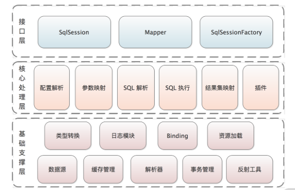

### 基础支撑层

> 类型转换模块

Mybatis是通过操作JDBC来操作数据库，意味着从应用层 -> Mybatis -> JDBC直接的映射关系需要套用一层转换。转换场景主要是：

- SQL绑定传入参数：由Java类型数据转换成JDBC类型数据；
- 执行结果返回ResultSet，需要将JDBC类型数据转换层Java类型数据。

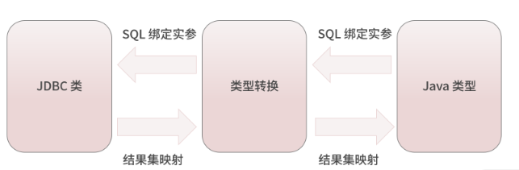

> **日志模块**

该模块目前可以集成 Log4j、Log4j2、slf4j 等优秀的日志框架。

> **反射工具模块**

MyBatis 的反射工具箱是在 Java 反射的基础之上进行的一层封装，为上层使用方提供更加灵活、方便的 API 接口，同时缓存 Java 的原生反射相关的元数据，提升了反射代码执行的效率，优化了反射操作的性能。

反射工具类包：`org.apache.ibatis.reflection`

> **Binding模块**

建立Mapper的绑定映射关系

> **数据源模块**

待补充。。。


> **缓存模块**

Mybatis 一、二级缓存

> **解析器模块**

mybatis-config.xml、Mapper.xml

> **事务管理模块**

待补充。。。

### 核心处理层

> **配置解析**

Configuration

> **SQL解析与scripting模块**

主要是sql标签的解析，如\<where>, \<if>, \<foreach>, \<set> 等

> **SQL执行、结果集映射模块**

Executor、StatementHandler、ParameterHandler 和 ResultSetHandler。

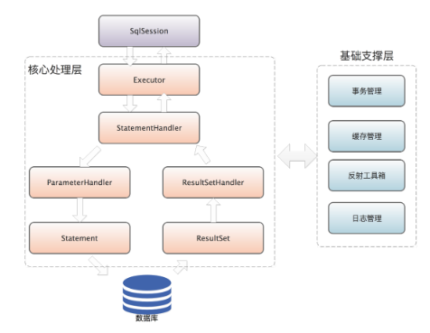

> **插件**

提供扩展接口

### 接口层

**接口层是 MyBatis 暴露给调用的接口集合**，这些接口都是使用 MyBatis 时最常用的一些接口，例如，SqlSession 接口、SqlSessionFactory 接口等。其中，最核心的是 SqlSession 接口，你可以通过它实现很多功能，例如，获取 Mapper 代理、执行 SQL 语句、控制事务开关等。

## 目录结构

- annotations : 注解，例如`org.apache.ibatis.annotations.Mapper`
- binding : 数据绑定
- builder : 构建类
- cache : 缓存
- cursor : 游标
- datasource : 数据源设置
- exceptions : 异常
- executor : 执行器
- io : IO
- jdbc : JDBC相关
- lang : JDKversion标记
- logging : 日志
- mapping : 映射关系
- parsing : 解析，xml解析
- plugin : 插件
- reflection : 反射工具类
- scripting : 脚本(sql)组装工具
- session : 会话
- transaction : 事务相关内容
- type : 类型，存放了数据库和JAVA类型之间的关系如`org.apache.ibatis.type.JdbcType`


# 初始化

Mybatis的初始化与Spring的IOC容器初始化类似，通过定位、加载、解析相应的配置文件来完成初始化。配置文件包括：**mybatis-config.xml**（核心）、**映射配置文件**、以及相应的**注解**。

==注：Spring Boot与Mybatis的融合是通过封装`mybatis-spring-boot-starter`的形式，自动完成Mybatis的初始化==

> 入口

Mybatis初始化的入口方法：`org.apache.ibatis.session.SqlSessionFactoryBuilder#build`

build()方法里面，通过委托XMLConfigBuilder（`extends BaseBuilder`）来解析配置文件，并最终构造SqlSessionFactory返回。

```java
public SqlSessionFactory build(InputStream inputStream, String environment, Properties properties) {
    try {
        // 建造者设计模式，解析配置文件
        XMLConfigBuilder parser = new XMLConfigBuilder(inputStream, environment, properties);
        // 解析配置文件的内容构造到Configuration对象，再由Configuration创建DefaultSqlSessionFactory返回
        return build(parser.parse());
    } catch (Exception e) {
        throw ExceptionFactory.wrapException("Error building SqlSession.", e);
    } finally {
        ErrorContext.instance().reset();
        try {
            inputStream.close();
        } catch (IOException e) {
            // Intentionally ignore. Prefer previous error.
        }
    }
}

public SqlSessionFactory build(Configuration config) {
    return new DefaultSqlSessionFactory(config);
}
```

> 初始化流程图

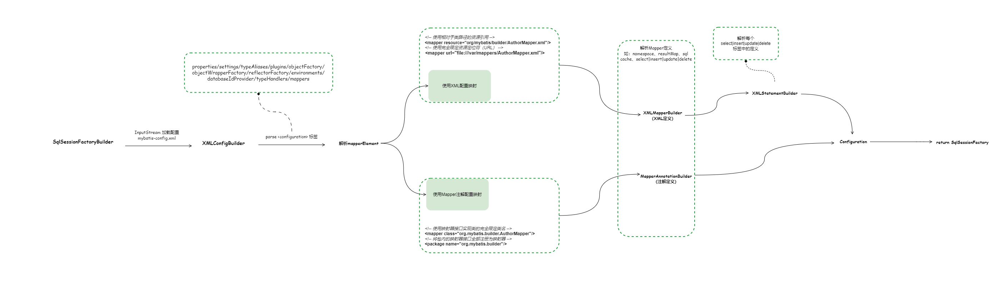

## BaseBuilder

抽象类BaseBuilder定义解析配置文件的方法，并构造配置对象Configuration。BaseBuilder的实现类有：XMLMapperBuilder、XMLConfigBuilder、XMLStatementBuilder等，由他们负责配置文件解析。

```java
public abstract class BaseBuilder {
    // 保存了 Mybatis 的几乎所以核心配置信息，全局唯一
    protected final Configuration configuration;
    // 在 mybatis-config.xml 中可以通过 <typeAliases> 标签定义别名
    protected final TypeAliasRegistry typeAliasRegistry;
    // 在 mybatis-config.xml 中可以通过 <typeHandlers> 标签添加自定义TypeHandler
    // TypeHandler 用于完成JDBC数据类型与Java类型的相互转换，所有的 TypeHandler 都保存在 typeHandlerRegistry 中
    protected final TypeHandlerRegistry typeHandlerRegistry;

    public BaseBuilder(Configuration configuration) {
        this.configuration = configuration;
        this.typeAliasRegistry = this.configuration.getTypeAliasRegistry();
        this.typeHandlerRegistry = this.configuration.getTypeHandlerRegistry();
    }
}
```

我们可以看到`typeAliasRegistry`和`typeHandlerRegistry`都是由configuration get出来的，这意味着configuration在构造构成中会构建这两个对象。

## XMLConfigBuilder

XMLConfigBuilder主要负责解析mybatis-config.xml配置文件，负责解析xml的方法parseConfiguration。

```java
public class XMLConfigBuilder extends BaseBuilder {
    // 标记是否解析过mybatis-config.xml文件
    private boolean parsed;
    // 用于解析 mybatis-config.xml 的解析器
    private final XPathParser parser;
    // 标识 <environment> 配置名称，默认读取<environment>标签的default属性
    private String environment;
    // 创建并缓存 Reflector对象
    private final ReflectorFactory localReflectorFactory = new DefaultReflectorFactory();

    /**
     * 解析的入口，调用了 parseConfiguration() 进行后续的解析
     */
    public Configuration parse() {
        // parsed标志位 的处理
        if (parsed) {
            throw new BuilderException("Each XMLConfigBuilder can only be used once.");
        }
        parsed = true;
        // 在 mybatis-config.xml配置文件 中查找 <configuration> 节点，并开始解析
        parseConfiguration(parser.evalNode("/configuration"));
        return configuration;
    }

    private void parseConfiguration(XNode root) {
        try {
            // 根据 root.evalNode("properties") 中的值就可以知道具体是解析哪个标签的方法咯
            propertiesElement(root.evalNode("properties"));
            Properties settings = settingsAsProperties(root.evalNode("settings"));
            loadCustomVfs(settings);
            typeAliasesElement(root.evalNode("typeAliases"));
            pluginElement(root.evalNode("plugins"));
            objectFactoryElement(root.evalNode("objectFactory"));
            objectWrapperFactoryElement(root.evalNode("objectWrapperFactory"));
            reflectorFactoryElement(root.evalNode("reflectorFactory"));
            settingsElement(settings);
            // read it after objectFactory and objectWrapperFactory issue #631
            environmentsElement(root.evalNode("environments"));
            databaseIdProviderElement(root.evalNode("databaseIdProvider"));
            typeHandlerElement(root.evalNode("typeHandlers"));
            mapperElement(root.evalNode("mappers"));
        } catch (Exception e) {
            throw new BuilderException("Error parsing SQL Mapper Configuration. Cause: " + e, e);
        }
    }
}
```

### \<typeHandlers\>标签

通过解析标签`<typeHandlers>`，注册相应的TypeHander来构建typeHandlerRegistry。解析方法：`org.apache.ibatis.builder.xml.XMLConfigBuilder#typeHandlerElement`。

主要作用：注册自定义TypeHandler，并建立javaType与TypeHandler的映射关系，注册的主要途径：

- `<package>`：扫描package下的TypeHandler (`implements TypeHandler`)，并解析注解标注（`@MappedTypes(Long.class)`）的javaType。
- `<typeHandler>`：根据标签指定的Class信息和javaType类型来构建TypeHandler 。

==注：TypeHandler的映射关系保存在`Map<Type, Map<JdbcType, TypeHandler<?>>> typeHandlerMap = new ConcurrentHashMap<>();`中，如果package扫描的TypeHandler而没有指定注解`@MappedJdbcTypes(value={JdbcType.BIGINT, includeNullJdbcType=true)`，typeHandlerMap中的JdbcType key会存入null。==

```java
private void typeHandlerElement(XNode parent) throws Exception {
    if (parent != null) {
        // 处理 <typeHandlers> 下的所有子标签
        for (XNode child : parent.getChildren()) {
            // 处理 <package> 标签
            if ("package".equals(child.getName())) {
                // 获取指定的包名
                String typeHandlerPackage = child.getStringAttribute("name");
                // 通过 typeHandlerRegistry 的register(packageName)方法
                // 扫描指定包中的所有 TypeHandler类，并进行注册
                typeHandlerRegistry.register(typeHandlerPackage);
            } else {
                // Java数据类型
                String javaTypeName = child.getStringAttribute("javaType");
                // JDBC数据类型
                String jdbcTypeName = child.getStringAttribute("jdbcType");
                String handlerTypeName = child.getStringAttribute("handler");
                Class<?> javaTypeClass = resolveClass(javaTypeName);
                JdbcType jdbcType = resolveJdbcType(jdbcTypeName);
                Class<?> typeHandlerClass = resolveClass(handlerTypeName);
                // 注册
                if (javaTypeClass != null) {
                    if (jdbcType == null) {
                        typeHandlerRegistry.register(javaTypeClass, typeHandlerClass);
                    } else {
                        typeHandlerRegistry.register(javaTypeClass, jdbcType, typeHandlerClass);
                    }
                } else {
                    typeHandlerRegistry.register(typeHandlerClass);
                }
            }
        }
    }
}
```

### \<environments\>标签

通过配置\<environments\>标签，可以让Mybatis连接上多个数据源。但需要注意的是每个SqlSessionFactory实例只能构建其中一个environment。

\<environments\>标签解析方法：`org.apache.ibatis.builder.xml.XMLConfigBuilder#environmentsElement`

```java
private void environmentsElement(XNode context) throws Exception {
    if (context != null) {
        // 如果未指定XMLConfigBuilder的environment字段，则使用<environments>标志指定的default属性
        if (environment == null) {
            environment = context.getStringAttribute("default");
        }
        for (XNode child : context.getChildren()) {
            // 获取指定environment的标签，通过id比较
            String id = child.getStringAttribute("id");
            if (isSpecifiedEnvironment(id)) {
                // 实例化 TransactionFactory
                TransactionFactory txFactory = transactionManagerElement(child.evalNode("transactionManager"));
                // 创建 DataSourceFactory 和 DataSource
                DataSourceFactory dsFactory = dataSourceElement(child.evalNode("dataSource"));
                DataSource dataSource = dsFactory.getDataSource();
                // 创建的Environment对象中封装了上面的TransactionFactory对象和DataSource对象
                Environment.Builder environmentBuilder = new Environment.Builder(id)
                    .transactionFactory(txFactory)
                    .dataSource(dataSource);
                // 为configuration注入environment属性值
                configuration.setEnvironment(environmentBuilder.build());
            }
        }
    }
}
```

### \<databaseIdProvider>标签

不同的数据库厂商在SQL语法上有些差异，但对于业务开发者来说这应该是不关心的，所以ORM框架需要做到屏蔽这种差异。

对于Hibernate，其通过HQL的方式实现。对于Mybatis来说，其通过在mybatis-config.xml配置\<databaseIdProvider>标签来实现。

Mybatis 初始化时，会根据前面解析到的 DataSource 来确认当前使用的数据库产品，然后在解析映射文件时，<u>加载不带 databaseId 属性的sql语句及带有 databaseId 属性的sql语句，其中，带有 databaseId 属性的sql语句优先级更高，会被优先选中。</u>

- 配置

```xml
<!-- 未指定属性时， databaseId通过方法DatabaseMetaData#getDatabaseProductName()获取 -->
<!-- 主要是通过Connection的metadata中获取 -->
<databaseIdProvider type="DB_VENDOR" />

<!-- 指定属性时， databaseId上述方法获取到，通常情况下这些字符串都非常长，而且相同产品的不同版本会返回不同的值 -->
<!-- 这时，我们可以通过设置属性别名来使其变短 -->
<!-- 如果属性name不匹配时，databaseId返回null -->
<databaseIdProvider type="DB_VENDOR">
  <property name="SQL Server" value="sqlserver"/>
  <property name="DB2" value="db2"/>
  <property name="Oracle" value="oracle" />
</databaseIdProvider>
```

- 解析方法

```JAVA
private void databaseIdProviderElement(XNode context) throws Exception {
    DatabaseIdProvider databaseIdProvider = null;
    if (context != null) {
        String type = context.getStringAttribute("type");
        // awful patch to keep backward compatibility
        if ("VENDOR".equals(type)) {
            type = "DB_VENDOR";
        }
        Properties properties = context.getChildrenAsProperties();
        databaseIdProvider = (DatabaseIdProvider) resolveClass(type).getDeclaredConstructor().newInstance();
        databaseIdProvider.setProperties(properties);
    }
    Environment environment = configuration.getEnvironment();
    if (environment != null && databaseIdProvider != null) {
        String databaseId = databaseIdProvider.getDatabaseId(environment.getDataSource());
        configuration.setDatabaseId(databaseId);
    }
}
```

- 查找databaseId

```java
public class VendorDatabaseIdProvider implements DatabaseIdProvider {
    // 1. getDatabaseProductName 获取productName（通常比较长，不同版本有差别）
    private String getDatabaseName(DataSource dataSource) throws SQLException {
        String productName = getDatabaseProductName(dataSource);
        // 查找配置的property属性，如果找到则返回别名value，否返回null
        if (this.properties != null) {
            for (Map.Entry<Object, Object> property : properties.entrySet()) {
                if (productName.contains((String) property.getKey())) {
                    return (String) property.getValue();
                }
            }
            // no match, return null
            return null;
        }
        return productName;
    }

    // 通过Connection的metadata中获取productName
    private String getDatabaseProductName(DataSource dataSource) throws SQLException {
        try (Connection con = dataSource.getConnection()) {
            DatabaseMetaData metaData = con.getMetaData();
            return metaData.getDatabaseProductName();
        }

    }

}
```

### \<mappers>标签

\<mappers>标签去哪里查找映射配置文件，及使用了配置注解标识的接口。其中共有4种定义的形式：相对于类路径的资源引用、或完全限定资源定位符（包括 `file:///` 形式的 URL）、或类名、或包名等，4者互斥有着存在一种。

- xml配置文件

```xml
<!-- 4个互斥的，贪方便的写法 -->
<mappers>
    <!-- 针对xml使用 -->
    <!-- 使用相对于类路径的资源引用 -->
    <mapper resource="org/mybatis/builder/AuthorMapper.xml"/>
    <!-- 使用完全限定资源定位符（URL） -->
    <mapper url="file:///var/mappers/AuthorMapper.xml"/>
    
    <!-- 针对mapper使用注解使用 -->
    <!-- 使用映射器接口实现类的完全限定类名 -->
    <mapper class="org.mybatis.builder.AuthorMapper"/>
    <!-- 将包内的映射器接口全部注册为映射器 -->
    <package name="org.mybatis.builder"/>
</mappers>
```

- 解析方法

解析\<mappers>节点，本方法会创建 XMLMapperBuilder对象加载映射文件，如果映射配置文件存在相应的Mapper接口，也会加载相应的Mapper接口，解析其中的注解并完成向 MapperRegistry 的注册。

```java
private void mapperElement(XNode parent) throws Exception {
    if (parent != null) {
        // 遍历子节点<mapper>标签
        for (XNode child : parent.getChildren()) {
            if ("package".equals(child.getName())) {
                // 获取 <package> 子节点 中的包名
                String mapperPackage = child.getStringAttribute("name");
                // 扫描指定的包目录，然后向 MapperRegistry 注册 Mapper接口
                configuration.addMappers(mapperPackage);
            } else {
                // 映射器由一个接口和一个XML配置文件组成，XML文件中定义了一个命名空间namespace
                // 命名空间的值是接口对应的全路径
                String resource = child.getStringAttribute("resource");
                String url = child.getStringAttribute("url");
                String mapperClass = child.getStringAttribute("class");
                // 如果<mapper>节点指定了resource或是url属性，则创建XMLMapperBuilder对象
                // 解析resource或url属性 指定的Mapper配置文件
                if (resource != null && url == null && mapperClass == null) {
                    ErrorContext.instance().resource(resource);
                    InputStream inputStream = Resources.getResourceAsStream(resource);
                    XMLMapperBuilder mapperParser = new XMLMapperBuilder(inputStream, configuration, resource, configuration.getSqlFragments());
                    mapperParser.parse();
                } else if (resource == null && url != null && mapperClass == null) {
                    ErrorContext.instance().resource(url);
                    InputStream inputStream = Resources.getUrlAsStream(url);
                    XMLMapperBuilder mapperParser = new XMLMapperBuilder(inputStream, configuration, url, configuration.getSqlFragments());
                    mapperParser.parse();
                // 如果<mapper>节点指定了class属性，则向 MapperRegistry 注册该Mapper接口
                } else if (resource == null && url == null && mapperClass != null) {
                    Class<?> mapperInterface = Resources.classForName(mapperClass);
                    configuration.addMapper(mapperInterface);
                } else {
                    throw new BuilderException("A mapper element may only specify a url, resource or class, but not more than one.");
                }
            }
        }
    }
}
```

## XMLMapperBuilder

XMLMapperBuilder：主要负责解析mybatis-config.xml配置文件中配置的\<mapper>标签定义，负责找到对应的Mapper和Mapper.xml并加载解析。核心方法：`org.apache.ibatis.builder.xml.XMLMapperBuilder#parse`

```java
public class XMLMapperBuilder extends BaseBuilder {
    public void parse() {
        // 是否已经加载过该配置文件
        if (!configuration.isResourceLoaded(resource)) {
            // 解析 <mapper>节点
            configurationElement(parser.evalNode("/mapper"));
            // 将 resource 添加到 configuration 的 loadedResources属性中，
            // 该属性是一个 HashSet<String>类型的集合，其中记录了已经加载过的映射文件
            configuration.addLoadedResource(resource);
            // 注册 Mapper接口
            bindMapperForNamespace();
        }
        // 处理 configurationElement()方法 中解析失败的 <resultMap>节点
        parsePendingResultMaps();
        // 处理 configurationElement()方法 中解析失败的 <cacheRef>节点
        parsePendingCacheRefs();
        // 处理 configurationElement()方法 中解析失败的 <statement>节点
        parsePendingStatements();
    }

    // 解析xml sql映射放到configuration
    private void configurationElement(XNode context) {
        try {
            // 获取 <mapper>节点 的 namespace属性
            String namespace = context.getStringAttribute("namespace");
            if (namespace == null || namespace.equals("")) {
                throw new BuilderException("Mapper's namespace cannot be empty");
            }
            // 使用 MapperBuilderAssistant对象 的 currentNamespace属性 记录 namespace命名空间
            builderAssistant.setCurrentNamespace(namespace);
            // 解析 <cache-ref>节点，后面的解析方法 也都见名知意
            cacheRefElement(context.evalNode("cache-ref"));
            cacheElement(context.evalNode("cache"));
            parameterMapElement(context.evalNodes("/mapper/parameterMap"));
            // *解析resultMap标签
            resultMapElements(context.evalNodes("/mapper/resultMap"));
            // *解析sql id标签
            sqlElement(context.evalNodes("/mapper/sql"));
            // *解析sql statement标签
            buildStatementFromContext(context.evalNodes("select|insert|update|delete"));
        } catch (Exception e) {
            throw new BuilderException("Error parsing Mapper XML. The XML location is '" + resource + "'. Cause: " + e, e);
        }
    }
}
```

### \<resultMap>标签

Mybatis 通过\<resultMap>节点定义了ORM 规则，建立了业务成DTO与数据库column的映射关系，减少重复代码，提高开发效率。通过解析\<resultMap>标签，将解析结果存入`org.apache.ibatis.mapping.ResultMap`中，其中保存映射关系的类是`org.apache.ibatis.mapping.ResultMapping`。

解析方法：`org.apache.ibatis.builder.xml.XMLMapperBuilder#resultMapElement(org.apache.ibatis.parsing.XNode, java.util.List<org.apache.ibatis.mapping.ResultMapping>, java.lang.Class<?>)`

> ResultMap

```java
public class ResultMap {
    private Configuration configuration;
    // <resultMap> 中的id属性, 唯一
    private String id;
    private Class<?> type;
    // 记录了除 <discriminator>节点 之外的其它映射关系(即，ResultMapping对象集合)
    private List<ResultMapping> resultMappings;
    // 记录了映射关系中带有 ID标志 的映射关系，如：<id>节点 和 <constructor>节点 的 <idArg>子节点
    private List<ResultMapping> idResultMappings;
    // 记录了映射关系中带有 Constructor标志 的映射关系，如：<constructor>所有子元素
    private List<ResultMapping> constructorResultMappings;
    // 记录了映射关系中不带有 Constructor标志 的映射关系
    private List<ResultMapping> propertyResultMappings;
    // 记录了所有映射关系中涉及的 column属性 的集合
    private Set<String> mappedColumns;
    // 记录了所有映射关系中涉及的 property属性 的集合
    private Set<String> mappedProperties;
    // 鉴别器，对应 <discriminator>节点
    private Discriminator discriminator;
    // 是否含有嵌套的结果映射，如果某个映射关系中存在 resultMap属性，
    // 且不存在 resultSet属性，则为true
    private boolean hasNestedResultMaps;
    // 是否含有嵌套查询，如果某个属性映射存在 select属性，则为true
    private boolean hasNestedQueries;
    // 是否开启自动映射
    private Boolean autoMapping;
}
```

> ResultMapping

```java
public class ResultMapping {
    private Configuration configuration;
    // 对应节点的 property属性，表示该列进行映射的属性
    private String property;
    // 对应节点的 column属性，表示从数据库中得到的列名或列名的别名
    private String column;
    // 表示 一个 JavaBean 的完全限定名，或一个类型别名
    private Class<?> javaType;
    // 进行映射列的 JDBC类型
    private JdbcType jdbcType;
    // 类型处理器
    private TypeHandler<?> typeHandler;
    // 该属性通过 id 引用了另一个 <resultMap>节点，它负责将结果集中的一部分列映射成
    // 它所关联的结果对象。这样我们就可以通过 join方式 进行关联查询，然后直接映射成
    // 多个对象，并同时设置这些对象之间的组合关系(nested嵌套的)
    private String nestedResultMapId;
    // 该属性通过 id 引用了另一个 <select>节点，它会把指定的列值传入 select属性 指定的
    // select语句 中作为参数进行查询。使用该属性可能会导致 ORM 中的 N+1问题，请谨慎使用
    private String nestedQueryId;
    private Set<String> notNullColumns;
    private String columnPrefix;
    // 处理后的标志，共有两个：id 和 constructor
    private List<ResultFlag> flags;
    private List<ResultMapping> composites;
    private String resultSet;
    private String foreignColumn;
    // 是否延迟加载
    private boolean lazy;
}
```

> \<resultMap>标签解析方法resultMapElement

最后调用方法buildResultMappingFromContext：主要是解析\<resultMap>下的子标签，构建每一个ResultMapping返回。

当构建完 ResultMapping 对象集合之后，会调用 `resultMapResolver.resolve();`，该方法会调用 MapperBuilderAssistant 的 addResultMap()方法 创建 ResultMap 对象，并添加到 Configuration 的 resultMaps 集合中保存，最终完成\<resultMap>标签的解析构建过程。

```java
private ResultMap resultMapElement(XNode resultMapNode) {
    return resultMapElement(resultMapNode, Collections.emptyList(), null);
}

private ResultMap resultMapElement(XNode resultMapNode, List<ResultMapping> additionalResultMappings, Class<?> enclosingType) {
    ErrorContext.instance().activity("processing " + resultMapNode.getValueBasedIdentifier());
    // type属性，表示结果集将被映射成 type 指定类型的对象
    // type属性要么指定全类名，要么建立Alias
    String type = resultMapNode.getStringAttribute("type",
                                                   resultMapNode.getStringAttribute("ofType",
                                                                                    resultMapNode.getStringAttribute("resultType",
                                                                                                                     resultMapNode.getStringAttribute("javaType"))));
    // 解析type指定的Class类型
    Class<?> typeClass = resolveClass(type);
    if (typeClass == null) {
        // 处理子标签中<association>没有指定resultType或resultMap的对象映射
        typeClass = inheritEnclosingType(resultMapNode, enclosingType);
    }
    Discriminator discriminator = null;
    List<ResultMapping> resultMappings = new ArrayList<>(additionalResultMappings);
    // 获取并处理 <resultMap> 的子节点 (id*, result*, association*, collection*, discriminator)
    List<XNode> resultChildren = resultMapNode.getChildren();
    for (XNode resultChild : resultChildren) {
        // 处理 <constructor>节点
        if ("constructor".equals(resultChild.getName())) {
            processConstructorElement(resultChild, typeClass, resultMappings);
            // 处理 <discriminator>节点 根据结果值来决定使用哪个resultMap
        } else if ("discriminator".equals(resultChild.getName())) {
            discriminator = processDiscriminatorElement(resultChild, typeClass, resultMappings);
        } else {
            // 处理 <id>, <result>, <association>, <collection> 等节点
            List<ResultFlag> flags = new ArrayList<>();
            if ("id".equals(resultChild.getName())) {
                flags.add(ResultFlag.ID);
            }
            // 创建 ResultMapping对象，并添加到 resultMappings集合
            resultMappings.add(buildResultMappingFromContext(resultChild, typeClass, flags));
        }
    }
    String id = resultMapNode.getStringAttribute("id", resultMapNode.getValueBasedIdentifier());
    // 该属性指定了该 <resultMap>节点 的继承关系
    String extend = resultMapNode.getStringAttribute("extends");
    // 为 true 则启动自动映射功能，该功能会自动查找与列明相同的属性名，并调用 setter方法，
    // 为 false，则需要在 <resultMap>节点 内注明映射关系才会调用对应的 setter方法
    Boolean autoMapping = resultMapNode.getBooleanAttribute("autoMapping");
    ResultMapResolver resultMapResolver = new ResultMapResolver(builderAssistant, id, typeClass, extend, discriminator, resultMappings, autoMapping);
    try {
        return resultMapResolver.resolve();
    } catch (IncompleteElementException  e) {
        configuration.addIncompleteResultMap(resultMapResolver);
        throw e;
    }
}
```

### \<sql>标签

我们再Mapper.xml文件中可以定义sql标签，用于sql statement的拼接。解析sql标签简单来说将解析的sql按照key-value的形式放入` Map<String, XNode> sqlFragments;`Map中，其中key有两种形式：

- Mapper全限定类名.id
- id

value为整个sql标签。

具体put方法：`org.apache.ibatis.session.Configuration.StrictMap#put`

```java
private void sqlElement(List<XNode> list) throws Exception {
    if (configuration.getDatabaseId() != null) {
        sqlElement(list, configuration.getDatabaseId());
    }
    sqlElement(list, null);
}

private void sqlElement(List<XNode> list, String requiredDatabaseId) throws Exception {
    // 遍历 <sql>节点
    for (XNode context : list) {
        String databaseId = context.getStringAttribute("databaseId");
        String id = context.getStringAttribute("id");
        // 为 id 添加命名空间
        id = builderAssistant.applyCurrentNamespace(id, false);
        // 检测 <sql> 的 databaseId 与当前 Configuration 中记录的 databaseId 是否一致
        if (databaseIdMatchesCurrent(id, databaseId, requiredDatabaseId)) {
            // 记录到 sqlFragments(Map<String, XNode>) 中保存
            sqlFragments.put(id, context);
        }
    }
}
```

### Mapper绑定

每个映射配置文件 Mapper.xml 的命名空间可以绑定一个 Mapper 接口，并注册到 MapperRegistry 中。执行绑定的方法发生在 Mapper.xml 解析的过程中：`org.apache.ibatis.builder.xml.XMLMapperBuilder#parse`

```java
public void parse() {
    if (!configuration.isResourceLoaded(resource)) {
        configurationElement(parser.evalNode("/mapper"));
        configuration.addLoadedResource(resource);
        bindMapperForNamespace();
    }
}
```

其中由 XMLMapperBuilder 的 bindMapperForNamespace()方法中，完成了映射配置文件与对应 Mapper 接口的绑定。

```java
// 绑定命名空间
private void bindMapperForNamespace() {
    // 获取当前映射配置文件的命名空间（<Mapper>是逐一解析的），前面解析Mapper.xml标签时保存的
    String namespace = builderAssistant.getCurrentNamespace();
    if (namespace != null) {
        Class<?> boundType = null;
        try {
            // 创建命名空间对应的class
            boundType = Resources.classForName(namespace);
        } catch (ClassNotFoundException e) {
            //ignore, bound type is not required
        }
        if (boundType != null) {
            // mapper还没注册
            if (!configuration.hasMapper(boundType)) {
                // Spring may not know the real resource name so we set a flag
                // to prevent loading again this resource from the mapper interface
                // look at MapperAnnotationBuilder#loadXmlResource
                // 追加个 "namespace:" 的前缀，并添加到 Configuration 的 loadedResources 集合中
                // 这里相当于加一个标志位，防止在addMapper里面再加载一次xml资源
                configuration.addLoadedResource("namespace:" + namespace);
                // 添加到 Configuration 的 mapperRegistry 集合中，另外往这个方法栈的更深处看会发现
                // 其创建了 MapperAnnotationBuilder 对象，并调用了该对象的 parse()方法 解析 Mapper 接口
                // 这里还用调用 MapperAnnotationBuilder#parse 的原因是兼容xml和注解同时有配置的情况
                configuration.addMapper(boundType);
            }
        }
    }
}

public class MapperRegistry {
    public <T> void addMapper(Class<T> type) {
        if (type.isInterface()) {
            if (hasMapper(type)) {
                throw new BindingException("Type " + type + " is already known to the MapperRegistry.");
            }
            boolean loadCompleted = false;
            try {
                knownMappers.put(type, new MapperProxyFactory<T>(type));
                // 解析 Mapper接口 type 中的信息
                MapperAnnotationBuilder parser = new MapperAnnotationBuilder(config, type);
                parser.parse();
                loadCompleted = true;
            } finally {
                if (!loadCompleted) {
                    knownMappers.remove(type);
                }
            }
        }
    }
}

public class MapperAnnotationBuilder {
    public void parse() {
        String resource = type.toString();
        // 是否已经加载过该接口
        if (!configuration.isResourceLoaded(resource)) {
            // 检查是否加载过该接口对应的映射文件，如果未加载，则创建 XMLMapperBuilder对象
            // 解析对应的映射文件，该过程就是前面介绍的映射配置文件解析过程
            loadXmlResource();
            configuration.addLoadedResource(resource);
            assistant.setCurrentNamespace(type.getName());
            // 解析 @CacheNamespace注解
            parseCache();
            // 解析 @CacheNamespaceRef注解
            parseCacheRef();
            // type接口 的所有方法
            Method[] methods = type.getMethods();
            for (Method method : methods) {
                try {
                    if (!method.isBridge()) {
                        // 解析 SelectKey、ResultMap 等注解，并创建 MappedStatement对象
                        parseStatement(method);
                    }
                } catch (IncompleteElementException e) {
                    // 如果解析过程出现 IncompleteElementException异常，可能是因为引用了
                    // 未解析的注解，这里将出现异常的方法记录下来，后面提供补偿机制，重新进行解析
                    configuration.addIncompleteMethod(new MethodResolver(this, method));
                }
            }
        }
        // 遍历 configuration 中的 incompleteMethods集合，集合中记录了未解析的方法
        // 重新调用这些方法进行解析
        parsePendingMethods();
    }
}
```

**问题：假设同时配置了注解和xml怎么办？两者会同时生效么？优先级是怎样的？**

1. 对，同时生效，但是同一个方法来说相同属性只会有一个生效（因为采用strictMap，相同key put时会报错！）

2. 对于xml配置来说，先解析xml，后面解析注解配置

   路径：解析Mapper ->  XMLMapperBuilder -> bindMapperForNamespace ->  MapperAnnotationBuilder 

3. 对于注解来说，先解析注解，再解析xml

   路径：mapperRegistry.addMappers -> MapperAnnotationBuilder  -> loadXmlResource

## XMLStatementBuilder

待补充。。。

## MapperAnnotationBuilder

待补充。。。

# 基础支撑层

## 反射

### Reflector

反射工具包：`org.apache.ibatis.reflection`

Reflector，mybatis反射模块的基础。通常需要反射操作一个类时，都会先把Class封装成一个Reflector对象，Reflector中缓存Class的元数据信息。通过Reflector可以更加便利地操作Class的属性和方法。

- 构造器

```java
public class Reflector {
    // Reflector缓存的Class元信息，在构造Reflector时完成该属性的填充

    // 传入的Class
    private final Class<?> type;
    // Class 可读、可写的属性
    private final String[] readablePropertyNames;
    private final String[] writablePropertyNames;
    // Class setter、getter方法
    private final Map<String, Invoker> setMethods = new HashMap<>();
    private final Map<String, Invoker> getMethods = new HashMap<>();
    // Class 对应的setter的参数类型、getter的return类型
    // key: 属性  value：参数类型/return类型
    private final Map<String, Class<?>> setTypes = new HashMap<>();
    private final Map<String, Class<?>> getTypes = new HashMap<>();
    // 默认的构造方法
    private Constructor<?> defaultConstructor;
    // 所有属性名称的集合，记录到这个集合中的属性名称都是大写的。
    private Map<String, String> caseInsensitivePropertyMap = new HashMap<>();

    // Reflector的构造方法，完成class的属性填充
    public Reflector(Class<?> clazz) {
        type = clazz;
        addDefaultConstructor(clazz);
        addGetMethods(clazz);
        addSetMethods(clazz);
        addFields(clazz);
        readablePropertyNames = getMethods.keySet().toArray(new String[0]);
        writablePropertyNames = setMethods.keySet().toArray(new String[0]);
        for (String propName : readablePropertyNames) {
            caseInsensitivePropertyMap.put(propName.toUpperCase(Locale.ENGLISH), propName);
        }
        for (String propName : writablePropertyNames) {
            caseInsensitivePropertyMap.put(propName.toUpperCase(Locale.ENGLISH), propName);
        }
    }
}
```

- addDefaultConstructor

获取所有的构造器，找到空参构造器作为默认构造器

```java
private void addDefaultConstructor(Class<?> clazz) {
    Constructor<?>[] constructors = clazz.getDeclaredConstructors();
    Arrays.stream(constructors).filter(constructor -> constructor.getParameterTypes().length == 0)
        .findAny().ifPresent(constructor -> this.defaultConstructor = constructor);
}
```

- addGetMethods

```java
private void addGetMethods(Class<?> clazz) {
    Map<String, List<Method>> conflictingGetters = new HashMap<>();
    Method[] methods = getClassMethods(clazz);
    // addMethodConflict: 找到所有的setter方法
    Arrays.stream(methods).filter(m -> m.getParameterTypes().length == 0 && PropertyNamer.isGetter(m.getName()))
        .forEach(m -> addMethodConflict(conflictingGetters, PropertyNamer.methodToProperty(m.getName()), m));
    resolveGetterConflicts(conflictingGetters);
}
```

### Invoker

Reflector在构造过程中，Class中所有属性的 getter/setter 方法都会被封装成 MethodInvoker 对象，没有 getter/setter 的字段也会生成对应的 Get/SetFieldInvoker 对象。

```java
public interface Invoker {
    // method执行invoke
    Object invoke(Object target, Object[] args) throws IllegalAccessException, InvocationTargetException;
    // 获取method的类型，setter返回param类型，getter返回return类型
    Class<?> getType();
}
```
- 类图

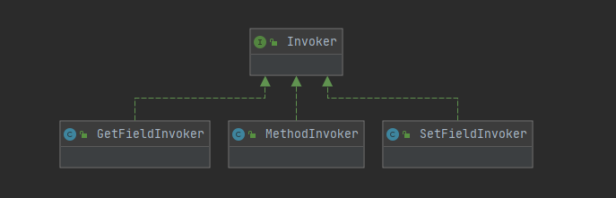

### ReflectorFactory

ReflectorFactory主要是用来创建Reflector对象，并提供缓存功能，DefaultReflectorFactory为默认实现。

由下面的缓存实现可知，缓存的没有提供清理功能，缓存的生命周期与DefaultReflectorFactory同步。

```java
public class DefaultReflectorFactory implements ReflectorFactory {
    private boolean classCacheEnabled = true;
    private final ConcurrentMap<Class<?>, Reflector> reflectorMap = new ConcurrentHashMap<>();

    public DefaultReflectorFactory() {
    }

    @Override
    public boolean isClassCacheEnabled() {
        return classCacheEnabled;
    }

    @Override
    public void setClassCacheEnabled(boolean classCacheEnabled) {
        this.classCacheEnabled = classCacheEnabled;
    }

    @Override
    public Reflector findForClass(Class<?> type) {
        if (classCacheEnabled) {
            // synchronized (type) removed see issue #461
            return reflectorMap.computeIfAbsent(type, Reflector::new);
        } else {
            return new Reflector(type);
        }
    }

}
```

### MetaClass

Class的元信息，底层依赖reflector。

### ObjectWrapper

ObjectWrapper 封装的则是对象元信息。在 ObjectWrapper 中抽象了一个对象的属性信息，并提供了查询对象属性信息的相关方法，以及更新属性值的相关方法。

> 属性相关工具

- PropertyTokenizer 工具类负责解析由“.”和“[]”构成的表达式。PropertyTokenizer 继承了 Iterator 接口，可以迭代处理嵌套多层表达式。
- PropertyCopier 是一个属性拷贝的工具类，提供了与 Spring 中 BeanUtils.copyProperties() 类似的功能，实现相同类型的两个对象之间的属性值拷贝，其核心方法是 copyBeanProperties() 方法。
- PropertyNamer 工具类提供的功能是转换方法名到属性名，以及检测一个方法名是否为 getter 或 setter 方法。

### ObjectFactory

如注释：MyBatis使用ObjectFactory来实例化指定的类。

```java
/**
 * MyBatis uses an ObjectFactory to create all needed new Objects.
 */
public interface ObjectFactory {
  default void setProperties(Properties properties) {}

  <T> T create(Class<T> type);

  <T> T create(Class<T> type, List<Class<?>> constructorArgTypes, List<Object> constructorArgs);

  <T> boolean isCollection(Class<T> type);
}
```

## 类型转换

Java类型与数据库字段类型对应映射：

枚举：`org.apache.ibatis.type.JdbcType`

|                       数据库类型                        |  Java类型  |
| :-----------------------------------------------------: | :--------: |
|                      varchar、char                      |   String   |
|                          blob                           |   byte[]   |
|                    Integer unsigned                     |    Long    |
| tinyint unsigned、smallint unsigned、mediumint unsigned |  Integer   |
|                           bit                           |  Boolean   |
|                     bigint unsigned                     | BigInteger |
|                          float                          |   float    |
|                         double                          |   double   |
|                         decimal                         | BigDecimal |

### TypeHandler

类型转换器TypeHandler: `JdbcType  互转  JavaType`

```java
public interface TypeHandler<T> {
    // 在通过PreparedStatement为SQL语句绑定参数时，会将传入的实参数据由JdbcType类型转换成Java类型
    void setParameter(PreparedStatement ps, int i, T parameter, JdbcType jdbcType) throws SQLException;
	// 从ResultSet中获取数据时会使用getResult()方法，其中会将读取到的数据由Java类型转换成JdbcType类型
    T getResult(ResultSet rs, String columnName) throws SQLException;

    T getResult(ResultSet rs, int columnIndex) throws SQLException;

    T getResult(CallableStatement cs, int columnIndex) throws SQLException;

}
```

- `TypeHandler.setParameter()`：完成JavaType到JdbcType的转换；
- `TypeHandler.getResult()`：完成JdbcType到JavaType的转换。

TypeHandler具体的转换逻辑由之类实现，其底层均是依赖JDBC的API。

注：==TypeHandler 主要用于单个参数的类型转换，如果要将多个列的值转换成一个 Java 对象，可以在映射文件中定义合适的映射规则 &lt;resultMap&gt; 完成映射。==

### TypeHandlerRegistry

我们已经知道TypeHandler的转换原理，类型转换逻辑由子类实现，这时延申TypeHandler的两个问题：

1. MyBatis如何管理众多TypeHandler的子类？
2. MyBatis如果找到合适的类型转换器，进行类型转换？

> TypeHandler注册

Mybatis在初始化过程中，会创建所有已知的TypeHandler（包括内置实现和自定义实现），注册到**TypeHandlerRegistry**。

1. TypeHandlerRegistry在构造过程中完成内置TypeHandler的注册：`org.apache.ibatis.type.TypeHandlerRegistry#TypeHandlerRegistry(org.apache.ibatis.session.Configuration)`，
2. TypeHandlerRegistry提供注册自定义TypeHandler的注册方法（在解析mybatis-config.xml定义的标签`<typeHandlers>`过程调用注册）：`org.apache.ibatis.type.TypeHandlerRegistry#register(java.lang.Class<?>)`

- TypeHandlerRegistry

```java
public final class TypeHandlerRegistry {
	// 该集合记录从 JdbcType 到 JavaType 需要使用TypeHandler对象的映射
    private final Map<JdbcType, TypeHandler<?>>  jdbcTypeHandlerMap = new EnumMap<>(JdbcType.class);
    // 该集合记录从 JavaType 到 JdbcType 需要使用TypeHandler对象的映射
    // 一对多的关系，如：Java中String 对应数据库 char、varchar、text 等多个类型
    private final Map<Type, Map<JdbcType, TypeHandler<?>>> typeHandlerMap = new ConcurrentHashMap<>();
    private final TypeHandler<Object> unknownTypeHandler;
    // 该集合记录了全部 TypeHandler 的class类型以及对应的 TypeHandler 实例对象。
    private final Map<Class<?>, TypeHandler<?>> allTypeHandlersMap = new HashMap<>();
    private static final Map<JdbcType, TypeHandler<?>> NULL_TYPE_HANDLER_MAP = Collections.emptyMap();
    private Class<? extends TypeHandler> defaultEnumTypeHandler = EnumTypeHandler.class;
}
```

- 注册方法register

```java
private void register(Type javaType, JdbcType jdbcType, TypeHandler<?> handler) {
    if (javaType != null) {
        Map<JdbcType, TypeHandler<?>> map = typeHandlerMap.get(javaType);
        if (map == null || map == NULL_TYPE_HANDLER_MAP) {
            map = new HashMap<>();
        }
        map.put(jdbcType, handler);
        typeHandlerMap.put(javaType, map);
    }
    allTypeHandlersMap.put(handler.getClass(), handler);
}
```

> TypeHandler获取

获取TypeHandler主要是通过重载方法：`getTypeHandler()`

```java
private <T> TypeHandler<T> getTypeHandler(Type type, JdbcType jdbcType) {
    if (ParamMap.class.equals(type)) {
        return null; // 过滤掉ParamMap类型
    }

    // 根据Java类型查找对应的TypeHandler集合
    // Java数据类型 与 JDBC数据类型 的关系往往是一对多，
    // 所以一般会先根据 Java数据类型 获取 Map<JdbcType, TypeHandler<?>>对象
    // 再根据 JDBC数据类型 获取对应的 TypeHandler对象
    Map<JdbcType, TypeHandler<?>> jdbcHandlerMap = getJdbcHandlerMap(type);
    TypeHandler<?> handler = null;
    if (jdbcHandlerMap != null) {
        // 根据JdbcType类型查找对应的TypeHandler实例
        handler = jdbcHandlerMap.get(jdbcType);
        if (handler == null) {
            // 没有对应的TypeHandler实例，则使用null对应的TypeHandler
            handler = jdbcHandlerMap.get(null);
        }

        if (handler == null) {
            // 如果jdbcHandlerMap只注册了一个TypeHandler，则使用此TypeHandler对象
            handler = pickSoleHandler(jdbcHandlerMap);
        }
    }
    return (TypeHandler<T>) handler;
}
```

## 日志

Mybatis可以接口主流的日志框架，主要采用适配器模式，将各个第三方日志框架接口转换为框架内部自定义的日志接口。MyBatis 自定义的 Log 接口位于 `org.apache.ibatis.logging` 包中，相关的适配器也位于该包中。

### Log实现

> LogFactory初始化Logger

Logger实际上是委托给日志框架的实现来打日志，如Slf4jImpl、Log4jImpl、Jdk14LoggingImpl等。（适配器模式)

```java
public final class LogFactory {
    private static Constructor<? extends Log> logConstructor;

    static {
        // static方法的所有的日志实现都调用一遍tryImplementation, 但是只会实现一个
        tryImplementation(LogFactory::useSlf4jLogging);
        tryImplementation(LogFactory::useCommonsLogging);
        tryImplementation(LogFactory::useLog4J2Logging);
        tryImplementation(LogFactory::useLog4JLogging);
        tryImplementation(LogFactory::useJdkLogging);
        tryImplementation(LogFactory::useNoLogging);
    }
    
    public static synchronized void useSlf4jLogging() {
        setImplementation(org.apache.ibatis.logging.slf4j.Slf4jImpl.class);
    }

    private static void tryImplementation(Runnable runnable) {
        // 只会初始化第一个logConstructor
        if (logConstructor == null) {
            try {
                runnable.run();
            } catch (Throwable t) {
                // ignore
            }
        }
    }

    private static void setImplementation(Class<? extends Log> implClass) {
        try {
            Constructor<? extends Log> candidate = implClass.getConstructor(String.class);
            Log log = candidate.newInstance(LogFactory.class.getName());
            if (log.isDebugEnabled()) {
                log.debug("Logging initialized using '" + implClass + "' adapter.");
            }
            logConstructor = candidate;
        } catch (Throwable t) {
            throw new LogException("Error setting Log implementation.  Cause: " + t, t);
        }
    }
}
```

> 指定Mybatis logImpl

Mybatis可以通过在mybatis-config.xml中配置\<setting>标签来指定logImpl。

```xml
  <settings>
    <setting name="logImpl" value="Log4j"/>
  </settings>
```

- 解析setting标签，获取logImpl

org.apache.ibatis.builder.xml.XMLConfigBuilder#parseConfiguration

```java
private void parseConfiguration(XNode root) {
  try {
    Properties settings = settingsAsProperties(root.evalNode("settings"));
    loadCustomLogImpl(settings);
  } catch (Exception e) {
    throw new BuilderException("Error parsing SQL Mapper Configuration. Cause: " + e, e);
  }
}
```

- logImpl可以使用别名，Mybatis初始化阶段已经注册别名

```java
// 日志实现类
typeAliasRegistry.registerAlias("SLF4J", Slf4jImpl.class);
typeAliasRegistry.registerAlias("COMMONS_LOGGING", JakartaCommonsLoggingImpl.class);
typeAliasRegistry.registerAlias("LOG4J", Log4jImpl.class);
typeAliasRegistry.registerAlias("LOG4J2", Log4j2Impl.class);
typeAliasRegistry.registerAlias("JDK_LOGGING", Jdk14LoggingImpl.class);
typeAliasRegistry.registerAlias("STDOUT_LOGGING", StdOutImpl.class);
typeAliasRegistry.registerAlias("NO_LOGGING", NoLoggingImpl.class);
```

### Log使用

我们知道当开启Mybatis的Debug模式，在执行SQL时会记录一些日志，负责记录日志的工具类均在 `org.apache.ibatis.logging。jdbc` 包中。

由下图可知，负责记录日志的类有：ConnectionLogger、PreparedStatementLogger、ResultSetLogger、StatementLogger。其同时实现了接口`InvocationHandler`，由此可以Mybatis是通过JDK动态代理来记录业务方法前后日志。

==注：分析动态代理模式关键是要找到代理的对象是什么？如JDK动态代理，先要找到这行代码：==

`Proxy.newProxyInstance(ClassLoader loader, Class<?>[] interfaces, InvocationHandler h);`

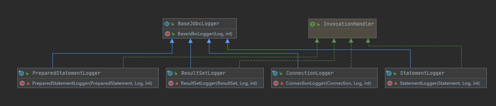

## 数据源与事务

DataSource及Transaction模块

### DataSource

Mybatis是通过工厂方法模式来获取数据源，同时针对不同的 DataSource，MyBatis 提供了不同的工厂实现，由DataSourceFactory子类实现，来进行创建 DataSource。我们可以在 `mybatis-config.xml` 中的 `<environment>` 标签来指定不同类型的DataSource。

```xml
<environments default="development">
    <environment id="development">
        <dataSource type="POOLED">
            ...
        </dataSource>
    </environment>
    <environment id="product">
        <dataSource type="JNDI">
            ...
        </dataSource>
    </environment>
</environments>
```

- 相关DataSourceFactory

JndiDataSourceFactory是通过解析指定的配置文件的形式来创建对应的DataSource。

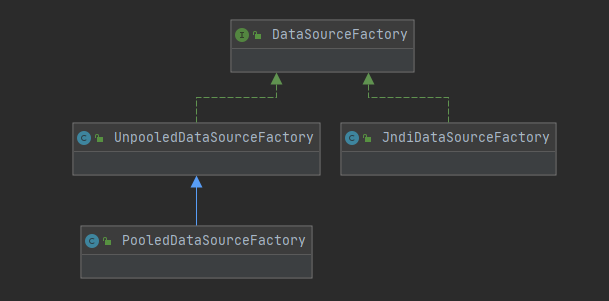

#### UnpooledDataSource

PooledDataSource是UnpooledDataSource的池化实现。两者的具体实现均在`getConnection()`方法中。

- `UnpooledDataSource.getConnection()`

```java
private Connection doGetConnection(Properties properties) throws SQLException {
    // 底层依赖JDBC，在获取connection前需要完成 JDBC 驱动的初始化
    initializeDriver();
    // 创建数据库连接
    Connection connection = DriverManager.getConnection(url, properties);
    // 配置数据库连接，如超时时间，事务自动提交，事务的隔离级别等，当然这是session级别的设置
    configureConnection(connection);
    return connection;
}
```

#### PooledDataSource(池实现细节)

- `PooledDataSource.popConnection()`

> 池化的好处：
>
> 1. 在空闲时段**缓存**一定数量的数据库连接备用，防止被突发流量冲垮；
> 2. 实现数据库连接的**重用**，从而提高系统的响应速度；
> 3. **控制**数据库连接上限，防止连接过多造成数据库假死；
> 4. **统一**管理数据库连接，避免连接泄漏。
>
> 
>
> 关于池中连接数的设计考量：总连接数、空闲连接数、阻塞队列、超时时间
>
> 1. **总连接数达到了配置上限**，新的连接需要在**阻塞队列**中等待，等待其他连接释放；
> 2. **空闲连接数达到了配置上限**，后续返回到池中的空闲连接不会进入连接池缓存，而是直接关闭释放掉；
> 3. **连接总数的上限值设置过大**，会导致数据库因连接过多而僵死或崩溃；
> 4. **连接总数的上限值设置过小**，数据库资源等不到充分利用，而造成资源浪费；
> 5. **空闲连接数的上限值设置过大**，需要维护这些空闲连接造成服务资源以及数据库资源的浪费；
> 6. **空闲连接数的上限值设置过小**，当出现瞬间峰值请求时，服务的响应速度就会比较慢；

PooledDataSource本身不管理具体的连接池，真正管理连接的是**PooledState**，从代码中可以看到每次操作连接池时都会对**PooledState**进行加锁。被关联的Conection均由`PooledConnection`进行封装。

- DataSource连接池原理

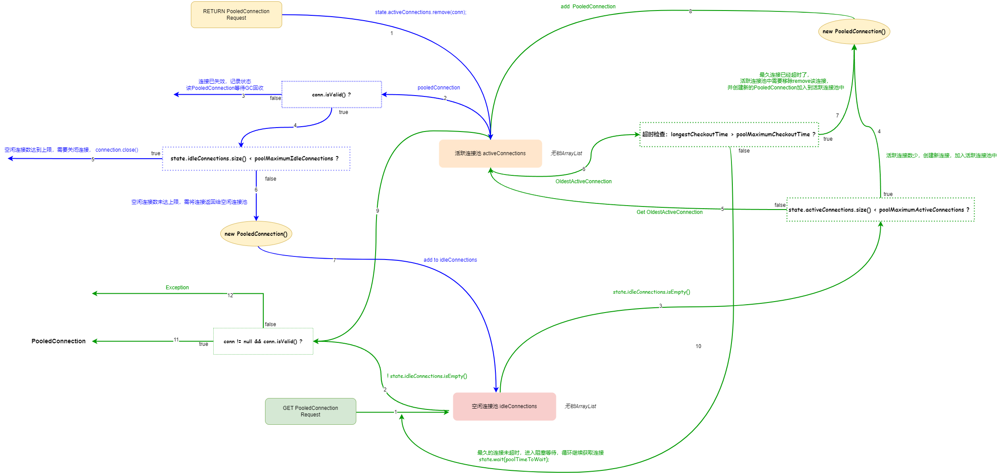

##### PooledConnection

```java
// jdk动态代理
class PooledConnection implements InvocationHandler {
    private static final String CLOSE = "close";
    // 代理的对象 Connection，增强的代理逻辑需要看invoke()方法
    private static final Class<?>[] IFACES = new Class<?>[] { Connection.class };
    private final int hashCode;
    // 记录当前 this 的 PooledConnection 归属于哪个 dataSource
    private final PooledDataSource dataSource;
    // PooledConnection 真正数据库连接对象。
    private final Connection realConnection;
    // PooledConnection 数据库连接代理对象。
    private final Connection proxyConnection;
    // 使用方从连接池中获取连接的时间戳
    private long checkoutTimestamp;
    // 连接创建的时间戳
    private long createdTimestamp;
    // 连接最后一次被使用的时间戳
    private long lastUsedTimestamp;
    // 数据库连接的标识。该标识是由数据库 URL、username 和 password 三部分组合计算出来的 hash 值，主要用于连接对象确认归属的连接池。
    private int connectionTypeCode;
    // 用于标识 PooledConnection 对象是否有效。
    // 该字段的主要目的是防止使用方将连接归还给连接池之后，依然保留该 PooledConnection 对象的引用
    // 并继续通过该引用的 PooledConnection 对象操作数据库。
    private boolean valid;

    // Connection 的代理方法
    @Override
    public Object invoke(Object proxy, Method method, Object[] args) throws Throwable {
        String methodName = method.getName();
        // 只对 Connection 的 close() 方法进行拦截
        // 因为调用connection.close不是真正关闭connection，而是将connection归还给连接池
        if (CLOSE.equals(methodName)) {
            dataSource.pushConnection(this);
            return null;
        }
        try {
            // 只要不是Object的方法，都需要检测当前PooledConnection是否可用
            if (!Object.class.equals(method.getDeclaringClass())) {
                // issue #579 toString() should never fail
                // throw an SQLException instead of a Runtime
                checkConnection();
            }
            // 调用realConnection的对应方法
            return method.invoke(realConnection, args);
        } catch (Throwable t) {
            throw ExceptionUtil.unwrapThrowable(t);
        }
    }
}
```

##### PoolState

PoolState负责维护管理连接池中所有 PooledConnection 对象的状态。

```java
public class PoolState {
	// 注意：这些属性都是 protected 的，可以通过PoolState.field来访问
    protected PooledDataSource dataSource;
	// 空闲状态的 PooledConnection 对象集合
    protected final List<PooledConnection> idleConnections = new ArrayList<>();
    // 活跃状态的 PooledConnection 对象集合
    protected final List<PooledConnection> activeConnections = new ArrayList<>();
    // 请求数据库连接的次数
    protected long requestCount = 0;
    // 获取连接的累积耗时
    protected long accumulatedRequestTime = 0;
    // 所有连接的 checkoutTime 累加
    // checkoutTime: 表示的是使用方从连接池中取出连接到归还连接的总时长，也就是连接被使用的时长
    protected long accumulatedCheckoutTime = 0;
    // 当连接长时间未归还给连接池时，会被认为该连接超时，该字段记录了超时的连接个数
    protected long claimedOverdueConnectionCount = 0;
    // 记录了累积超时时间
    protected long accumulatedCheckoutTimeOfOverdueConnections = 0;
    // 当连接池全部连接已经被占用之后，新的请求会阻塞等待，该字段就记录了累积的阻塞等待总时间
    protected long accumulatedWaitTime = 0;
    // 记录了阻塞等待总次数
    protected long hadToWaitCount = 0;
    // 无效的连接数
    protected long badConnectionCount = 0;
}
```

##### popConnection()

获取PooledConnection的核心实现：

- 步骤1：检查空闲连接池idleConnections是否有空闲连接，有则直接返回连接；
- 步骤2：活跃连接池activeConnections数量**未达到**上限值；
  - 创建新的PooledConnection -> 检查连接是否可用（ping） -> 加入活跃连接池
- 步骤3：活跃连接池activeConnections数量**达到**上限值；活跃连接池activeConnections中获取最早的活跃连接 -> 检查该连接是否超时 
  - 旧连接超时：若连接是自动提交事务则回滚事务-> 创建新的PooledConnection -> 旧PooledConnection 置为失效  -> 新的PooledConnection加入活跃连接池
  - 旧连接未超时：进入线程等待20s（`state.wait(poolTimeToWait);`）-> 1. 等待线程通知重新获取PooledConnection，重复步骤1 -> 2. 超时等待超20s，返回获取连接失败报错
- 步骤4：检查获取连接是否成功
  - 成功：返回连接 -> 加入活跃连接池activeConnections
  - 失败：记录状态 -> 返回获取连接失败报错

```java
private PooledConnection popConnection(String username, String password) throws SQLException {
    boolean countedWait = false;
    PooledConnection conn = null;
    long t = System.currentTimeMillis();
    int localBadConnectionCount = 0;

    // 异常时会退出，conn = null
    while (conn == null) {
        synchronized (state) {
            // 步骤1
            if (!state.idleConnections.isEmpty()) {
                // Pool has available connection
                conn = state.idleConnections.remove(0);
                if (log.isDebugEnabled()) {
                    log.debug("Checked out connection " + conn.getRealHashCode() + " from pool.");
                }
            } else {
                // 步骤2
                // Pool does not have available connection
                if (state.activeConnections.size() < poolMaximumActiveConnections) {
                    // Can create new connection
                    conn = new PooledConnection(dataSource.getConnection(), this);
                    if (log.isDebugEnabled()) {
                        log.debug("Created connection " + conn.getRealHashCode() + ".");
                    }
                } else {
                    // 步骤3
                    // Cannot create new connection
                    PooledConnection oldestActiveConnection = state.activeConnections.get(0);
                    long longestCheckoutTime = oldestActiveConnection.getCheckoutTime();
                    if (longestCheckoutTime > poolMaximumCheckoutTime) {
                        // Can claim overdue connection
                        state.claimedOverdueConnectionCount++;
                        state.accumulatedCheckoutTimeOfOverdueConnections += longestCheckoutTime;
                        state.accumulatedCheckoutTime += longestCheckoutTime;
                        state.activeConnections.remove(oldestActiveConnection);
                        if (!oldestActiveConnection.getRealConnection().getAutoCommit()) {
                            try {
                                oldestActiveConnection.getRealConnection().rollback();
                            } catch (SQLException e) {
                               /*
                   				Just log a message for debug and continue to execute the following
                   				statement like nothing happened.
                   				Wrap the bad connection with a new PooledConnection, this will help
                   				to not interrupt current executing thread and give current thread a
                   				chance to join the next competition for another valid/good database
                   				connection. At the end of this loop, bad {@link @conn} will be set as null.
                 			  */
                                log.debug("Bad connection. Could not roll back");
                            }
                        }
                        conn = new PooledConnection(oldestActiveConnection.getRealConnection(), this);
                        conn.setCreatedTimestamp(oldestActiveConnection.getCreatedTimestamp());
                        conn.setLastUsedTimestamp(oldestActiveConnection.getLastUsedTimestamp());
                        oldestActiveConnection.invalidate();
                        if (log.isDebugEnabled()) {
                            log.debug("Claimed overdue connection " + conn.getRealHashCode() + ".");
                        }
                    } else {
                        // Must wait
                        try {
                            if (!countedWait) {
                                state.hadToWaitCount++;
                                countedWait = true;
                            }
                            if (log.isDebugEnabled()) {
                                log.debug("Waiting as long as " + poolTimeToWait + " milliseconds for connection.");
                            }
                            long wt = System.currentTimeMillis();
                            state.wait(poolTimeToWait);
                            state.accumulatedWaitTime += System.currentTimeMillis() - wt;
                        } catch (InterruptedException e) {
                            break;
                        }
                    }
                }
            }
            // 步骤4
            if (conn != null) {
                // ping to server and check the connection is valid or not
                if (conn.isValid()) {
                    if (!conn.getRealConnection().getAutoCommit()) {
                        conn.getRealConnection().rollback();
                    }
                    conn.setConnectionTypeCode(assembleConnectionTypeCode(dataSource.getUrl(), username, password));
                    conn.setCheckoutTimestamp(System.currentTimeMillis());
                    conn.setLastUsedTimestamp(System.currentTimeMillis());
                    state.activeConnections.add(conn);
                    state.requestCount++;
                    state.accumulatedRequestTime += System.currentTimeMillis() - t;
                } else {
                    if (log.isDebugEnabled()) {
                        log.debug("A bad connection (" + conn.getRealHashCode() + ") was returned from the pool, getting another connection.");
                    }
                    state.badConnectionCount++;
                    localBadConnectionCount++;
                    conn = null;
                    if (localBadConnectionCount > (poolMaximumIdleConnections + poolMaximumLocalBadConnectionTolerance)) {
                        if (log.isDebugEnabled()) {
                            log.debug("PooledDataSource: Could not get a good connection to the database.");
                        }
                        throw new SQLException("PooledDataSource: Could not get a good connection to the database.");
                    }
                }
            }
        }

    }

    if (conn == null) {
        if (log.isDebugEnabled()) {
            log.debug("PooledDataSource: Unknown severe error condition.  The connection pool returned a null connection.");
        }
        throw new SQLException("PooledDataSource: Unknown severe error condition.  The connection pool returned a null connection.");
    }

    return conn;
}
```

##### pushConnection()

PooledConnection归还连接池核心实现：

- 步骤1：PooledConnection连接是否可用，若不可用，则无需归还，等待gc回收
- 步骤2：空闲的连接数是否小于最大空闲连接数，
  - 若是：PooledConnection需要归还连接池。记录状态 -> 创建新的PooledConnection -> 设置时间戳 -> 新的PooledConnection 加入空闲连接池中 -> 旧PooledConnection 置为失效
  - 若否：PooledConnection无需归还连接池，PooledConnection需要close。记录状态 ->  回滚connection的事务 -> connection.close -> 旧PooledConnection 置为失效

> 延申问题：归还PooledConnection只是涉及空闲连接池idleConnections，那么核心连接池activeConnections呢？

```java
protected void pushConnection(PooledConnection conn) throws SQLException {
    synchronized (state) {
        // 移出活跃连接池
        state.activeConnections.remove(conn);
        if (conn.isValid()) { // 检测该 PooledConnection 对象是否可用
            // 步骤2 -> 是
            if (state.idleConnections.size() < poolMaximumIdleConnections && conn.getConnectionTypeCode() == expectedConnectionTypeCode) {
                state.accumulatedCheckoutTime += conn.getCheckoutTime();
                if (!conn.getRealConnection().getAutoCommit()) {
                    conn.getRealConnection().rollback();
                }
                // newConn 沿用旧连接的conn.getRealConnection()和dataSource
                PooledConnection newConn = new PooledConnection(conn.getRealConnection(), this);
                // 加入空闲连接池中
                state.idleConnections.add(newConn);
                newConn.setCreatedTimestamp(conn.getCreatedTimestamp());
                newConn.setLastUsedTimestamp(conn.getLastUsedTimestamp());
                // 旧PooledConnection置为失效状态
                conn.invalidate();
                if (log.isDebugEnabled()) {
                    log.debug("Returned connection " + newConn.getRealHashCode() + " to pool.");
                }
                // 唤醒等待锁的线程
                state.notifyAll();
            } else {
                // 步骤2 -> 否
                state.accumulatedCheckoutTime += conn.getCheckoutTime();
                // 如果connection不是自动提交事务，需要先回滚事务
                if (!conn.getRealConnection().getAutoCommit()) {
                    conn.getRealConnection().rollback();
                }
                // 关闭连接
                conn.getRealConnection().close();
                if (log.isDebugEnabled()) {
                    log.debug("Closed connection " + conn.getRealHashCode() + ".");
                }
                // 旧PooledConnection置为失效状态
                conn.invalidate();
            }
        } else {
            // 步骤1，记录badConnectionCount状态，PooledConnection等待gc
            if (log.isDebugEnabled()) {
                log.debug("A bad connection (" + conn.getRealHashCode() + ") attempted to return to the pool, discarding connection.");
            }
            state.badConnectionCount++;
        }
    }
}
```

### Transaction

我们可以通过mybatis-config.xml中`<environments>`标签来配置事务的相关，可供配置的事务管理器有：`JDBC| MANAGED`，如下：

```xml
<environments default="development">
  <environment id="development">
    <transactionManager type="JDBC"/>
	<transactionManager type="MANAGED"/>
    <dataSource type="POOLED"/>
  </environment>
</environments>
```

Mybatis定义事务接口的抽象：`org.apache.ibatis.transaction.Transaction`

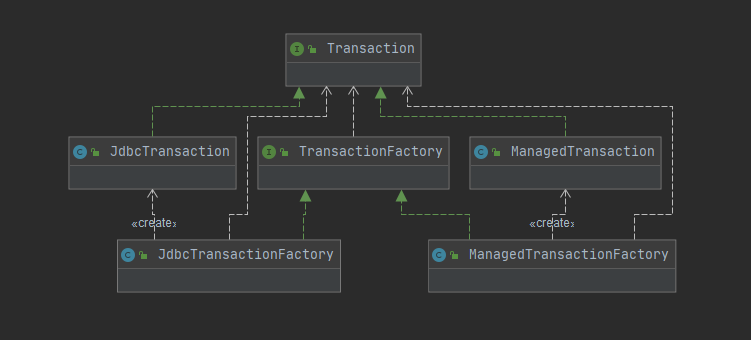

> JdbcTransaction

直接使用JDBC提供的API对事务进行操作提交或回滚，依赖于从DataSource中获取的Connection来管理事务的作用域。

注意：Mybatis一般会默认设置自动提交事务，处于性能的考虑。（如果大量的Select语句在每次执行时，都调用commit/rollback性能耗费更大）

> ManagedTransaction

方法基本上无实现，而是让**外部容器来管理事务**的整个生命周期（比如 JEE 应用服务器的上下文）。 

默认情况下它会关闭连接，然而一些容器并不希望这样，因此需要将 closeConnection 属性设置为 false 来阻止它默认的关闭行为。

==注意：如果你正在使用 Spring + MyBatis，则没有必要配置事务管理器，因为 Spring 模块会使用自带的管理器来覆盖前面的配置。Spring相关的事务：org.mybatis.spring.transaction.SpringManagedTransaction==

## Binding-Mapper

Bingding模块，主要解决了执行SQL语句，传递参数等绑定问题。

### Why Mapper？

> 有MyBatis之前-iBatis

Mybatis的前身是iBatis，使用iBatis查询一个对象时，通常的语句是:

`SqlSession.queryForObject ("findById", customerId)`

findById就是SQL语句的id标识，customerId为该SQL语句的传参。从上述语句我们可以分析出，id标识使用固定的字符串，以为着如果传递错误的id标识时，在iBaits在初始化时不能发现该id标识是错误的，不能够提前把错误暴露出去。

**解决问题：**

​	1. 建立id标识的唯一行 

​	2. 提前将错误的id标识提前暴露出去

> 有MyBatis之后

MyBatis使用Mapper接口，接口中定义SQL语句、方法名id以及传参。在MyBatis初始化过程中，会将Mapper接口对应的映射配置文件中的SQL语句相关联，如果存在无法关联的SQL语句，MyBatis就会抛出异常，帮助我们及时发现问题。

建立绑定关系之后，我们可以通过使用`Mapper.method()`来执行指定的SQL语句。

**延申问题：**

1. 我们知道接口没有方法的实现，那么调用的Mapper是MyBatis生成的代理对象
2. 那么Mapper代理对象是如何创建的，原理是？

> Mapper相关组件，也是binding模块核心组件

Binding模块包：`org.apache.ibatis.binding`

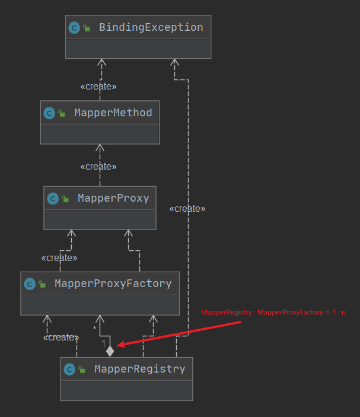

### MapperRegistry

MapperRegistry，主要用来保存MapperProxyFactory的对象类，当我们添加一个Mapper时，就会new MapperProxyFactory保存在MapperRegistry，后面用来生成Mapper的对象对象MapperProxy。

```java
public class MapperRegistry {
	// Configuration：在addMapper，初始化过程中需要用到该config
    private final Configuration config;
    // key: Mapper class类型, value: MapperProxyFactory
    private final Map<Class<?>, MapperProxyFactory<?>> knownMappers = new HashMap<>();
}
```

- getMapper

委托MapperProxyFactory生成MapperProxy对象

```java
public <T> T getMapper(Class<T> type, SqlSession sqlSession) {
  final MapperProxyFactory<T> mapperProxyFactory = (MapperProxyFactory<T>) knownMappers.get(type);
  if (mapperProxyFactory == null) {
    throw new BindingException("Type " + type + " is not known to the MapperRegistry.");
  }
  try {
    return mapperProxyFactory.newInstance(sqlSession);
  } catch (Exception e) {
    throw new BindingException("Error getting mapper instance. Cause: " + e, e);
  }
}
```

- addMapper

1. 注册MapperProxyFactory，knownMappers.put()

2. 解析该Mapper，利用MapperAnnotationBuilder和config

```java
public <T> void addMapper(Class<T> type) {
    if (type.isInterface()) {
        if (hasMapper(type)) {
            throw new BindingException("Type " + type + " is already known to the MapperRegistry.");
        }
        boolean loadCompleted = false;
        try {
            knownMappers.put(type, new MapperProxyFactory<>(type));
            // It's important that the type is added before the parser is run
            // otherwise the binding may automatically be attempted by the
            // mapper parser. If the type is already known, it won't try.
            MapperAnnotationBuilder parser = new MapperAnnotationBuilder(config, type);
            parser.parse();
            loadCompleted = true;
        } finally {
            if (!loadCompleted) {
                knownMappers.remove(type);
            }
        }
    }
}
```

### MapperProxyFactory

MapperProxyFactory主要用来生成代理对象MapperProxy。留意这里有个`methodCache`

methodCache由MapperProxyFactory传入MapperProxy，在MapperProxy方法调用时put进入。由MapperProxyFactory传入这个methodCache的原因是，Mybatis希望：*Reuse MethodHandle for default methods*。

**引申：**

Java7之后，引入了另外一种反射使用方式`MethodHandle`，关于两者的区分和使用方式：

- 性能区别

  MethodHandle性能更优，因为访问检查MethodHandle在创建已经完成，而反射在运行时才检查；

- 访问控制区别

  Reflection可以绕过Java的访问限制，可以访问和修改私有的成员

  MethodHandle尊重Java的访问限制，能访问与调用者在同一个包或者具有相应访问权限的成员。

  MyBatis使用的MethodHandle还是Reflection的判断是: `java.lang.reflect.Method#isDefault`(public的interface)

```java
public class MapperProxyFactory<T> {
	// Mapper接口的class类型
    private final Class<T> mapperInterface;
    // key: method, value: MapperMethodInvoker作用是执行代理方法, 区分不同方法修饰符使用不同的反射方式, Method或MethodHandle
    private final Map<Method, MapperMethodInvoker> methodCache = new ConcurrentHashMap<>();

    public MapperProxyFactory(Class<T> mapperInterface) {
        this.mapperInterface = mapperInterface;
    }

    public Class<T> getMapperInterface() {
        return mapperInterface;
    }

    public Map<Method, MapperMethodInvoker> getMethodCache() {
        return methodCache;
    }

    @SuppressWarnings("unchecked")
    protected T newInstance(MapperProxy<T> mapperProxy) {
        return (T) Proxy.newProxyInstance(mapperInterface.getClassLoader(), new Class[] { mapperInterface }, mapperProxy);
    }

    public T newInstance(SqlSession sqlSession) {
        final MapperProxy<T> mapperProxy = new MapperProxy<>(sqlSession, mapperInterface, methodCache);
        return newInstance(mapperProxy);
    }

}
```

### MapperProxy

MapperProxyFactory创建完代理对象MapperProxy之后，业务方法每次调用`Mapper.method()`都会进入`MapperProxy.invoke()`方法。

- invoke

```java
public class MapperProxy<T> implements InvocationHandler, Serializable {
    
    @Override
    public Object invoke(Object proxy, Method method, Object[] args) throws Throwable {
        try {
            if (Object.class.equals(method.getDeclaringClass())) { // 如果目标方法继承自 Object，则直接调用目标方法
                return method.invoke(this, args);
            } else {
                // 非继承Oject类的方法, 实际上委托给MapperMethodInvoker, 由其来调用invoke()方法
                return cachedInvoker(method).invoke(proxy, method, args, sqlSession);
            }
        } catch (Throwable t) {
            throw ExceptionUtil.unwrapThrowable(t);
        }
    }
}
```

- cachedInvoker

使用MethodHandler情况，反射调用接口中有方法实现的方法：

- 方法修饰符为`public`，并且不包含`abstract`和`static`修饰符。
- 方法所属的类是一个接口。

==其他情况使用MapperMethod，即MyBatis默认实现Mapper代理对象的方式。==

```java
private MapperMethodInvoker cachedInvoker(Method method) throws Throwable {
    try {
        // methodCache由MapperProxyFactory传入，先从缓存中获取
        return methodCache.computeIfAbsent(method, m -> {
            // public interface
            // 默认方法是公共非抽象实例方法，即具有主体的非静态方法，在接口类型中声明。
            if (m.isDefault()) {
                try {
                    // 这里根据JDK版本的不同，获取方法对应的MethodHandle的方式也有所不同
                    if (privateLookupInMethod == null) {
                        return new DefaultMethodInvoker(getMethodHandleJava8(method));
                    } else {
                        return new DefaultMethodInvoker(getMethodHandleJava9(method));
                    }
                } catch (IllegalAccessException | InstantiationException | InvocationTargetException
                         | NoSuchMethodException e) {
                    throw new RuntimeException(e);
                }
            } else {
                // 对于其他方法，会创建MapperMethod并使用PlainMethodInvoker封装
                return new PlainMethodInvoker(new MapperMethod(mapperInterface, method, sqlSession.getConfiguration()));
            }
        });
    } catch (RuntimeException re) {
        Throwable cause = re.getCause();
        throw cause == null ? re : cause;
    }
}
```

- DefaultMethodInvoker

```java
private static class DefaultMethodInvoker implements MapperMethodInvoker {
    @Override
    public Object invoke(Object proxy, Method method, Object[] args, SqlSession sqlSession) throws Throwable {
        // 首先将MethodHandle绑定到一个实例对象上，然后调用invokeWithArguments()方法执行目标方法
        return methodHandle.bindTo(proxy).invokeWithArguments(args);
    }
}
```

- PlainMethodInvoker

```java
private static class PlainMethodInvoker implements MapperMethodInvoker {
    @Override
    public Object invoke(Object proxy, Method method, Object[] args, SqlSession sqlSession) throws Throwable {
        // 直接执行MapperMethod.execute()方法完成方法调用
        return mapperMethod.execute(sqlSession, args);
    }
}
```

### MapperMethodInvoker

MapperProxy执行invoke()方法时，会寻找对应的MapperMethodInvoker，并委托给MapperMethodInvoker执行invoke方法。示例方法：`org.apache.ibatis.binding.MapperProxy#invoke`。

```java
public class MapperProxy<T> implements InvocationHandler, Serializable { 
    @Override
    public Object invoke(Object proxy, Method method, Object[] args) throws Throwable {
        cachedInvoker(method).invoke(proxy, method, args, sqlSession)
    }
}
```

`cachedInvoker(method)`会返回两种类型的MapperMethodInvoker，分别是`DefaultMethodInvoker`和`PlainMethodInvoker`。

-  DefaultMethodInvoker

  代理方法满足，`public && non-abstract && declared in an interface`使用该MapperMethodInvoker，我们使用的Mapper定义的方法是抽象的，所以不会使用该MapperMethodInvoker。

-  PlainMethodInvoker：

​	我们定义的Mapper方法就是使用这个MapperMethodInvoker。

> 相关类

如下，正在执行代理的业务方法是`MapperMethodInvoker.invoke()`。

- 对于PlainMethodInvoker来说，invoke调用的是`mapperMethod.execute(sqlSession, args)`
- 对于DefaultMethodInvoker来说，invoke调用的是`methodHandle.bindTo(proxy).invokeWithArguments(args)`

```java
interface MapperMethodInvoker {
    Object invoke(Object proxy, Method method, Object[] args, SqlSession sqlSession) throws Throwable;
}

private static class PlainMethodInvoker implements MapperMethodInvoker {
    private final MapperMethod mapperMethod;

    public PlainMethodInvoker(MapperMethod mapperMethod) {
        super();
        this.mapperMethod = mapperMethod;
    }

    @Override
    public Object invoke(Object proxy, Method method, Object[] args, SqlSession sqlSession) throws Throwable {
        return mapperMethod.execute(sqlSession, args);
    }
}

private static class DefaultMethodInvoker implements MapperMethodInvoker {
    private final MethodHandle methodHandle;

    public DefaultMethodInvoker(MethodHandle methodHandle) {
        super();
        this.methodHandle = methodHandle;
    }

    @Override
    public Object invoke(Object proxy, Method method, Object[] args, SqlSession sqlSession) throws Throwable {
        return methodHandle.bindTo(proxy).invokeWithArguments(args);
    }
}
```

### MapperMethod

由上述可知对于调用方法是默认方法（**public, non-abstract, declared in an interface，即声明在接口中, 公共非抽象的方法**），MyBatis会采用MethodHandle的方式进行代理调用；与之相反，MyBatis就采用MapperMethod方式来调用。

MapperMethod即是MyBatis用代理对象执行SQL，返回Object result的地方，执行方法：`org.apache.ibatis.binding.MapperMethod#execute`

```java
public class MapperMethod {
  private final SqlCommand command;
  private final MethodSignature method;
}
```

#### SqlCommand

SqlCommand主要是保存执行SQL的唯一标识（package.InterfaceName.methodName），以及执行SQL命令的类型，如：`INSERT, UPDATE, DELETE, SELECT, FLUSH`。

> 找到匹配的MappedStatement

两个方法 -> mapperInterface 指定的接口（父），declaringClass 方法声明的类（可能是子）

查找逻辑，主要是用id标识configuration中去寻找，寻找方法：`org.apache.ibatis.binding.MapperMethod.SqlCommand#resolveMappedStatement`

1. 从mapperInterface中获取，有则return;
2. `if (mapperInterface.equals(declaringClass))`，即方法声明的类就是父的接口，return null;
3. `if (declaringClass.isAssignableFrom(superInterface))`，即方法声明的类有父类接口，则递归从父类中查找。

```java
public static class SqlCommand {
	// 构造方法中从初始化阶段解析好的MappedStatement中获取id标识和命令类型
    // id标识：全路径包名 + 类名 + 方法名
    private final String name;	// id标识
    private final SqlCommandType type; // SQL命令类型

    public SqlCommand(Configuration configuration, Class<?> mapperInterface, Method method) {
        final String methodName = method.getName();
        final Class<?> declaringClass = method.getDeclaringClass();
        // 找到匹配的MappedStatement：1. 从指定的mapperInterface
        // MappedStatement就是Mapper.xml解析之后的对象，包括SQL语句，ResultMap等
        MappedStatement ms = resolveMappedStatement(mapperInterface, methodName, declaringClass, configuration);
        if (ms == null) {
            if (method.getAnnotation(Flush.class) != null) {
                name = null;
                type = SqlCommandType.FLUSH;
            } else {
                throw new BindingException("Invalid bound statement (not found): "
                                           + mapperInterface.getName() + "." + methodName);
            }
        } else {
            name = ms.getId();
            type = ms.getSqlCommandType();
            if (type == SqlCommandType.UNKNOWN) {
                throw new BindingException("Unknown execution method for: " + name);
            }
        }
    }
}
```

#### MethodSignature

MethodSignature封装执行方法的信息。

```java
public static class MethodSignature {

    private final boolean returnsMany; // 返回值是否为集合或数组
    private final boolean returnsMap; // 返回值是否为Map
    private final boolean returnsVoid; // 返回值是否为void
    private final boolean returnsCursor; // 返回值是否为Cursor
    private final boolean returnsOptional; // 返回值是否为Optional 
    private final Class<?> returnType; // 方法返回值的具体类型
    private final String mapKey;// 如果返回值是Map类型, 可以注解指定 @MapKey 的列名 
    private final Integer resultHandlerIndex; // 标记该方法参数列表中 ResultHandler类型参数的位置, 唯一性校验
    private final Integer rowBoundsIndex; // 标记该方法参数列表中 RowBounds类型参数的位置, 唯一性校验
    /**
     * 这是一个处理 Mapper接口中方法参数列表的解析器，它使用了一个 SortedMap<Integer, String>
     * 类型的容器，记录了参数在参数列表中的位置索引与参数名之间的对应关系，key参数 在参数列表中的索引位置，
     * value参数名(参数名可用@Param注解指定，默认使用参数索引作为其名称)
     * 
     * names 集合会跳过 RowBounds 类型以及 ResultHandler 类型的参数
     */
    private final ParamNameResolver paramNameResolver;// 解析方法参数列表的工具类。

    public MethodSignature(Configuration configuration, Class<?> mapperInterface, Method method) {
        Type resolvedReturnType = TypeParameterResolver.resolveReturnType(method, mapperInterface);
        if (resolvedReturnType instanceof Class<?>) {
            this.returnType = (Class<?>) resolvedReturnType;
        } else if (resolvedReturnType instanceof ParameterizedType) {
            this.returnType = (Class<?>) ((ParameterizedType) resolvedReturnType).getRawType();
        } else {
            this.returnType = method.getReturnType();
        }
        this.returnsVoid = void.class.equals(this.returnType);
        this.returnsMany = configuration.getObjectFactory().isCollection(this.returnType) || this.returnType.isArray();
        this.returnsCursor = Cursor.class.equals(this.returnType);
        this.returnsOptional = Optional.class.equals(this.returnType);
        this.mapKey = getMapKey(method);
        this.returnsMap = this.mapKey != null;
        this.rowBoundsIndex = getUniqueParamIndex(method, RowBounds.class);
        this.resultHandlerIndex = getUniqueParamIndex(method, ResultHandler.class);
        this.paramNameResolver = new ParamNameResolver(configuration, method);
    }
}
```

##### ParamNameResolver

SQL参数解析器，其中 names 字段（SortedMap<Integer, String>类型）记录了各个参数在参数列表中的位置以及参数名称，其中 key 是参数在参数列表中的位置索引，value 为参数的名称。

比如：我们日常使用标记参数@Param，#{param1}, #{paramName}, #{0}, #{1}等等用法，就是ParamNameResolver负责解析存储和获取等。

> 构造方法保存参数信息

```java
public class ParamNameResolver {
     // aMethod(@Param("M") int a, @Param("N") int b) ->  {{0, "M"}, {1, "N"}}
	// aMethod(int a, int b) ->  {{0, "arg0"}, {1, "arg1"}}
	// aMethod(int a, RowBounds rb, int b) -> {{0, "arg0"}, {2, "arg1"}}
    private final SortedMap<Integer, String> names;

    // 构造方法
    public ParamNameResolver(Configuration config, Method method) {
        final Class<?>[] paramTypes = method.getParameterTypes();
        final Annotation[][] paramAnnotations = method.getParameterAnnotations();
        final SortedMap<Integer, String> map = new TreeMap<>();
        int paramCount = paramAnnotations.length;
        // get names from @Param annotations
        for (int paramIndex = 0; paramIndex < paramCount; paramIndex++) {
            // 跳过 RowBounds 类型以及 ResultHandler 类型的参数
            if (isSpecialParameter(paramTypes[paramIndex])) {
                // skip special parameters
                continue;
            }
            String name = null;
            // 解析@Param注解，优先级高
            for (Annotation annotation : paramAnnotations[paramIndex]) {
                if (annotation instanceof Param) {
                    hasParamAnnotation = true;
                    name = ((Param) annotation).value();
                    break;
                }
            }
            // 没有指定@Param注解时
            if (name == null) {
                // @Param was not specified.
                if (config.isUseActualParamName()) {
                    name = getActualParamName(method, paramIndex);
                }
                if (name == null) {
                    // use the parameter index as the name ("0", "1", ...)
                    // gcode issue #71
                    name = String.valueOf(map.size());
                }
            }
            map.put(paramIndex, name);
        }
        names = Collections.unmodifiableSortedMap(map);
    }
}
```

> 调用获取参数信息

```java
public Object getNamedParams(Object[] args) {
    final int paramCount = names.size();
    if (args == null || paramCount == 0) {
        return null;
    } else if (!hasParamAnnotation && paramCount == 1) {
        return args[names.firstKey()];
    } else {
        final Map<String, Object> param = new ParamMap<>();
        int i = 0;
        for (Map.Entry<Integer, String> entry : names.entrySet()) {
            // entry: 0 -> name
            param.put(entry.getValue(), args[entry.getKey()]);
            // add generic param names (param1, param2, ...)
            final String genericParamName = GENERIC_NAME_PREFIX + (i + 1);
            // ensure not to overwrite parameter named with @Param
            if (!names.containsValue(genericParamName)) {
                param.put(genericParamName, args[entry.getKey()]);
            }
            i++;
        }
        return param;
    }
}
```

从获取的Param参数可以看到，param1和param2都会解析一份，因此我们可以在sql总使用#{param1}，#{param2}来获取我们指定的参数。

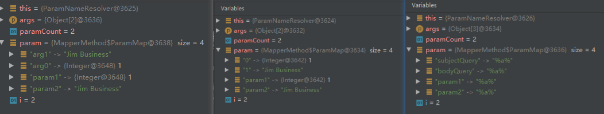

##### execute

execute：SQL参数绑定和结果集绑定的方法，`org.apache.ibatis.binding.MapperMethod#execute`

当我们调用`Mapper.method()`时，我们大致会经历如下的流程：

业务方法`Mapper.method()`	=>	`MapperProxyFactory.newInstance`	=>	`MapperProxy.invoke()` 	=>	

`PlainMethodInvoker.invoke()`	=>	 `MapperMethod.execute()`。

> execute

```java
public Object execute(SqlSession sqlSession, Object[] args) {
    Object result;
    switch (command.getType()) {
        case INSERT: {
            // 从paramNameResolver中获取参数，也就是调用getNamedParams()方法
            Object param = method.convertArgsToSqlCommandParam(args);
            // 对结果的类型进行转换，INSERT,UPDATE,DELETE 类型返回主要是void, Integer, Long, Boolean等， 
            // rowCountResult()方法对其转换
            result = rowCountResult(sqlSession.insert(command.getName(), param));
            break;
        }
        case UPDATE: {
            Object param = method.convertArgsToSqlCommandParam(args);
            result = rowCountResult(sqlSession.update(command.getName(), param));
            break;
        }
        case DELETE: {
            Object param = method.convertArgsToSqlCommandParam(args);
            result = rowCountResult(sqlSession.delete(command.getName(), param));
            break;
        }
        case SELECT:
            if (method.returnsVoid() && method.hasResultHandler()) {
                // 处理返回值为 void 且 ResultSet 通过 ResultHandler 处理的方法
                executeWithResultHandler(sqlSession, args);
                result = null;
            } else if (method.returnsMany()) {
                // 处理返回值为集合 或 数组的方法
                result = executeForMany(sqlSession, args);
            } else if (method.returnsMap()) {
                // 处理返回值为 Map 的方法
                result = executeForMap(sqlSession, args);
            } else if (method.returnsCursor()) {
                // 处理返回值为 Cursor 的方法
                result = executeForCursor(sqlSession, args);
            } else {
                // 处理返回值为单一对象的方法
                Object param = method.convertArgsToSqlCommandParam(args);
                result = sqlSession.selectOne(command.getName(), param);
                if (method.returnsOptional()
                    && (result == null || !method.getReturnType().equals(result.getClass()))) {
                    result = Optional.ofNullable(result);
                }
            }
            break;
        case FLUSH:
            result = sqlSession.flushStatements();
            break;
        default:
            throw new BindingException("Unknown execution method for: " + command.getName());
    }
    if (result == null && method.getReturnType().isPrimitive() && !method.returnsVoid()) {
        throw new BindingException("Mapper method '" + command.getName()
                                   + " attempted to return null from a method with a primitive return type (" + method.getReturnType() + ").");
    }
    return result;
}
```

> rowCountResult

当执行 `insert`、`update`、`delete` 类型的 sql 语句 时，其执行结果都要经过本方法处理

```java
private Object rowCountResult(int rowCount) {
    final Object result;
    if (method.returnsVoid()) {
        // 返回值为 void 时
        result = null;
    } else if (Integer.class.equals(method.getReturnType()) || Integer.TYPE.equals(method.getReturnType())) {
        // 返回值为 Integer 时
        result = rowCount;
    } else if (Long.class.equals(method.getReturnType()) || Long.TYPE.equals(method.getReturnType())) {
        // 返回值为 Long 时
        result = (long)rowCount;
    } else if (Boolean.class.equals(method.getReturnType()) || Boolean.TYPE.equals(method.getReturnType())) {
        // 返回值为 Boolean 时
        result = rowCount > 0;
    } else {
        throw new BindingException("Mapper method '" + command.getName() + "' has an unsupported return type: " + method.getReturnType());
    }
    return result;
}
```

> executeWithResultHandler

如果 Mapper接口 中定义的方法准备使用 ResultHandler 处理查询结果集，则通过此方法处理。

```java
private void executeWithResultHandler(SqlSession sqlSession, Object[] args) {
	// command.getName() => 全类名.方法名 （org.apache.ibatis.binding.BoundBlogMapper.collectRangeBlogs）
    //  获取 sql语句对应的 MappedStatement 对象，该对象中记录了 sql 语句相关信息
    MappedStatement ms = sqlSession.getConfiguration().getMappedStatement(command.getName());
    // 当使用 ResultHandler 处理结果集时，必须指定 ResultMap 或 ResultType
    if (!StatementType.CALLABLE.equals(ms.getStatementType()) 
        && void.class.equals(ms.getResultMaps().get(0).getType())) {
        throw new BindingException("method " + command.getName()
                                   + " needs either a @ResultMap annotation, a @ResultType annotation,"
                                   + " or a resultType attribute in XML so a ResultHandler can be used as a parameter.");
    }
    // 从paramNameResolver中获取参数，也就是调用getNamedParams()方法
    Object param = method.convertArgsToSqlCommandParam(args);
    // 如果实参列表中有 RowBounds 类型参数，rowBoundsIndex != null
    if (method.hasRowBounds()) {
        // 从 args参数列表 中获取 RowBounds对象
        RowBounds rowBounds = method.extractRowBounds(args);
         // 执行查询，并用指定的 ResultHandler 处理结果对象
        sqlSession.select(command.getName(), param, rowBounds, method.extractResultHandler(args));
    } else {
        sqlSession.select(command.getName(), param, method.extractResultHandler(args));
    }
}
```

> executeForMany

如果 Mapper 接口中对应方法的返回值为集合(Collection接口实现类) 或 数组，则调用本方法将结果集处理成相应的集合或数组。

```java
private <E> Object executeForMany(SqlSession sqlSession, Object[] args) {
    List<E> result;
    Object param = method.convertArgsToSqlCommandParam(args);
    // 参数列表中是否有 RowBounds类型的参数，rowBoundsIndex != null
    if (method.hasRowBounds()) {
        RowBounds rowBounds = method.extractRowBounds(args);
        // 这里使用了 selectList()方法 进行查询，所以返回的结果集就是 List类型的
        result = sqlSession.selectList(command.getName(), param, rowBounds);
    } else {
        result = sqlSession.selectList(command.getName(), param);
    }
    // 将结果集转换为数组或 Collection集合
    // issue #510 Collections & arrays support
    if (!method.getReturnType().isAssignableFrom(result.getClass())) {
        if (method.getReturnType().isArray()) {
            return convertToArray(result);
        } else {
            return convertToDeclaredCollection(sqlSession.getConfiguration(), result);
        }
    }
    return result;
}
```

> executeForMap

如果 Mapper接口 中对应方法的返回值为类型为 Map，则调用此方法执行 sql语句。

```java
private <K, V> Map<K, V> executeForMap(SqlSession sqlSession, Object[] args) {
    Map<K, V> result;
    Object param = method.convertArgsToSqlCommandParam(args);
    if (method.hasRowBounds()) {
        RowBounds rowBounds = method.extractRowBounds(args);
        // 注意这里调用的是 SqlSession 的 selectMap()方法，返回的是一个 Map类型结果集
        result = sqlSession.selectMap(command.getName(), param, method.getMapKey(), rowBounds);
    } else {
        result = sqlSession.selectMap(command.getName(), param, method.getMapKey());
    }
    return result;
}
```

> executeForCursor

本方法与上面的 executeForMap()方法 类似，只不过 sqlSession 调用的是 selectCursor()。

```java
private <T> Cursor<T> executeForCursor(SqlSession sqlSession, Object[] args) {
    Cursor<T> result;
    Object param = method.convertArgsToSqlCommandParam(args);
    if (method.hasRowBounds()) {
        RowBounds rowBounds = method.extractRowBounds(args);
        result = sqlSession.selectCursor(command.getName(), param, rowBounds);
    } else {
        result = sqlSession.selectCursor(command.getName(), param);
    }
    return result;
}
```

## 缓存管理

缓存管理相关类所在包：org.apache.ibatis.cache


### PerpetualCache

Cache的具体实现类，装饰类也是基于此来封装。可以看到PerpetualCache使用Map作为缓存，id作为唯一标识（留意重写的equals和hashCode方法，都是基于id的）。

```java
public class PerpetualCache implements Cache {
  private final String id;
  private final Map<Object, Object> cache = new HashMap<>();
}
```

### blockingCache

blockingCache在原有的基础上**增加一个阻塞获取缓存**功能。具体实现是：每次获取缓存前都需要根据key来获取锁trylock，如果获取不到则阻塞等待。

从`getObject(Object key)`方法可以看到，如果获取的value为null，则一直lock，直到调用当前线程调用`putObject(Object key, Object value)`，或者有线程调用`removeObject(Object key)`才会释放锁。**（坑点）**

removeObject(Object key)：这个方法命名很奇葩，但是人家还是写了注释的。（despite of its name, this method is called only to release locks）

```java
public class BlockingCache implements Cache {
    // 超时时间
    private long timeout;
    // cache的实现
    private final Cache delegate;
    // 保存锁的Map
    private final ConcurrentHashMap<Object, ReentrantLock> locks;

    @Override
    public void putObject(Object key, Object value) {
        try {
            delegate.putObject(key, value);
        } finally {
            releaseLock(key);
        }
    }

    @Override
    public Object getObject(Object key) {
        acquireLock(key);
        Object value = delegate.getObject(key);
        if (value != null) {
            releaseLock(key);
        }
        return value;
    }
}
```

### FifoCache

FifoCache：先进先出缓存，first in, first out cache。该类缓存需要注意一下问题：

- 维护队列
- 队列大小
- 缓存过期

源码中可知，FifoCache使用LinkedList来维护队列的顺序，队列大小默认为1024。在putObject时需要维持队列的大小，超出指定size时，需要remove oldest object。

```java
public class FifoCache implements Cache {

    private final Cache delegate;
    private final Deque<Object> keyList;
    private int size;

    public FifoCache(Cache delegate) {
        this.delegate = delegate;
        this.keyList = new LinkedList<>();
        this.size = 1024;
    }
    
    @Override
    public void putObject(Object key, Object value) {
        cycleKeyList(key);
        delegate.putObject(key, value);
    }

    @Override
    public Object getObject(Object key) {
        return delegate.getObject(key);
    }

    @Override
    public Object removeObject(Object key) {
        return delegate.removeObject(key);
    }

    @Override
    public void clear() {
        delegate.clear();
        keyList.clear();
    }

    private void cycleKeyList(Object key) {
        keyList.addLast(key);
        if (keyList.size() > size) {
            Object oldestKey = keyList.removeFirst();
            delegate.removeObject(oldestKey);
        }
    }
}
```

### LoggingCache

LoggingCache：以debug日志形式，记录缓存的命中率，可以配合其他装饰器缓存使用。

缺点是，没有提供重置方法，没有很直观地算出某段时间的缓存命中率。

```java
public class LoggingCache implements Cache {

    private final Log log;
    private final Cache delegate;
    protected int requests = 0;
    protected int hits = 0;

    public LoggingCache(Cache delegate) {
        this.delegate = delegate;
        this.log = LogFactory.getLog(getId());
    }

    @Override
    public Object getObject(Object key) {
        requests++;
        final Object value = delegate.getObject(key);
        if (value != null) {
            hits++;
        }
        if (log.isDebugEnabled()) {
            log.debug("Cache Hit Ratio [" + getId() + "]: " + getHitRatio());
        }
        return value;
    }

    private double getHitRatio() {
        return (double) hits / (double) requests;
    }
}
```

### LruCache

LruCache：最近使用缓存，least recently used cache。该类缓存需要注意一下问题：

- 维护队列
- 队列大小
- 缓存清理
- 缓存维护

实际上，LinkedHashMap已经维护好了LRU的规则，LruCache只需要维护参与LRU的key，重写`removeEldestEntry()`方法，触发LRU维护的方法，即getObject()，就可以实现LruCahce。

```java
public class LruCache implements Cache {

    private final Cache delegate;
    private Map<Object, Object> keyMap;
    private Object eldestKey;

    public LruCache(Cache delegate) {
        this.delegate = delegate;
        setSize(1024);
    }

    public void setSize(final int size) {
        // access = true， 代表getObject时维护链表的LRU有序性
        keyMap = new LinkedHashMap<Object, Object>(size, .75F, true) {
            private static final long serialVersionUID = 4267176411845948333L;
            // 父类LinkedHashMap默认返回false，需要按需重写
            @Override
            protected boolean removeEldestEntry(Map.Entry<Object, Object> eldest) {
                boolean tooBig = size() > size;
                if (tooBig) {
                    eldestKey = eldest.getKey();
                }
                return tooBig;
            }
        };
    }

    @Override
    public void putObject(Object key, Object value) {
        delegate.putObject(key, value);
        cycleKeyList(key);
    }

    @Override
    public Object getObject(Object key) {
        keyMap.get(key); //touch
        return delegate.getObject(key);
    }

    @Override
    public Object removeObject(Object key) {
        return delegate.removeObject(key);
    }

    @Override
    public void clear() {
        delegate.clear();
        keyMap.clear();
    }

    private void cycleKeyList(Object key) {
        keyMap.put(key, key);
        if (eldestKey != null) {
            delegate.removeObject(eldestKey);
            eldestKey = null;
        }
    }
}
```

### ScheduledCache

懒式清理缓存，当调用`getObejct()`, `putObejct()`, `removeObject()`方法时，判断缓存过期时间，若过期了则触发缓存清理。

### SerializedCache

序列化缓存，`putObject()`时序列化相应的value，`getObject()`时反序列化value。

> 摘取ChatGPT对序列化的回答：
>
> 
>
> Java中的序列化是将对象转换为字节流的过程，可以将对象在网络中进行传输或者存储到文件中。序列化的主要作用是实现对象的持久化和跨网络传输。
>
> 
>
> 以下是一些常见的序列化应用场景：
>
> 1. 对象持久化：通过序列化，可以将对象保存到磁盘上，以便在程序重新启动时恢复对象的状态。这在需要长期保存对象数据或者需要对对象进行传输的情况下非常有用。
> 2. 网络通信：在分布式系统或者客户端-服务器架构中，可以使用序列化将对象转换为字节流，然后通过网络进行传输。接收方可以将字节流反序列化为对象，以便恢复原始对象。
> 3. 缓存：序列化还可以用于将对象存储在缓存中，以提高性能。当从缓存中获取对象时，可以通过反序列化来恢复对象，而不必重新创建对象。
> 4. 远程方法调用（RPC）：序列化在远程方法调用中发挥重要作用。客户端可以将方法参数对象序列化为字节流，然后通过网络将其发送给远程服务器执行。服务器接收到字节流后，可以将其反序列化为对象，并执行相应的方法操作。
>
> 
>
> 相比于使用 JSON 进行序列化，Java 中的序列化（通常是通过 Java 序列化机制实现的）具有以下优点和缺点：
>
> 优点：
>
> 1. 简单易用：Java 序列化是 Java 语言内置的机制，使用起来相对简单，无需额外的库或依赖。
> 2. 对象完整性：Java 序列化可以完整地保存对象的状态，包括对象的字段值、引用关系和类的层次结构，因此可以轻松地保存和恢复对象的完整性。
> 3. 适用性广泛：Java 序列化可以序列化几乎所有的 Java 对象，包括自定义类和标准库中的类，无需额外的配置。
> 4. 支持循环引用：Java 序列化机制可以处理对象之间的循环引用，保证在序列化和反序列化过程中对象的引用关系不会丢失。
>
> 缺点：
>
> 1. **可读性差**：序列化后的字节流是二进制数据，不易于人类阅读和理解。相比之下，JSON 是一种文本格式，具有更好的可读性和可调试性。
> 2. **兼容性限制**：Java 序列化依赖于对象的类结构，如果对象的类发生变化（例如添加、删除或修改字段），就可能导致序列化和反序列化失败。这限制了跨语言和跨平台的兼容性。
> 3. **性能开销**：相对于 JSON 或其他基于文本的序列化格式，Java 序列化通常会产生更大的字节流，并且序列化和反序列化的过程涉及更多的计算和IO操作，可能导致性能开销较高。
> 4. **版本问题**：Java 序列化对类的版本敏感，如果序列化时的类版本与反序列化时的类版本不匹配，会导致反序列化失败。这就需要开发人员在类的演进过程中进行额外的管理和维护。

### SoftCache

软引用cache，GC后会回收这部分的cache。

很多场景下，我们的程序需要在一个对象被 GC 时得到通知，引用队列就是用于收集这些信息的队列。**在创建 SoftReference 对象 时，可以为其关联一个引用队列，当 SoftReference 所引用的对象被 GC 时， JVM 就会将该 SoftReference 对象 添加到与之关联的引用队列中**。当需要检测这些通知信息时，就可以从引用队列中获取这些 SoftReference 对象。不仅是 SoftReference，弱引用和虚引用都可以关联相应的队列。

**[bug]**

==这个hardLinksToAvoidGarbageCollection非常费解，会不会内存泄漏呀，同时get相同key时还能加入这个队列？==

这么多年如果没人用这个cache，同时hardLinksToAvoidGarbageCollection也没暴露出，MyBatis就不管了，哈哈哈。

```java
public class SoftCache implements Cache {
    // 强引用队列，FIFO保存不被GC的Object，目前MyBatis并没有将其暴露，所以里面保存的热点数据也是莫有用
    private final Deque<Object> hardLinksToAvoidGarbageCollection;
    // 关联弱引用队列，用于记录已经被 GC 的缓存项所对应的 SoftEntry对象
    private final ReferenceQueue<Object> queueOfGarbageCollectedEntries;
    private final Cache delegate;
    // 强引用队列大小
    private int numberOfHardLinks;


    @Override
    public void putObject(Object key, Object value) {
        removeGarbageCollectedItems();
        delegate.putObject(key, new SoftEntry(key, value, queueOfGarbageCollectedEntries));
    }

    @Override
    public Object getObject(Object key) {
        Object result = null;
        @SuppressWarnings("unchecked") // assumed delegate cache is totally managed by this cache
        SoftReference<Object> softReference = (SoftReference<Object>) delegate.getObject(key);
        if (softReference != null) {
            result = softReference.get();
            if (result == null) {
                delegate.removeObject(key);
            } else {
                // 如果弱引用不为空，则将该引用添加到强引用队列中
                // See #586 (and #335) modifications need more than a read lock
                synchronized (hardLinksToAvoidGarbageCollection) {
                    hardLinksToAvoidGarbageCollection.addFirst(result);
                    if (hardLinksToAvoidGarbageCollection.size() > numberOfHardLinks) {
                        hardLinksToAvoidGarbageCollection.removeLast();
                    }
                }
            }
        }
        return result;
    }
    
    @Override
    public Object removeObject(Object key) {
        removeGarbageCollectedItems();
        return delegate.removeObject(key);
    }

    @Override
    public void clear() {
        synchronized (hardLinksToAvoidGarbageCollection) {
            hardLinksToAvoidGarbageCollection.clear();
        }
        removeGarbageCollectedItems();
        delegate.clear();
    }

    private void removeGarbageCollectedItems() {
        SoftEntry sv;
        while ((sv = (SoftEntry) queueOfGarbageCollectedEntries.poll()) != null) {
            delegate.removeObject(sv.key);
        }
    }

    private static class SoftEntry extends SoftReference<Object> {
        private final Object key;

        SoftEntry(Object key, Object value, ReferenceQueue<Object> garbageCollectionQueue) {
            super(value, garbageCollectionQueue);
            this.key = key;
        }
    }
}
```

### 缓存构建

构建方法：`org.apache.ibatis.builder.MapperBuilderAssistant#useNewCache`

缓存构建过程在Mybatis初始化的流程来完成，xml启动关联`<cache>`标签，注解启动关联注解`@CacheNamespace`。

### 缓存机制

参考文档：https://tech.meituan.com/2018/01/19/mybatis-cache.html

Mybatis使用一二级缓存来减缓数据库访问的压力，通常情况下我们开发人员基本上都是使用Mybatis的默认配置，对于缓存来说也不例外。

Mybatis默认开启一级缓存，二级缓存的开启可看<缓存构建>章节。

> 缓存延申的疑问：
>
> Mybatis默认开启的缓存机制，会不会对GC造成压力和增加FULL GC的频次呢？
>
> 
>
> 一级缓存不会，因为会话结束之后缓存被清理了
>
> 二级缓存就难说了

#### 一级缓存

##### 原理

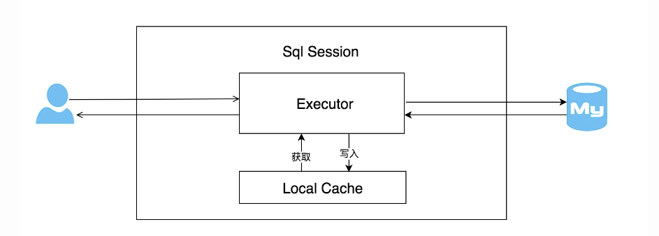

同一个会话中，有可能执行多次查询条件完全相同的SQL，MyBatis提供的一级缓存可以减少对数据库查询的次数。相同的SQL语句，会优先命中一级缓存。由此可知，一级缓存是Session级别的。

==缓存是Session级别的，意味者其他Session更新了数据，而本次的Session读取到脏数据。（尤其是我们的服务是分布式的时候）==


每个SqlSession中持有了Executor，每个Executor中有一个LocalCache。当用户发起查询时，MyBatis根据当前执行的语句生成`MappedStatement`，在Local Cache进行查询，如果缓存命中的话，直接返回结果给用户，如果缓存没有命中的话，查询数据库，结果写入`Local Cache`，最后返回结果给用户。具体实现类的类关系图如上，伪代码如下。

当Executor进行提交commit或回滚rollback时，自动清空LocalCache，所以LocalCache属于Session级别。

```java
protected PerpetualCache localCache;

public <E> List<E> query(MappedStatement ms, Object parameter, RowBounds rowBounds, ResultHandler resultHandler, CacheKey key, BoundSql boundSql) throws SQLException {
  // ms非select语句都要刷新缓存
  if (ms.isFlushCacheRequired()) {
    clearLocalCache();
  }
  // 查缓存
  list = localCache.getObject(key);
  if (list != null) {
    // 这个主要是处理存储过程用的
    handleLocallyCachedOutputParameters(ms, key, parameter, boundSql);
  } else {
    // 缓存为空，查数据库并设置缓存
    list = queryFromDatabase(ms, parameter, rowBounds, resultHandler, key, boundSql);
    localCache.putObject(key, EXECUTION_PLACEHOLDER);
  }

  // STATEMENT级别，每次查询结束都清掉缓存
  if (configuration.getLocalCacheScope() == LocalCacheScope.STATEMENT) {
    clearLocalCache(); // issue #482
  }

  return list;
}
```

##### 配置与使用

Mybatis-config.xml配置如下，可选`SESSION`或者`STATEMENT`，默认是`SESSION`级别。

- SESSION：在一个MyBatis会话中执行的所有语句，都会共享这一个缓存
- STATEMENT：缓存只对当前执行的这一个`Statement`有效（每次查询结束清掉缓存）。

```xml
<!-- 注意这个是开启二级缓存, 一级缓存默认开启, 没有提供修改的入口 -->
<setting name="cacheEnabled" value="true"/>
<!-- 设置一级缓存的级别 -->
<setting name="localCacheScope" value="SESSION"/>
```

#### 二级缓存

##### 原理

二级缓存是用来解决不同的SqlSession之间需要共享缓存的问题。

开启二级缓存后，会使用CachingExecutor装饰Executor，进入一级缓存的查询流程前，现在CachingExecutor进行二级缓存的查询，如下图：

当开启缓存后，数据的查询执行的流程就是 二级缓存 -> 一级缓存 -> 数据库。


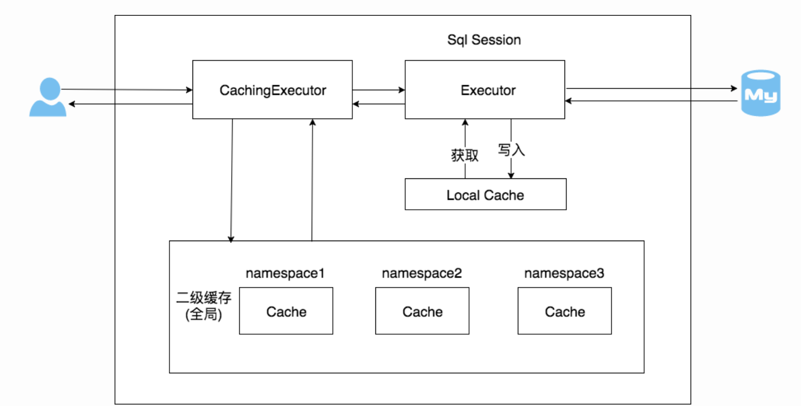

CachingExecutor二级缓存实现伪代码如下：

```java
public <E> List<E> query(MappedStatement ms, Object parameterObject, RowBounds rowBounds, ResultHandler resultHandler, CacheKey key, BoundSql boundSql) throws SQLException {
  // 从MappedStatement中获取缓存，同一个MappedStatement是同个缓存
  Cache cache = ms.getCache();
  if (cache != null) {
    flushCacheIfRequired(ms);
    if (ms.isUseCache() && resultHandler == null) { 
      ensureNoOutParams(ms, parameterObject, boundSql);
      // 如果没有脏数据，则从缓存中获取，加锁
      if (!dirty) {
        cache.getReadWriteLock().readLock().lock();
        try {
          @SuppressWarnings("unchecked")
          List<E> cachedList = (List<E>) cache.getObject(key);
          if (cachedList != null) return cachedList;
        } finally {
          cache.getReadWriteLock().readLock().unlock();
        }
      }
      // 二级缓存获取不到，就从simpleExecutor中执行（查询一级缓存或查数据库等）
      List<E> list = delegate.<E> query(ms, parameterObject, rowBounds, resultHandler, key, boundSql);
      // 提交缓存到tcm，注意tcm需要二阶段提交，并没有真正保存的cache中，等到tcm.commit/rollback时才会提交缓存
      tcm.putObject(cache, key, list); // issue #578. Query must be not synchronized to prevent deadlocks
      return list;
    }
  }
  return delegate.<E>query(ms, parameterObject, rowBounds, resultHandler, key, boundSql);
}
```

> 注意：
>
> 1. 二级缓存的cache保存在MappedStatement中，但是在同一个nameSpace下注入的cache都是同一个，这样达到cache在不同Session之间共享的目的。
> 2. 同时所有的cache都在Configuration中的cacheMap保存，key就是NameSpace，其中我们可以通过`<cache-ref>`标签来指定NameSpace，进而获取对应的cache。
> 3. 二级缓存，当Session提交之后才会put到二级缓存，否则缓存是空的。而一级缓存没有此限制。

##### 配置与使用

> 开启二级缓存，必须满足以下2个条件才生效

**如果已经配置以下 2 个条件，相当于在 Mapper 命名空间中创建了一个 cache 对象，但是要注意此时 cache 对象是空的，还没有任何缓存的加入。**

1. Mybatis-config.xml中配置	=> 	全局开启二级缓存，创建缓存 Executor

```xml
<setting name="cacheEnabled" value="true"/>
```

2. 在Mapper文件中配置cache或者cache-ref	=> 用于声明这个namespace使用二级缓存

```xml
<!-- 该NameSpace开启二级缓存 -->
<cache/>   
<!-- cache-ref代表引用别的命名空间的Cache配置，两个命名空间的操作使用的是同一个Cache。 -->
<!-- 比如这里的 cache-ref，使用 mapper.StudentMapper 命名空间的 cache，不是自身命名空间的 cache -->
<cache-ref namespace="mapper.StudentMapper"/>
```

**注意：**cache-ref

相当于多个NameSpace共用同一个缓存，缓存粒度更粗，意味这多个Mapper NameSpace下的所有操作都会对缓存使用造成影响。

3. sql 标签中使用二级缓存

```xml
<select ... flushCache="false" useCache="true"/>
<insert ... flushCache="true"/>
<update ... flushCache="true"/>
<delete ... flushCache="true"/>
```

# 核心处理层

## 动态SQL

MyBatis 在初始化过程中，会将 Mapper 映射文件中定义的 SQL 语句解析成 `SqlSource` 对象，其中动态标签、SQL 语句文本等，会被解析成对应类型的 `SqlNode` 对象。

我们知道仅用于一个个的 SqlNode 还不足以得到我们需要执行的 SQL 。真正执行的 SQL 是已经绑定用户参数的可执行的SQL 。这是需要将这些 SqlNode 组织起来并绑定参数的功能类。

而MyBatis中的`SqlSource`承担此功能（注意：这里的 SqlSource 只是拥有 SqlNode 的引用而已，真正触发动态 SQL 的拼接是`SqlSource.getBoundSql()` 的调用）。

### DynamicContext

MyBatis 解析**动态** SQL 的链路很长，过程中需要将解析结果缓存，供上下文使用，承担该上下文的对象就是，`org.apache.ibatis.scripting.xmltags.DynamicContext`。

构建时机：MyBatis 启动过程中，在解析  Mapper 中 SQL 时构建，具体入口：`org.apache.ibatis.builder.xml.XMLMapperBuilder#buildStatementFromContext(java.util.List<org.apache.ibatis.parsing.XNode>)`

==**注：**==其中负责解析 SQL 语句地方：`org.apache.ibatis.builder.xml.XMLStatementBuilder#parseStatementNode`。如下可以看到解析完的 SQL 会返回一个 `SqlSource`。（各类的 SqlNode 也在这方法里面完成组装。）

```java
// Parse the SQL (pre: <selectKey> and <include> were parsed and removed)
SqlSource sqlSource = langDriver.createSqlSource(configuration, context, parameterTypeClass);
```

- 上下文 DynamicContext 保存的信息

```java
public class DynamicContext {
	// 绑定实参的key
    public static final String PARAMETER_OBJECT_KEY = "_parameter";
    public static final String DATABASE_ID_KEY = "_databaseIdd

    static {
        OgnlRuntime.setPropertyAccessor(ContextMap.class, new ContextAccessor());
    }

    // 动态sql时， 保存实参绑定的信息, 因为 PreparedStatement 防止 SQL 注入问题, 故参数不可直接拼接, 需要暂时在这里
    // sql 调用时再 set 进入
    private final ContextMap bindings;
    // 用来拼接SQL
    private final StringJoiner sqlBuilder = new StringJoiner(" ");
    // 标识数字, 拼接 for_each 参数时会用到
    private int uniqueNumber = 0;

    public DynamicContext(Configuration configuration, Object parameterObject) {
        if (parameterObject != null && !(parameterObject instanceof Map)) {
            MetaObject metaObject = configuration.newMetaObject(parameterObject);
            boolean existsTypeHandler = configuration.getTypeHandlerRegistry().hasTypeHandler(parameterObject.getClass());
            bindings = new ContextMap(metaObject, existsTypeHandler);
        } else {
            bindings = new ContextMap(null, false);
        }
        bindings.put(PARAMETER_OBJECT_KEY, parameterObject);
        bindings.put(DATABASE_ID_KEY, configuration.getDatabaseId());
    }
}
```

### SqlNode

```java
public interface SqlNode {
    // 传入DynamicContext，将解析的 SQL 片段用 context.sqlBuilder 拼接，
    // 全部的动态SQL片段都解析完成之后，就可以从DynamicContext.sqlBuilder字段中得到完整的SQL
    boolean apply(DynamicContext context);
}
```

- SqlNode 相关实现

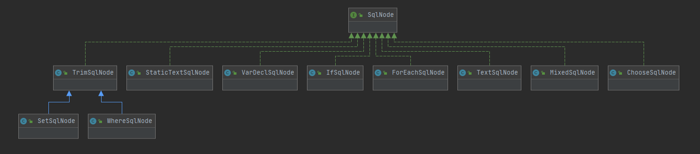

- 组装 SqlNode 的入口

`org.apache.ibatis.scripting.xmltags.XMLScriptBuilder`

```java
public SqlSource createSqlSource(Configuration configuration, XNode script, Class<?> parameterType) {
  XMLScriptBuilder builder = new XMLScriptBuilder(configuration, script, parameterType);
  return builder.parseScriptNode();
}

public SqlSource parseScriptNode() {
  // 解析动态sql标签， 见下面的 NodeHandler
  List<SqlNode> contents = parseDynamicTags(context);
  // 拼接sqlNode
  MixedSqlNode rootSqlNode = new MixedSqlNode(contents);
  SqlSource sqlSource = null;
  if (isDynamic) {
    sqlSource = new DynamicSqlSource(configuration, rootSqlNode);
  } else {
    sqlSource = new RawSqlSource(configuration, rootSqlNode, parameterType);
  }
  return sqlSource;
}
```

#### 动态标签处理器NodeHandler

我们知道我们可以在 mapper.xml 定义一些动态标签，来达到执行动态 SQL 的目的，常用的动态标签如：`where | if | foreach | set` 等。每个标签都有不同的解析和拼接方式，MyBatis 是使用 NodeHandler 来完成构建一个个的 SqlNode。

`org.apache.ibatis.scripting.xmltags.XMLScriptBuilder.NodeHandler` 

NodeHandler 是定义在 XMLScriptBuilder 中的私有接口，并维护解析不同动态标签的 Handler。

```java
private interface NodeHandler {
  void handleNode(XNode nodeToHandle, List<SqlNode> targetContents);
}

private Map<String, NodeHandler> nodeHandlers = new HashMap<String, NodeHandler>() {
  private static final long serialVersionUID = 7123056019193266281L;

  {
    put("trim", new TrimHandler());
    put("where", new WhereHandler());
    put("set", new SetHandler());
    put("foreach", new ForEachHandler());
    put("if", new IfHandler());
    put("choose", new ChooseHandler());
    put("when", new IfHandler());
    put("otherwise", new OtherwiseHandler());
    put("bind", new BindHandler());
  }
};
```

#### MixedSqlNode

**MixedSqlNode 在整个 SqlNode 树中充当了树枝节点，也就是扮演了组合模式中 Composite 的角色**，其中维护了一个 `List<SqlNode>` 集合用于记录 MixedSqlNode 下所有的子 SqlNode 对象。

`MixedSqlNode.apply()` ：核心逻辑就是遍历 `List<SqlNode>` 集合中全部的子 SqlNode 对象并调用 apply() 方法，由子 SqlNode 对象完成真正的动态 SQL 处理逻辑。

```java
public class MixedSqlNode implements SqlNode {
  private List<SqlNode> contents;

  public MixedSqlNode(List<SqlNode> contents) {
    this.contents = contents;
  }

  public boolean apply(DynamicContext context) {
    for (SqlNode sqlNode : contents) {
      sqlNode.apply(context);
    }
    return true;
  }
}
```

#### StaticTextSqlNode

StaticTextSqlNode 用来表示非动态 SQL 片段，成员变量只有 text，用来保存 SQL 的文本。

`StaticTextSqlNode.apply()` ：核心逻辑，使用 DynamicContext.sqlBuilder 来拼接 sql 文本片段。

```java
public class StaticTextSqlNode implements SqlNode {
  private String ;

  public StaticTextSqlNode(String text) {
    this.text = text;
  }

  public boolean apply(DynamicContext context) {
    context.appendSql(text);
    return true;
  }
}
```

#### TextSqlNode

TextSqlNode 用来解析包含 `${}` 占位符的动态 SQL 片段。成员变量 text 记录占位符的 SQL 文本内容，如：`AND note = ${note}`

`TextSqlNode.apply()` ：核心逻辑，使用**用户传入的实参**替换 text 中占位符 `${}`的内容（如：`AND note = 'param'`），并 DynamicContext.sqlBuilder 来拼接 sql 文本片段。

```java
public class TextSqlNode implements SqlNode {
  private String text;

  public boolean apply(DynamicContext context) {
    // 创建 ${} 的解析器
    GenericTokenParser parser = createParser(new BindingTokenParser(context));
    // 解析并替换 ${} 里面的内容
    context.appendSql(parser.parse(text));
    return true;
  }

  // 这里解析出来 ${} 里面填充的内容，此时发生在 SQL 调用执行过程中，
  // 故 context.getBindings().get("_parameter") 可以获取到调用的传参
  public String handleToken(String content) {
    Object parameter = context.getBindings().get("_parameter");
    if (parameter == null) {
      context.getBindings().put("value", null);
    } else if (SimpleTypeRegistry.isSimpleType(parameter.getClass())) {
      context.getBindings().put("value", parameter);
    }
    Object value = OgnlCache.getValue(content, context.getBindings());
    return (value == null ? "" : String.valueOf(value)); // issue #274 return "" instead of "null"
  }
}
```

#### IfSqlNode

IfSqlNode：用来解析`<if>`标签动态 SQL 片段。成员变量 test 记录 if 的判断条件，如：`note != null and note != ''`，条件的解析器为 evaluator。而 contents 这是链接到下一个的 SqlNode，因为当 if 条件满足时我们需要执行`<if>`标签中的内容，而 contents 则是标签内容的 SqlNode。

`IfSqlNode.apply()` ：核心逻辑，使用 evaluator 计算保存的 test 条件，true 则下一个节点的apply 方法 `contents.apply()`。

```java
public class IfSqlNode implements SqlNode {
  private ExpressionEvaluator evaluator;
  private String test;
  private SqlNode contents;

  public boolean apply(DynamicContext context) {
    if (evaluator.evaluateBoolean(test, context.getBindings())) {
      contents.apply(context);
      return true;
    }
    return false;
  }
}
```

#### TrimSqlNode

TrimSqlNode 用来裁剪标签定义的 SQL。

`StaticTextSqlNode.apply()` ：核心逻辑，使用 DynamicContext.sqlBuilder 来拼接 sql 文本片段。

```java
public class TrimSqlNode implements SqlNode {

    private final SqlNode contents;
    private final String prefix;
    private final String suffix;
    private final List<String> prefixesToOverride;
    private final List<String> suffixesToOverride;
    private final Configuration configuration;

    @Override
    public boolean apply(DynamicContext context) {
        // 创建处理裁剪的上下文
        FilteredDynamicContext filteredDynamicContext = new FilteredDynamicContext(context);
        // 处理裁剪标签类的 SQL 片段，拼接在一起完成未处理过裁剪的 SQL 片段的组装
        boolean result = contents.apply(filteredDynamicContext);
        // 进行裁剪操作
        filteredDynamicContext.applyAll();
        return result;
    }

	// 上下文的子类，专门用来处理裁剪
    private class FilteredDynamicContext extends DynamicContext {
        // 代理类，SQL 拼接完成之后还是要放入此类中
        private DynamicContext delegate;
        // 是否已经处理过了前缀
        private boolean prefixApplied;
        // 是否已经处理过了后缀
        private boolean suffixApplied;
        // raw SQL 片段的拼接（未处理过裁剪的 SQL 片段）
        private StringBuilder sqlBuffer;

        // 处理裁剪的核心方法
        public void applyAll() {
            sqlBuffer = new StringBuilder(sqlBuffer.toString().trim());
            String trimmedUppercaseSql = sqlBuffer.toString().toUpperCase(Locale.ENGLISH);
            if (trimmedUppercaseSql.length() > 0) {
                // 处理前缀
                applyPrefix(sqlBuffer, trimmedUppercaseSql);
                // 处理后缀
                applySuffix(sqlBuffer, trimmedUppercaseSql);
            }
            // 完成 SQL 拼接后，拼接到 DynamicContext 中
            delegate.appendSql(sqlBuffer.toString());
        }

        // prefixesToOverride 不为空，语句前面裁剪指定的 prefixesToOverride
        // prefix 不为空，语句前面拼接指定的 prefix
        private void applyPrefix(StringBuilder sql, String trimmedUppercaseSql) {
            if (!prefixApplied) {
                prefixApplied = true;
                if (prefixesToOverride != null) {
                    for (String toRemove : prefixesToOverride) {
                        if (trimmedUppercaseSql.startsWith(toRemove)) {
                            sql.delete(0, toRemove.trim().length());
                            break;
                        }
                    }
                }
                if (prefix != null) {
                    sql.insert(0, " ");
                    sql.insert(0, prefix);
                }
            }
        }

        // suffixesToOverride 不为空，语句后面裁剪指定的 suffixesToOverride
        // suffix 不为空，语句后面拼接指定的 suffix
        private void applySuffix(StringBuilder sql, String trimmedUppercaseSql) {
            if (!suffixApplied) {
                suffixApplied = true;
                if (suffixesToOverride != null) {
                    for (String toRemove : suffixesToOverride) {
                        if (trimmedUppercaseSql.endsWith(toRemove) || trimmedUppercaseSql.endsWith(toRemove.trim())) {
                            int start = sql.length() - toRemove.trim().length();
                            int end = sql.length();
                            sql.delete(start, end);
                            break;
                        }
                    }
                }
                if (suffix != null) {
                    sql.append(" ");
                    sql.append(suffix);
                }
            }
        }
    }
}
```

> `<trim>`标签的裁剪解析

`prefixOverrides` 和 `suffixOverrides`：前后缀覆盖标识，可以 “|” 分隔多个；

`prefix` 和 `suffix`：用来覆盖的前后缀

如下例，覆盖重写后的SQL：`(note = #{note})`；`AND` 被前缀 `(` 覆盖；`,` 被后缀 `)` 覆盖。

```xml
<trim prefix="(" prefixOverrides="AND|OR" suffix=")" suffixOverrides=",">
	AND note = #{note},
</trim>
```

##### SetSqlNode & WhereSqlNode

SetSqlNode 和 WhereSqlNode 均继承于 TrimSqlNode，两者构造时仅改变前后缀的属性，其他行为与 TrimSqlNode 是一致的。

```java
public class SetSqlNode extends TrimSqlNode {

    private static final List<String> COMMA = Collections.singletonList(",");

    public SetSqlNode(Configuration configuration,SqlNode contents) {
        super(configuration, contents, "SET", COMMA, null, COMMA);
    }
}

public class WhereSqlNode extends TrimSqlNode {

    private static List<String> prefixList = Arrays.asList("AND ","OR ","AND\n", "OR\n", "AND\r", "OR\r", "AND\t", "OR\t");

    public WhereSqlNode(Configuration configuration, SqlNode contents) {
        super(configuration, contents, "WHERE", prefixList, null, null);
    }

}
```

#### ForEachSqlNode

ForEachSqlNode：主要用来拼接和遍历`<foreach>`标签下集合元素。

`ForEachSqlNode.apply()` ：核心逻辑，解析并拼接`<foreach>`内容，将传入的实参存入`ContextMap bindings`中，以供 SQL 绑定时调用。


- foreach 使用示例

```xml
-> 原生 SQL

select * from role where id  in 
<foreach collection="idsList" item="item" separator="," open="(" close=")">
  #{item,jdbcType=BIGINT}
</foreach>

-> ForEachSqlNode 处理后：
select * from role where id  in 
 （#{__frch_item_0,jdbcType=BIGINT}， #{__frch_item_1,jdbcType=BIGINT}， #{__frch_item_2,jdbcType=BIGINT}）

-> bindings 的存储：

见下述
```

- Session 周期 bindings 的存储

如下图可知：在使用`<foreach>`标签时，我们传入的实参 idList 被存储了3份在 ContextMap bindings 中。

**所以我们使用多线程SQL查询, 当 in 条件数量过大时，尤其遇上慢 SQL，内存得不到释放，极有可能造成 OOM。**

```json
{_parameter={roleName=张, idsList=[1, 2, 3], param1=[1, 2, 3], param2=张}, __frch_item_2=3, __frch_item_1=2, _databaseId=mysql, __frch_item_0=1}
```

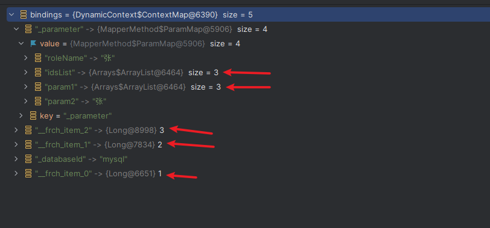

- ForEachSqlNode

```java
public class ForEachSqlNode implements SqlNode {
    public static final String ITEM_PREFIX = "__frch_";

    // 表达式解析器，这里主要用来解析 collection 属性的 idsList
    private final ExpressionEvaluator evaluator;
    // collection 表达式，idsList
    private final String collectionExpression;
    // foreach 标签下的 sqlNode
    private final SqlNode contents;
    // foreach 标签类属性
    private final String open;
    private final String close;
    private final String separator;
    private final String item;
    private final String index;
    // mybatis 属性
    private final Configuration configuration;


    @Override
    public boolean apply(DynamicContext context) {
        // 获取上下文绑定的 Map
        Map<String, Object> bindings = context.getBindings();
        // 获取 collection 属性对应传入的实参
        final Iterable<?> iterable = evaluator.evaluateIterable(collectionExpression, bindings);
        if (!iterable.iterator().hasNext()) {
            return true;
        }
        boolean first = true;
        // 1. 拼接 open 属性
        applyOpen(context);
        int i = 0;
        for (Object o : iterable) {
            // 保存原有的 context 因为要更换新的 context 来处理标签内容
            DynamicContext oldContext = context;
            
            // 处理前缀拼接的 context, 用来拼接 separator 属性
            if (first || separator == null) {
                context = new PrefixedContext(context, "");
            } else {
                context = new PrefixedContext(context, separator);
            }
            
            // 传入的实参绑定 item，保存到 map 中
            int uniqueNumber = context.getUniqueNumber();
            // Issue #709
            if (o instanceof Map.Entry) {
                @SuppressWarnings("unchecked")
                Map.Entry<Object, Object> mapEntry = (Map.Entry<Object, Object>) o;
                applyIndex(context, mapEntry.getKey(), uniqueNumber);
                applyItem(context, mapEntry.getValue(), uniqueNumber);
            } else {
                applyIndex(context, i, uniqueNumber);
                applyItem(context, o, uniqueNumber);
            }
            
            // apply mixsqlnode
            contents.apply(new FilteredDynamicContext(configuration, context, index, item, uniqueNumber));
            
            if (first) {
                first = !((PrefixedContext) context).isPrefixApplied();
            }
            
            // 找回原来的 context
            context = oldContext;
            i++;
        }
        // 拼接 close 属性
        applyClose(context);
        // 这里的 item 和 index 主要是用来拼接 #{} 的属性, 使用完需要 remove d
        context.getBindings().remove(item);
        context.getBindings().remove(index);
        return true;
    }
}
```

##### 处理拼接的context

> PrefixedContext

处理前缀拼接，如：foreach 标签的 separator

注意有些操作是 `DynamicContext delegate`。

appendSql：将 separator 拼接在前面。

```java
private class PrefixedContext extends DynamicContext {
    private final DynamicContext delegate;
    private final String prefix;
    private boolean prefixApplied;

    public PrefixedContext(DynamicContext delegate, String prefix) {
        super(configuration, null);
        this.delegate = delegate;
        this.prefix = prefix;
        this.prefixApplied = false;
    }

    public boolean isPrefixApplied() {
        return prefixApplied;
    }

    @Override
    public Map<String, Object> getBindings() {
        return delegate.getBindings();
    }

    @Override
    public void bind(String name, Object value) {
        delegate.bind(name, value);
    }

    @Override
    public void appendSql(String sql) {
        if (!prefixApplied && sql != null && sql.trim().length() > 0) {
            delegate.appendSql(prefix);
            prefixApplied = true;
        }
        delegate.appendSql(sql);
    }

    @Override
    public String getSql() {
        return delegate.getSql();
    }

    @Override
    public int getUniqueNumber() {
        return delegate.getUniqueNumber();
    }
}
```

> FilteredDynamicContext

处理占位符拼接，如 #{}

注意有些操作是 `DynamicContext delegate`。

appendSql：就是把指定的占位符，替换成 MyBatis 特定的占位符。

如：`#{item,jdbcType=BIGINT} -> #{__frch_item_0,jdbcType=BIGINT}`

==注，用来解析占位符的解析器：==`org.apache.ibatis.parsing.GenericTokenParser`

```java
private static class FilteredDynamicContext extends DynamicContext {
    private final DynamicContext delegate;
    private final int index;
    private final String itemIndex;
    private final String item;

    public FilteredDynamicContext(Configuration configuration,DynamicContext delegate, String itemIndex, String item, int i) {
        super(configuration, null);
        this.delegate = delegate;
        this.index = i;
        this.itemIndex = itemIndex;
        this.item = item;
    }

    @Override
    public Map<String, Object> getBindings() {
        return delegate.getBindings();
    }

    @Override
    public void bind(String name, Object value) {
        delegate.bind(name, value);
    }

    @Override
    public String getSql() {
        return delegate.getSql();
    }

    @Override
    public void appendSql(String sql) {
        GenericTokenParser parser = new GenericTokenParser("#{", "}", content -> {
            String newContent = content.replaceFirst("^\\s*" + item + "(?![^.,:\\s])", itemizeItem(item, index));
            if (itemIndex != null && newContent.equals(content)) {
                newContent = content.replaceFirst("^\\s*" + itemIndex + "(?![^.,:\\s])", itemizeItem(itemIndex, index));
            }
            return "#{" + newContent + "}";
        });

        delegate.appendSql(parser.parse(sql));
    }

    @Override
    public int getUniqueNumber() {
        return delegate.getUniqueNumber();
    }

}
```

#### ChooseSqlNode

ChooseSqlNode：主要用来处理`<choose>、<when>、<otherwise>`等标签下 SQL 片段的选择。

`ForEachSqlNode.apply()` ：核心逻辑，当有一个`<when>`标签，即 defaultSqlNode，生效之后直接返回，否则应用`<otherwise>`标签，即 ifSqlNodes。当然`<otherwise>`标签亦可不写。

关于 ifSqlNodes 和 defaultSqlNode 的划分，可参考处理器： `org.apache.ibatis.scripting.xmltags.XMLScriptBuilder.ChooseHandler`。

- sql

```xml
<select id="selectByCondition" resultType="wenqi.Role">
  select * from role
  <where>
    <choose>
      <when test="noteCondition != null and noteCondition == 1">
        and note like '0'
      </when>
      <when test="noteCondition != null and noteCondition == 2">
        and note like '1'
      </when>
      <otherwise>
        and note like '张'
      </otherwise>
    </choose>
  </where>
</select>
```

- ChooseSqlNode

```java
public class ChooseSqlNode implements SqlNode {
	// <otherwise> 标签的节点
    private final SqlNode defaultSqlNode;
    // <when> 标签的节点，处理与 ifSqlNode 一致
    private final List<SqlNode> ifSqlNodes;

    @Override
    public boolean apply(DynamicContext context) {
        for (SqlNode sqlNode : ifSqlNodes) {
            if (sqlNode.apply(context)) {
                return true;
            }
        }
        if (defaultSqlNode != null) {
            defaultSqlNode.apply(context);
            return true;
        }
        return false;
    }
}
```


### SqlSource

SqlSource 负责组装解析后的每个 sqlNode，以如下动态 SQL ，返回的 DynamicSqlSource 为例，展示 SqlSource 的数据结构。 

```java
public interface SqlSource {

  BoundSql getBoundSql(Object parameterObject);

}
```

我们可以从这个方法中看到：`org.apache.ibatis.scripting.xmltags.XMLScriptBuilder#parseScriptNode`，MyBatis 根据标志字段 isDynamic 来创建不同的 SqlSource，分别是：DynamicSqlSource 和 RawSqlSource。

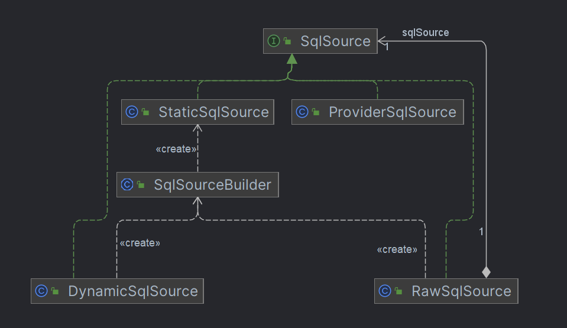

> SqlSource 数据结构

```xml
<select id="selectByRole" resultType="wenqitest.Role">
  select * from role
    <where>
      <if test="id != null">
        AND id = #{id,javaType=long}
      </if>
      <if test="roleName != null and roleName != ''">
        AND role_name like concat('%', #{roleName,jdbcType=VARCHAR}, '%')
      </if>
      <if test="note != null and note != ''">
        AND note = #{note,jdbcType=VARCHAR}
      </if>
    </where>
</select>
```

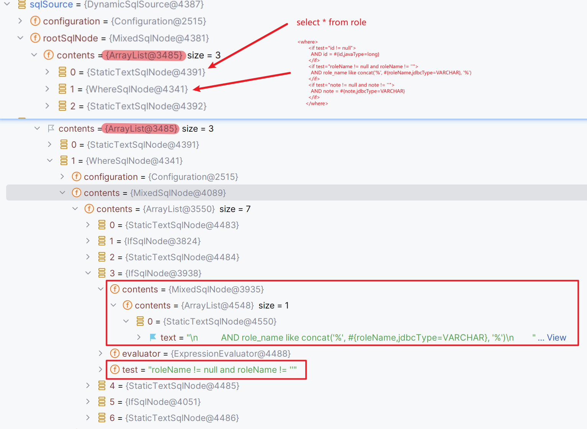

等到执行过程中调用`SqlSource.getBoundSql()`，才会触发动态 SQL 的拼接，从节点 MixedSqlNode 开始，逐一执行 `SqlNode.apply()` 完成整个 SQL 的拼接，调用栈如下：

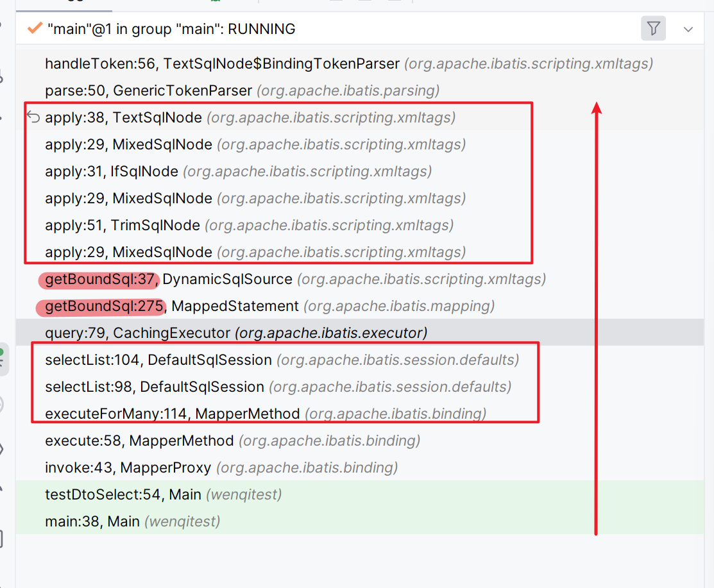

#### SqlSourceBuilder

我们从 `RawSqlSource.getBoundSql` 和 `DynamicSqlSource.getBoundSql` 中可以看到都创建了 SqlSourceBuilder，并调用了 `parse()` 方法。


> parse

parse()：主要作用是，解析`#{id,jdbcType=BIGINT}`，并替换成`？`，并解析参数的类型。

```java
public SqlSource parse(String originalSql, Class<?> parameterType, Map<String, Object> additionalParameters) {
    ParameterMappingTokenHandler handler = new ParameterMappingTokenHandler(configuration, parameterType, additionalParameters);
    GenericTokenParser parser = new GenericTokenParser("#{", "}", handler);
    String sql = parser.parse(originalSql);
    return new StaticSqlSource(configuration, sql, handler.getParameterMappings());
}
```

- 效果

```sql
select id, role_name as roleName, note from role where id = #{id,jdbcType=BIGINT}

--> 

select id, role_name as roleName, note from role where id = ?
```

> ParameterMappingTokenHandler

org.apache.ibatis.builder.SqlSourceBuilder.ParameterMappingTokenHandler：参数类型解析处理器，如`jdbcType=BIGINT`解析类名`java.lang.Long`，并存放在`parameterMappings`中。

#### DynamicSqlSource

DynamicSqlSource：用来处理动态 SQL 的组装，当执行阶段调用 `getBoundSql()` 时，先创建 DynamicContext 并调用 `rootSqlNode.apply(context)` 来完成 sqlNode 的拼接和实体参数的绑定。

最终也是委托 `StaticSqlSource.getBoundSql()` 来构建 BoundSql 来返回。

```java
public class DynamicSqlSource implements SqlSource {

    private final Configuration configuration;
    private final SqlNode rootSqlNode;

    public DynamicSqlSource(Configuration configuration, SqlNode rootSqlNode) {
        this.configuration = configuration;
        this.rootSqlNode = rootSqlNode;
    }

    // parameterObject y
    @Override
    public BoundSql getBoundSql(Object parameterObject) {
        // sqlNode 的组装，rootSqlNode 实际上是 mixedSqlNode
        DynamicContext context = new DynamicContext(configuration, parameterObject);
        rootSqlNode.apply(context);
        // 使用 SqlSourceBuilder 来解析替换占位符 #{}，并构建 StaticSqlSource
        SqlSourceBuilder sqlSourceParser = new SqlSourceBuilder(configuration);
        Class<?> parameterType = parameterObject == null ? Object.class : parameterObject.getClass();
        SqlSource sqlSource = sqlSourceParser.parse(context.getSql(), parameterType, context.getBindings());
        // 获取 BoundSql
        BoundSql boundSql = sqlSource.getBoundSql(parameterObject);
        context.getBindings().forEach(boundSql::setAdditionalParameter);
        return boundSql;
    }

}
```

#### RawSqlSource

RawSqlSource：用来处理非动态 sql 的组装，当执行阶段调用 `getBoundSql()` 时，可以看到实际上是委托 `StaticSqlSource.getBoundSql()` 来处理。

构造器里面：`sqlSource = sqlSourceParser.parse(sql, clazz, new HashMap<>());`，完成了 sql 的组装和占位符的替换。

```java
public class RawSqlSource implements SqlSource {

    private final SqlSource sqlSource;

    public RawSqlSource(Configuration configuration, SqlNode rootSqlNode, Class<?> parameterType) {
        this(configuration, getSql(configuration, rootSqlNode), parameterType);
    }

    public RawSqlSource(Configuration configuration, String sql, Class<?> parameterType) {
        SqlSourceBuilder sqlSourceParser = new SqlSourceBuilder(configuration);
        Class<?> clazz = parameterType == null ? Object.class : parameterType;
        // 非动态 sql， 无 DynamicContext 绑定实参，故传入 new HashMap<>() 
        sqlSource = sqlSourceParser.parse(sql, clazz, new HashMap<>());
    }

    // 构造阶段，完成 sqlNode 的拼接
    private static String getSql(Configuration configuration, SqlNode rootSqlNode) {
        DynamicContext context = new DynamicContext(configuration, null);
        rootSqlNode.apply(context);
        return context.getSql();
    }

    @Override
    public BoundSql getBoundSql(Object parameterObject) {
        return sqlSource.getBoundSql(parameterObject);
    }

}
```

#### StaticSqlSource

StaticSqlSource：保存用来构造 sql 的所需信息，包括 sql 语句, 参数类型。当调用 `getBoundSql(`) 方法时，构造 BoundSql 返回。

```java
public class StaticSqlSource implements SqlSource {
	// 待 ？的 sql 语句
    private final String sql;
    // 传入的参数类型
    private final List<ParameterMapping> parameterMappings;
    private final Configuration configuration;

    public StaticSqlSource(Configuration configuration, String sql) {
        this(configuration, sql, null);
    }

    public StaticSqlSource(Configuration configuration, String sql, List<ParameterMapping> parameterMappings) {
        this.sql = sql;
        this.parameterMappings = parameterMappings;
        this.configuration = configuration;
    }

    @Override
    public BoundSql getBoundSql(Object parameterObject) {
        return new BoundSql(configuration, sql, parameterMappings, parameterObject);
    }

}
```

## 结果集映射

MyBatis 启动过程中将 Mapper.xml 中定义的 `<resultMap>` 标签解析成 ResultMap 对象保存在 `Configuration.resultMaps` 中。其定义了 Jdbc.ResultSet 与 Java 对象的映射规则，也就是**一行数据记录如何映射成一个 Java 对象**。


ResultMap 只是定义了一个静态的映射规则，那在运行时，MyBatis 是如何根据映射规则将 ResultSet 映射成 Java 对象的呢？

当 MyBatis 执行完一条 select 语句，**拿到 ResultSet 结果集之后，会将其交给关联的 ResultSetHandler 进行后续的映射处理**。


**==注意：==这里仅仅适用于 selectList、selectOne、void select、 selectCursor 等情况，而 selectMap 有其另外实现。**

无论是 selectList 还是 selectOne 都经由 `ResultSetHandler.handleResultSets` 来处理，均返回 `List<Object> multipleResults = new ArrayList<>();`

```java
public <E> List<E> query(Statement statement, ResultHandler resultHandler) throws SQLException {
    CallableStatement cs = (CallableStatement) statement;
	// execute sql
    cs.execute();
    // ResultSetHander
    List<E> resultList = resultSetHandler.handleResultSets(cs);
    resultSetHandler.handleOutputParameters(cs);
    return resultList;
}
```

### **ResultSetHandler** 

ResultSetHandler 只有一个实现类 DefaultResultSetHandler。

```java
public interface ResultSetHandler {
	// ResultSet 映射 Java 对象
    <E> List<E> handleResultSets(Statement stmt) throws SQLException;
	// ResultSet 映射 Cursor 对象
    <E> Cursor<E> handleCursorResultSets(Statement stmt) throws SQLException;
	// 处理存储过程的输出参数
    void handleOutputParameters(CallableStatement cs) throws SQLException;
}
```

#### DefaultResultSetHandler

> handleResultSets

解析数据库返回 ResultSet 集合（当定义多个 `<resultMap>` 时会产生多个 ResultSet ），组装成 Java 对象。

```java
public List<Object> handleResultSets(Statement stmt) throws SQLException {
	// 记录每个 ResultSet 映射出来的 Java 对象
    final List<Object> multipleResults = new ArrayList<>();

    int resultSetCount = 0;
        
    // 从Statement中获取第一个ResultSet，其中对不同的数据库有兼容处理逻辑,
    // 这里拿到的ResultSet会被封装成ResultSetWrapper对象返回
    ResultSetWrapper rsw = getFirstResultSet(stmt);
	
    // 获取这条SQL语句关联的全部ResultMap规则。如果一条SQL语句能够产生多个ResultSet，
    // 那么在编写Mapper.xml映射文件的时候，我们可以在SQL标签的resultMap属性中配置多个
    // <resultMap>标签的id，它们之间通过","分隔，实现对多个结果集的映射
    List<ResultMap> resultMaps = mappedStatement.getResultMaps();
    int resultMapCount = resultMaps.size();
    validateResultMapsCount(rsw, resultMapCount);
    
    // 遍历ResultMap集合 
    while (rsw != null && resultMapCount > resultSetCount) {
        ResultMap resultMap = resultMaps.get(resultSetCount);
        
        // 根据ResultMap中定义的映射规则处理ResultSet，并将映射得到的Java对象添加到 multipleResults 集合中保存
        handleResultSet(rsw, resultMap, multipleResults, null);
        
        // 获取下一个 ResultSet (如果有的话)
        rsw = getNextResultSet(stmt);
        
        cleanUpAfterHandlingResultSet();
        resultSetCount++;
    }

    // 处理嵌套映射的
    String[] resultSets = mappedStatement.getResultSets();
    if (resultSets != null) {
        while (rsw != null && resultSetCount < resultSets.length) {
            ResultMapping parentMapping = nextResultMaps.get(resultSets[resultSetCount]);
            if (parentMapping != null) {
                String nestedResultMapId = parentMapping.getNestedResultMapId();
                ResultMap resultMap = configuration.getResultMap(nestedResultMapId);
                handleResultSet(rsw, resultMap, null, parentMapping);
            }
            rsw = getNextResultSet(stmt);
            cleanUpAfterHandlingResultSet();
            resultSetCount++;
        }
    }

    // 构建结果 list 返回
    return collapseSingleResultList(multipleResults);
}
```

- ResultSetWrapper 


ResultSet 的包装类，里面包含所有的映射信息和元数据信息，如 resultSet、columnNames、classNames、jdbcTypes、typeHandler 等等。

> handleResultSet

解析单个 ResultSet：由 sql 标签中定义的 ResultMap 中定义的映射规则来处理ResultSet，并解析成 Java 对象加入 multipleResults 中返回。

```java
private void handleResultSet(ResultSetWrapper rsw, ResultMap resultMap, List<Object> multipleResults, ResultMapping parentMapping) throws SQLException {
    try {
        if (parentMapping != null) { 
            // 嵌套映射处理过程
            handleRowValues(rsw, resultMap, null, RowBounds.DEFAULT, parentMapping);
        } else {
            if (resultHandler == null) { // 是否自定义 resultHandler
                DefaultResultHandler defaultResultHandler = new DefaultResultHandler(objectFactory);
                // 处理结果集映射
                handleRowValues(rsw, resultMap, defaultResultHandler, rowBounds, null);
                // 从 defaultResultHandler 中获取结果集 resultlist，加入 multipleResults 返回
                // 注意这里是 list.add 不是 list.addAll
                multipleResults.add(defaultResultHandler.getResultList());
            } else {
                // 自定义的 resultHandler , 注意这里没有返回处理好的 Java 对象
                // 需要在自定义的 resultHandler 处理好结果集
                handleRowValues(rsw, resultMap, resultHandler, rowBounds, null);
            }
        }
    } finally {
        // issue #228 (close resultsets)
        closeResultSet(rsw.getResultSet());
    }
}
```

> handleRowValues

处理多行记录，生成结果集设置到resultHandler，主要委托 handleRowValuesForSimpleResultMap 来完成。

```java
public void handleRowValues(ResultSetWrapper rsw, ResultMap resultMap, ResultHandler<?> resultHandler, RowBounds rowBounds, ResultMapping parentMapping) throws SQLException {
    if (resultMap.hasNestedResultMaps()) { // 嵌套映射结果集处理
        ensureNoRowBounds();
        checkResultHandler();
        handleRowValuesForNestedResultMap(rsw, resultMap, resultHandler, rowBounds, parentMapping);
    } else {
        // 简单结果集映射处理， 非嵌套
        handleRowValuesForSimpleResultMap(rsw, resultMap, resultHandler, rowBounds, parentMapping);
    }
}
```

> handleRowValuesForSimpleResultMap

简单结果集映射处理， 非嵌套

```java
private void handleRowValuesForSimpleResultMap(ResultSetWrapper rsw, ResultMap resultMap, ResultHandler<?> resultHandler, RowBounds rowBounds, ResultMapping parentMapping)
    throws SQLException {
    DefaultResultContext<Object> resultContext = new DefaultResultContext<>();
    ResultSet resultSet = rsw.getResultSet();
    // 跳到 rowBounds 指定的 offset (一般都是 0 啦)
    skipRows(resultSet, rowBounds);
    // 检测是否还有需要映射的数据记录, 如果返回多行, 这里是一行行解析映射的
    while (shouldProcessMoreRows(resultContext, rowBounds) && !resultSet.isClosed() && resultSet.next()) {
        //  使用结果值来决定使用哪个 resultMap, 参考官方文档使用 discriminator 案例 
        ResultMap discriminatedResultMap = resolveDiscriminatedResultMap(resultSet, resultMap, null);
        // ResultSet 中的一行记录进行映射
        Object rowValue = getRowValue(rsw, discriminatedResultMap, null);
        // 保存对象到 resultHandler.list 中
        // 假设是 selectList, 会将一个个 Java Object add 到 resultHandler.list 中
        storeObject(resultHandler, resultContext, rowValue, parentMapping, resultSet);
    }
}
```

>getRowValue

row -> Java Object

```java
private Object getRowValue(ResultSetWrapper rsw, ResultMap resultMap, String columnPrefix) throws SQLException {
    final ResultLoaderMap lazyLoader = new ResultLoaderMap();
    // 这里相当于 new Object(), 属性是空的
    Object rowValue = createResultObject(rsw, resultMap, lazyLoader, columnPrefix);
    
    // hasTypeHandlerForResultObject 是否有自定义的 TypeHandler
    // 若是：则不执行下面逻辑由自定义的 TypeHandler 来处理属性赋值
    if (rowValue != null && !hasTypeHandlerForResultObject(rsw, resultMap.getType())) {
        // 这里将 rowValue 的引用放入 MetaObject 中, MetaObject 赋值相当于 rowValue 赋值
        final MetaObject metaObject = configuration.newMetaObject(rowValue);
        
        boolean foundValues = this.useConstructorMappings;
        if (shouldApplyAutomaticMappings(resultMap, false)) {
            foundValues = applyAutomaticMappings(rsw, resultMap, metaObject, columnPrefix) || foundValues;
        }
        
        // 真正获取 row value的方法, 底层就是基于 resultSet.getString("user_name")
        // 注意这里传入 metaObject, 非 rowValue
        foundValues = applyPropertyMappings(rsw, resultMap, metaObject, lazyLoader, columnPrefix) || foundValues;
        
        foundValues = lazyLoader.size() > 0 || foundValues;
        rowValue = foundValues || configuration.isReturnInstanceForEmptyRow() ? rowValue : null;
    }
    
    return rowValue;
}
```

### ResultHandler

当解析完 ResultSet 时，返回的 Java 对象就会保存在 ResultContext，传输到 ResultHandler 做最后结果集的处理。

ResultHandler 实现类如下：

- DefaultResultHandler ：selectOne、selectList
- DefaultMapResultHandler : selectMap
- ObjectWrapperResultHandler ：Cursor select

```java
public interface ResultHandler<T> {
    void handleResult(ResultContext<? extends T> resultContext);
}
```

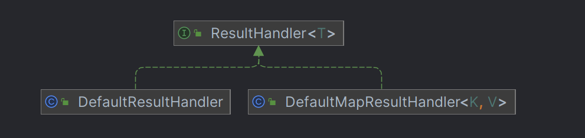

#### ResultContext

见文知义，ResultContext 是用来携带 result 的上下文。只有一个默认实现：`org.apache.ibatis.executor.result.DefaultResultContext`。

```java
public interface ResultContext<T> {

    T getResultObject();

    int getResultCount();

    boolean isStopped();

    void stop();

}

public class DefaultResultContext<T> implements ResultContext<T> {
	// 解析出来的 Java 对象
    private T resultObject;
    // 已经解析出来的 Java 对象数量
    private int resultCount;
    private boolean stopped;

    public DefaultResultContext() {
        resultObject = null;
        resultCount = 0;
        stopped = false;
    }

    @Override
    public T getResultObject() {
        return resultObject;
    }

    @Override
    public int getResultCount() {
        return resultCount;
    }

    @Override
    public boolean isStopped() {
        return stopped;
    }

    public void nextResultObject(T resultObject) {
        resultCount++;
        this.resultObject = resultObject;
    }

    @Override
    public void stop() {
        this.stopped = true;
    }

}
```

#### DefaultResultHandler

DefaultResultHandler 用来解析 selectOne 和 selectList 等查询结果。由 `handleResult()` 方法可以看出，DefaultResultHandler 内部维护一个 list，每解析一个 resultSet 对应的 Java 对象就 add 到这个 list 中。

```java
public class DefaultResultHandler implements ResultHandler<Object> {

    private final List<Object> list;

    public DefaultResultHandler() {
        list = new ArrayList<>();
    }

    @SuppressWarnings("unchecked")
    public DefaultResultHandler(ObjectFactory objectFactory) {
        list = objectFactory.create(List.class);
    }

    @Override
    public void handleResult(ResultContext<?> context) {
        list.add(context.getResultObject());
    }

    public List<Object> getResultList() {
        return list;
    }

}
```

#### DefaultMapResultHandler

见文知义，用来处理返回值是 Map 的查询方法。由 `handleResult()` 可知，跟进传入的 mapKey 来构造一个 Map 返回。

**==注意：==** selectMap 方法都是先调用 selectList 之后，根据返回的 list 来构造返回值 Map，而不是一开始就构造 Map 来返回。具体可看下述 `selectMap()` 方法。

- 关于 selectMap() 使用的正确姿势：

https://stackoverflow.com/questions/11913013/return-hashmap-in-mybatis-and-use-it-as-modelattribute-in-spring-mvc

```java
public class DefaultMapResultHandler<K, V> implements ResultHandler<V> {

    private final Map<K, V> mappedResults;
    private final String mapKey;
    private final ObjectFactory objectFactory;
    private final ObjectWrapperFactory objectWrapperFactory;
    private final ReflectorFactory reflectorFactory;

    @SuppressWarnings("unchecked")
    public DefaultMapResultHandler(String mapKey, ObjectFactory objectFactory, ObjectWrapperFactory objectWrapperFactory, ReflectorFactory reflectorFactory) {
        this.objectFactory = objectFactory;
        this.objectWrapperFactory = objectWrapperFactory;
        this.reflectorFactory = reflectorFactory;
        this.mappedResults = objectFactory.create(Map.class);
        this.mapKey = mapKey;
    }

    @Override
    public void handleResult(ResultContext<? extends V> context) {
        final V value = context.getResultObject();
        final MetaObject mo = MetaObject.forObject(value, objectFactory, objectWrapperFactory, reflectorFactory);
        // TODO is that assignment always true?
        final K key = (K) mo.getValue(mapKey);
        mappedResults.put(key, value);
    }

    public Map<K, V> getMappedResults() {
        return mappedResults;
    }
}
```

- selectMap

`org.apache.ibatis.session.defaults.DefaultSqlSession#selectMap(java.lang.String, java.lang.Object, java.lang.String, org.apache.ibatis.session.RowBounds)`

```java
public <K, V> Map<K, V> selectMap(String statement, Object parameter, String mapKey, RowBounds rowBounds) {
	// 先查询 selectList，完成映射之后返回的 list
    final List<? extends V> list = selectList(statement, parameter, rowBounds);
    final DefaultMapResultHandler<K, V> mapResultHandler = new DefaultMapResultHandler<>(mapKey, configuration.getObjectFactory(), configuration.getObjectWrapperFactory(), configuration.getReflectorFactory());
    final DefaultResultContext<V> context = new DefaultResultContext<>();
    // 循环处理成 Map
    for (V o : list) {
        context.nextResultObject(o);
        mapResultHandler.handleResult(context);
    }
    // 返回
    return mapResultHandler.getMappedResults();
}
```

## StatementHandler

StatementHandler，MyBatis 非常重要的接口，接口定义了一系列的操作，如创建查询Statement，参数绑定，SQL 执行等程序入口。

- 相关实现类

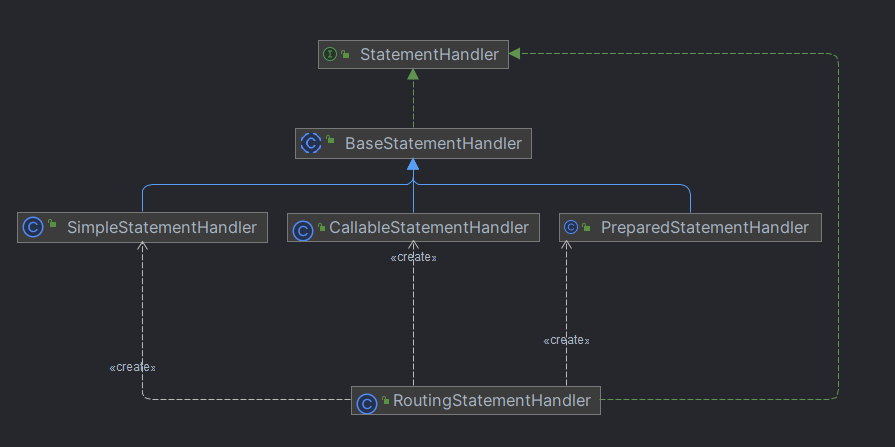

- 定义方法

```java
public interface StatementHandler {
	// 创建 Statement
    Statement prepare(Connection connection, Integer transactionTimeout) throws SQLException;
	// SQL 语句绑定实体参数
    void parameterize(Statement statement) throws SQLException;
	// 批量执行 SQL
    void batch(Statement statement) throws SQLException;
	// 单条执行update SQL
    int update(Statement statement) throws SQLException;
	// 单条执行query SQL
    <E> List<E> query(Statement statement, ResultHandler resultHandler) throws SQLException;
	// 单条执行cursor SQL
    <E> Cursor<E> queryCursor(Statement statement) throws SQLException;
	// 获取绑定 SQL, 此时为绑定实参，只有占位符
    BoundSql getBoundSql();
	// 获取参数处理器 ParameterHandler
    ParameterHandler getParameterHandler();

}
```

### RoutingStatementHandler

RoutingStatementHandler，在构造器中根据不同查询类型来构造不同 StatementHandler 作为委托对象，其余的实现方法均由委托的StatementHandler 来执行。

```java
public class RoutingStatementHandler implements StatementHandler {

    private final StatementHandler delegate;

    public RoutingStatementHandler(Executor executor, MappedStatement ms, Object parameter, RowBounds rowBounds, ResultHandler resultHandler, BoundSql boundSql) {

        switch (ms.getStatementType()) {
            case STATEMENT:
                delegate = new SimpleStatementHandler(executor, ms, parameter, rowBounds, resultHandler, boundSql);
                break;
            case PREPARED:
                delegate = new PreparedStatementHandler(executor, ms, parameter, rowBounds, resultHandler, boundSql);
                break;
            case CALLABLE:
                delegate = new CallableStatementHandler(executor, ms, parameter, rowBounds, resultHandler, boundSql);
                break;
            default:
                throw new ExecutorException("Unknown statement type: " + ms.getStatementType());
        }

    }
}
```

- 关于 STATEMENT 的类型

| 类型      | 用法                                        |
| --------- | ------------------------------------------- |
| STATEMENT | 对应于Statement对象，有SQL注入的风险        |
| PREPARED  | PreparedStatement，预编译处理               |
| CALLABLE  | CallableStatement一般调用存储过程的时候使用 |

### BaseStatementHandler

BaseStatementHandler 作为抽象类，仅实现了 `StatementHandler.prepare()` 方法，主要为新建的 Statement 对象设置一些参数，如 timeout、fetchSize等。

```java
public abstract class BaseStatementHandler implements StatementHandler {

    protected final Configuration configuration;
    protected final ObjectFactory objectFactory;
    protected final TypeHandlerRegistry typeHandlerRegistry;
    protected final ResultSetHandler resultSetHandler;
    protected final ParameterHandler parameterHandler;

    protected final Executor executor;
    protected final MappedStatement mappedStatement;
    protected final RowBounds rowBounds;

    protected BoundSql boundSql;

    protected BaseStatementHandler(Executor executor, MappedStatement mappedStatement, Object parameterObject, RowBounds rowBounds, ResultHandler resultHandler, BoundSql boundSql) {
        this.configuration = mappedStatement.getConfiguration();
        this.executor = executor;
        this.mappedStatement = mappedStatement;
        this.rowBounds = rowBounds;

        this.typeHandlerRegistry = configuration.getTypeHandlerRegistry();
        this.objectFactory = configuration.getObjectFactory();

        if (boundSql == null) { // issue #435, get the key before calculating the statement
            generateKeys(parameterObject);
            boundSql = mappedStatement.getBoundSql(parameterObject);
        }

        this.boundSql = boundSql;

        this.parameterHandler = configuration.newParameterHandler(mappedStatement, parameterObject, boundSql);
        this.resultSetHandler = configuration.newResultSetHandler(executor, mappedStatement, rowBounds, parameterHandler, resultHandler, boundSql);
    }

    @Override
    public Statement prepare(Connection connection, Integer transactionTimeout) throws SQLException {
        ErrorContext.instance().sql(boundSql.getSql());
        Statement statement = null;
        try {
            // Statement 的初始化
            statement = instantiateStatement(connection);
            // 参数设置
            setStatementTimeout(statement, transactionTimeout);
            setFetchSize(statement);
            return statement;
        } catch (SQLException e) {
            closeStatement(statement);
            throw e;
        } catch (Exception e) {
            closeStatement(statement);
            throw new ExecutorException("Error preparing statement.  Cause: " + e, e);
        }
    }
}
```

#### KeyGenerator

BaseStatementHandler 在构造过程中调用 `generateKeys(parameterObject)` 方法，KeyGenerator 接口来生成主键。

因为我们在执行 insert 语句中，可以不指定主键id，有些场景需要获取 insert 对象的对应的id，这时 KeyGenerator 可以很好帮助我们完成这项工作。

- generateKeys()

可以看到调用了 `keyGenerator.processBefore(executor, mappedStatement, null, parameter);` 方法。

```java
protected void generateKeys(Object parameter) {
  KeyGenerator keyGenerator = mappedStatement.getKeyGenerator();
  ErrorContext.instance().store();
  keyGenerator.processBefore(executor, mappedStatement, null, parameter);
  ErrorContext.instance().recall();
}
```

那么使用哪个 KeyGenerator 呢？初始化逻辑如下：

1. 默认使用 NoKeyGenerator，
2. 定义了 `<selectKey>` 标签，使用 SelectKeyGenerator，
3. `<sql>` 标签指定了 `useGeneratedKey = true` 且是 insert 语句，使用 Jdbc3KeyGenerator。

```java
// 关于 KeyGenerator 解析顺序，后面的覆盖前面的形式

// 1.1 org.apache.ibatis.builder.xml.XMLStatementBuilder#parseSelectKeyNode
// 1.2 org.apache.ibatis.builder.annotation.MapperAnnotationBuilder#handleSelectKeyAnnotation

// 2.1 org.apache.ibatis.builder.annotation.MapperAnnotationBuilder#parseStatement
// 2.2 org.apache.ibatis.builder.xml.XMLStatementBuilder#parseStatementNode

// 3. org.apache.ibatis.mapping.MappedStatement.Builder#Builder
mappedStatement.keyGenerator = configuration.isUseGeneratedKeys() && SqlCommandType.INSERT.equals(sqlCommandType) ? Jdbc3KeyGenerator.INSTANCE : NoKeyGenerator.INSTANCE;
```

- 相关类

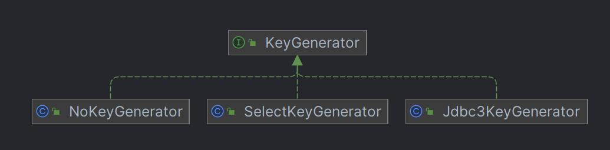

- 接口定义

 NoKeyGenerator、Jdbc3KeyGenerator.processBefore 都是空实现。

```java
public interface KeyGenerator {

    void processBefore(Executor executor, MappedStatement ms, Statement stmt, Object parameter);

    void processAfter(Executor executor, MappedStatement ms, Statement stmt, Object parameter);

}
```

- 使用姿势

```java
// 1. SelectKeyGenerator
<selectKey keyProperty="id" order="AFTER" resultType="java.lang.Long">
    SELECT LAST_INSERT_ID()
</selectKey>

// 2. Jdbc3KeyGenerator
<insert id="batchInsert" useGeneratedKeys="true">
  insert into role (role_name, note)
  values
      <foreach collection="roleList" separator="," item="item">
        (#{item.roleName,jdbcType=VARCHAR}, #{item.note,jdbcType=VARCHAR})
      </foreach>
</insert>
```

##### Jdbc3KeyGenerator

Jdbc3KeyGenerator 用于取回数据库生成的自增id，并设置导传入的实体参数中。只实现了 processAfter，因为 id 是从 resultSet 中获取的。

开启方法：

	1. mybatis-config.xml \<setting> 中定义 useGeneratedKeys 全局配置
	1. ＜insert＞ 标签中 useGeneratedKeys 属性。

```java
public class Jdbc3KeyGenerator implements KeyGenerator {

    private static final String SECOND_GENERIC_PARAM_NAME = ParamNameResolver.GENERIC_NAME_PREFIX + "2";

    public static final Jdbc3KeyGenerator INSTANCE = new Jdbc3KeyGenerator();

    private static final String MSG_TOO_MANY_KEYS = "Too many keys are generated. There are only %d target objects. "
        + "You either specified a wrong 'keyProperty' or encountered a driver bug like #1523.";

    @Override
    public void processBefore(Executor executor, MappedStatement ms, Statement stmt, Object parameter) {
        // do nothing
    }

    @Override
    public void processAfter(Executor executor, MappedStatement ms, Statement stmt, Object parameter) {
        processBatch(ms, stmt, parameter);
    }

    public void processBatch(MappedStatement ms, Statement stmt, Object parameter) {
        // 指定的 keyProperties，<insert> 标签属性指定
        final String[] keyProperties = ms.getKeyProperties();
        if (keyProperties == null || keyProperties.length == 0) {
            return;
        }
        // Statement 中获取 ResultSet
        try (ResultSet rs = stmt.getGeneratedKeys()) {
            final ResultSetMetaData rsmd = rs.getMetaData();
            final Configuration configuration = ms.getConfiguration();
            if (rsmd.getColumnCount() < keyProperties.length) {
                // Error?
            } else {
                // 从 ResultSet 中获取指定 keyProperty 的 value，并设置到实体参数 parameter 中
                assignKeys(configuration, rs, rsmd, keyProperties, parameter);
            }
        } catch (Exception e) {
            throw new ExecutorException("Error getting generated key or setting result to parameter object. Cause: " + e, e);
        }
    }
}
```

##### SelectKeyGenerator

 SelectKeyGenerator 中的 processBefore 和 processAfter 是互斥的，只会执行一个。

```java
public class SelectKeyGenerator implements KeyGenerator {

    @Override
    public void processBefore(Executor executor, MappedStatement ms, Statement stmt, Object parameter) {
        if (executeBefore) {
            processGeneratedKeys(executor, ms, parameter);
        }
    }

    @Override
    public void processAfter(Executor executor, MappedStatement ms, Statement stmt, Object parameter) {
        if (!executeBefore) {
            processGeneratedKeys(executor, ms, parameter);
        }
    }

    /**
      * 
      * @param executor  传入的执行器
      * @param ms		保存配置和映射信息
      * @param parameter 传入的实体参数
      */
    private void processGeneratedKeys(Executor executor, MappedStatement ms, Object parameter) {
        try {
            if (parameter != null && keyStatement != null && keyStatement.getKeyProperties() != null) {
                // 定义的 keyProperty 标签属性
                String[] keyProperties = keyStatement.getKeyProperties();
                final Configuration configuration = ms.getConfiguration();
                // 创建实体参数的对象，用来设置属性
                final MetaObject metaParam = configuration.newMetaObject(parameter);
                
                // 这里 new 一个执行器，难道 executor 跟事务还是 session 有关？
                // Do not close keyExecutor.
                // The transaction will be closed by parent executor.
                Executor keyExecutor = configuration.newExecutor(executor.getTransaction(), ExecutorType.SIMPLE);
                List<Object> values = keyExecutor.query(keyStatement, parameter, RowBounds.DEFAULT, Executor.NO_RESULT_HANDLER);
                
                if (values.size() == 0) {
                    throw new ExecutorException("SelectKey returned no data.");
                } else if (values.size() > 1) {
                    throw new ExecutorException("SelectKey returned more than one value.");
                } else {
                    // s
                    MetaObject metaResult = configuration.newMetaObject(values.get(0));
                    if (keyProperties.length == 1) {
                        if (metaResult.hasGetter(keyProperties[0])) {
                            setValue(metaParam, keyProperties[0], metaResult.getValue(keyProperties[0]));
                        } else {
                            // no getter for the property - maybe just a single value object
                            // so try that
                            setValue(metaParam, keyProperties[0], values.get(0));
                        }
                    } else {
                        handleMultipleProperties(keyProperties, metaParam, metaResult);
                    }
                }
            }
        } catch (ExecutorException e) {
            throw e;
        } catch (Exception e) {
            throw new ExecutorException("Error selecting key or setting result to parameter object. Cause: " + e, e);
        }
    }
}
```

#### ParameterHandler

StatementHandler 提供获取参数处理器 ParameterHandler 的方法。ParameterHandler 用来处理 SQL 语句中占位符的绑定和设置，即 “？” 替换实体参数。 

```java
public interface ParameterHandler {

  Object getParameterObject();

  void setParameters(PreparedStatement ps)
      throws SQLException;

}
```

> DefaultParameterHandler

DefaultParameterHandler 是 ParameterHandler 唯一实现。

```java
@Override
public void setParameters(PreparedStatement ps) {
    ErrorContext.instance().activity("setting parameters").object(mappedStatement.getParameterMap().getId());
    // 参数绑定信息
    List<ParameterMapping> parameterMappings = boundSql.getParameterMappings();
    if (parameterMappings != null) {
        for (int i = 0; i < parameterMappings.size(); i++) {
            ParameterMapping parameterMapping = parameterMappings.get(i);
            if (parameterMapping.getMode() != ParameterMode.OUT) {
                Object value;
                String propertyName = parameterMapping.getProperty();
                // 获取参数值
                if (boundSql.hasAdditionalParameter(propertyName)) { // issue #448 ask first for additional params
                    value = boundSql.getAdditionalParameter(propertyName);
                } else if (parameterObject == null) {
                    value = null;
                } else if (typeHandlerRegistry.hasTypeHandler(parameterObject.getClass())) {
                    value = parameterObject;
                } else {
                    MetaObject metaObject = configuration.newMetaObject(parameterObject);
                    value = metaObject.getValue(propertyName);
                }
                TypeHandler typeHandler = parameterMapping.getTypeHandler();
                JdbcType jdbcType = parameterMapping.getJdbcType();
                if (value == null && jdbcType == null) {
                    jdbcType = configuration.getJdbcTypeForNull();
                }
                try {
                    // 这里设置参数帮i的那个
                    typeHandler.setParameter(ps, i + 1, value, jdbcType);
                } catch (TypeException | SQLException e) {
                    throw new TypeException("Could not set parameters for mapping: " + parameterMapping + ". Cause: " + e, e);
                }
            }
        }
    }
}
```

### SimpleStatementHandler

处理非 PreparedStatement 的请求。

处理流程：statement -> excecute -> handleResult

```java
@Override
public int update(Statement statement) throws SQLException {
    String sql = boundSql.getSql();
    Object parameterObject = boundSql.getParameterObject();
    KeyGenerator keyGenerator = mappedStatement.getKeyGenerator();
    int rows;
    if (keyGenerator instanceof Jdbc3KeyGenerator) {
        statement.execute(sql, Statement.RETURN_GENERATED_KEYS);
        rows = statement.getUpdateCount();
        keyGenerator.processAfter(executor, mappedStatement, statement, parameterObject);
    } else if (keyGenerator instanceof SelectKeyGenerator) {
        statement.execute(sql);
        rows = statement.getUpdateCount();
        keyGenerator.processAfter(executor, mappedStatement, statement, parameterObject);
    } else {
        statement.execute(sql);
        rows = statement.getUpdateCount();
    }
    return rows;
}

@Override
public void batch(Statement statement) throws SQLException {
    String sql = boundSql.getSql();
    statement.addBatch(sql);
}

@Override
public <E> List<E> query(Statement statement, ResultHandler resultHandler) throws SQLException {
    String sql = boundSql.getSql();
    statement.execute(sql);
    return resultSetHandler.handleResultSets(statement);
}
```

### PreparedStatementHandler

处理 PreparedStatement 的请求。

处理流程：statement -> excecute -> keyGenerator.processAfter -> handleResult

```java
@Override
public int update(Statement statement) throws SQLException {
    PreparedStatement ps = (PreparedStatement) statement;
    ps.execute();
    int rows = ps.getUpdateCount();
    Object parameterObject = boundSql.getParameterObject();
    KeyGenerator keyGenerator = mappedStatement.getKeyGenerator();
    keyGenerator.processAfter(executor, mappedStatement, ps, parameterObject);
    return rows;
}

@Override
public void batch(Statement statement) throws SQLException {
    PreparedStatement ps = (PreparedStatement) statement;
    ps.addBatch();
}

@Override
public <E> List<E> query(Statement statement, ResultHandler resultHandler) throws SQLException {
    PreparedStatement ps = (PreparedStatement) statement;
    ps.execute();
    return resultSetHandler.handleResultSets(ps);
}
```

### CallableStatementHandler

CallableStatementHandler 是处理存储过程的 StatementHandler 实现。

## Executor

Executor 定义操作数据库的基本方法，基本上是封装 JDBC SqlSession 那一套。

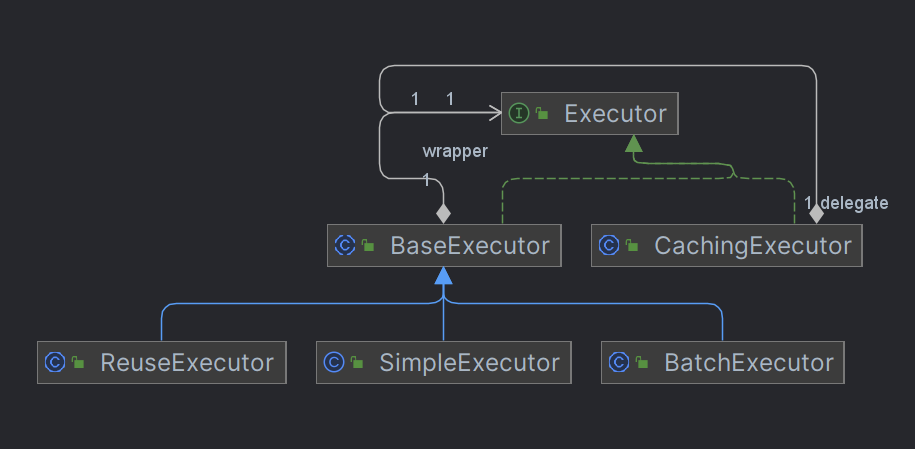

> 应该使用哪一个 Executor？

MyBatis 在启动阶段已经完成 Executor 的指定和创建。

`org.apache.ibatis.session.Configuration#newExecutor(org.apache.ibatis.transaction.Transaction, org.apache.ibatis.session.ExecutorType)`

```java
public Executor newExecutor(Transaction transaction, ExecutorType executorType) {
    executorType = executorType == null ? defaultExecutorType : executorType;
    executorType = executorType == null ? ExecutorType.SIMPLE : executorType;
    Executor executor;
    if (ExecutorType.BATCH == executorType) {
        executor = new BatchExecutor(this, transaction);
    } else if (ExecutorType.REUSE == executorType) {
        executor = new ReuseExecutor(this, transaction);
    } else {
        executor = new SimpleExecutor(this, transaction);
    }
    if (cacheEnabled) {
        executor = new CachingExecutor(executor);
    }
    executor = (Executor) interceptorChain.pluginAll(executor);
    return executor;
}
```

> 接口定义

```java
public interface Executor {

    ResultHandler NO_RESULT_HANDLER = null;
	// update, insert, delete 都是这个入口
    int update(MappedStatement ms, Object parameter) throws SQLException;

    <E> List<E> query(MappedStatement ms, Object parameter, RowBounds rowBounds, ResultHandler resultHandler, CacheKey cacheKey, BoundSql boundSql) throws SQLException;

    <E> List<E> query(MappedStatement ms, Object parameter, RowBounds rowBounds, ResultHandler resultHandler) throws SQLException;

    <E> Cursor<E> queryCursor(MappedStatement ms, Object parameter, RowBounds rowBounds) throws SQLException;
	// 批量执行 SQL 语句， 创建多个 MappedStatement，批量执行
    List<BatchResult> flushStatements() throws SQLException;

    void commit(boolean required) throws SQLException;

    void rollback(boolean required) throws SQLException;
	// 创建换成用的的 cacheKey 对象
    CacheKey createCacheKey(MappedStatement ms, Object parameterObject, RowBounds rowBounds, BoundSql boundSql);
	// 根据 cacheKey 判断是否有缓存对象
    boolean isCached(MappedStatement ms, CacheKey key);
	// 清空一级缓存
    void clearLocalCache();
	// 延迟加载一级缓存中的数据
    void deferLoad(MappedStatement ms, MetaObject resultObject, String property, CacheKey key, Class<?> targetType);

    Transaction getTransaction();

    void close(boolean forceRollback);

    boolean isClosed();

    void setExecutorWrapper(Executor executor);

}
```

### BaseExecutor

BaseExecutor 抽象类，定义 Executor 执行的模板方法。

```java
public abstract class BaseExecutor implements Executor {
    protected Transaction transaction;
    // 包装类
    protected Executor wrapper;
    // 延迟加载队列
    protected ConcurrentLinkedQueue<DeferredLoad> deferredLoads;
    // 一级缓存
    protected PerpetualCache localCache;
    protected PerpetualCache localOutputParameterCache;
    protected Configuration configuration;
    // 嵌套查询的层数
    protected int queryStack;
    private boolean closed;

    protected BaseExecutor(Configuration configuration, Transaction transaction) {
        this.transaction = transaction;
        this.deferredLoads = new ConcurrentLinkedQueue<>();
        this.localCache = new PerpetualCache("LocalCache");
        this.localOutputParameterCache = new PerpetualCache("LocalOutputParameterCache");
        this.closed = false;
        this.configuration = configuration;
        this.wrapper = this;
    }

    @Override
    public void setExecutorWrapper(Executor wrapper) {
        this.wrapper = wrapper;
    }

    // 需要子类实现的抽象方法
    protected abstract int doUpdate(MappedStatement ms, Object parameter)
        throws SQLException;

    protected abstract List<BatchResult> doFlushStatements(boolean isRollback)
        throws SQLException;

    protected abstract <E> List<E> doQuery(MappedStatement ms, Object parameter, RowBounds rowBounds, ResultHandler resultHandler, BoundSql boundSql)
        throws SQLException;

    protected abstract <E> Cursor<E> doQueryCursor(MappedStatement ms, Object parameter, RowBounds rowBounds, BoundSql boundSql)
        throws SQLException;


}
```

#### 一级缓存

默认开启，session 级别，无法指定是否开启。<u>见 BaseExecutor 的构建方法，默认创建 PerpetualCache，id 写死为 “LocalCache”。</u>

> 关于 BaseExecutor 中的缓存管理

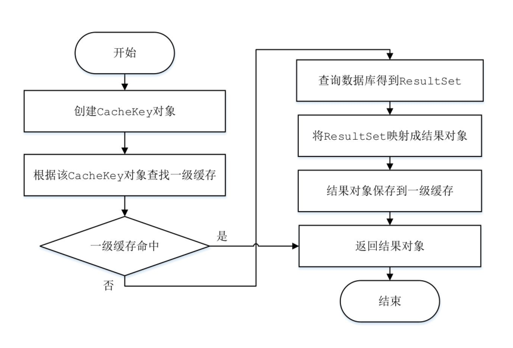

1. 缓存的 cacheKey

   org.apache.ibatis.executor.BaseExecutor#createCacheKey

   可以简单理解这个 cacheKey 是所有入参、sql语句的集合。这些相同时，cacheKey 也相同。

2. 使用缓存

`org.apache.ibatis.executor.BaseExecutor#query(org.apache.ibatis.mapping.MappedStatement, java.lang.Object, org.apache.ibatis.session.RowBounds, org.apache.ibatis.session.ResultHandler, org.apache.ibatis.cache.CacheKey, org.apache.ibatis.mapping.BoundSql)`

```java
public <E> List<E> query(MappedStatement ms, Object parameter, RowBounds rowBounds, ResultHandler resultHandler, CacheKey key, BoundSql boundSql) throws SQLException {
    // 首次清理缓存
    if (queryStack == 0 && ms.isFlushCacheRequired()) {
        clearLocalCache();
    }
    List<E> list;
    try {
        queryStack++;
        // 获取缓存
        list = resultHandler == null ? (List<E>) localCache.getObject(key) : null;
        if (list != null) {
            handleLocallyCachedOutputParameters(ms, key, parameter, boundSql);
        } else {
            // 缓存不存在， 查数据库
            list = queryFromDatabase(ms, parameter, rowBounds, resultHandler, key, boundSql);
        }
    } finally {
        queryStack--;
    }
}
```

2. 加载缓存

`org.apache.ibatis.executor.BaseExecutor#queryFromDatabase`

```java
private <E> List<E> queryFromDatabase(MappedStatement ms, Object parameter, RowBounds rowBounds, ResultHandler resultHandler, CacheKey key, BoundSql boundSql) throws SQLException {
    List<E> list;
    // 我猜这里是为了释放旧缓存对象，方便 GC
    // 猜错了， 跟延迟加载有关的
    localCache.putObject(key, EXECUTION_PLACEHOLDER);
    try {
        list = doQuery(ms, parameter, rowBounds, resultHandler, boundSql);
    } finally {
        // doQuery 报错，需要清掉 key
        localCache.removeObject(key);
    }
    // 放入缓存
    localCache.putObject(key, list);
    if (ms.getStatementType() == StatementType.CALLABLE) {
        localOutputParameterCache.putObject(key, parameter);
    }
    return list;
}
```

3. 清理缓存

触发清理缓存的地方：update()、commit()、rollback()、close()等方法的调用。

```java
@Override
public int update(MappedStatement ms, Object parameter) throws SQLException {
    // 这里是清空所有的 key 的缓存
    clearLocalCache();
    return doUpdate(ms, parameter);
}

@Override
public void commit(boolean required) throws SQLException {
    if (closed) {
        throw new ExecutorException("Cannot commit, transaction is already closed");
    }
    clearLocalCache();
    flushStatements();
    if (required) {
        transaction.commit();
    }
}

@Override
public void rollback(boolean required) throws SQLException {
    if (!closed) {
        try {
            clearLocalCache();
            flushStatements(true);
        } finally {
            if (required) {
                transaction.rollback();
            }
        }
    }
}

@Override
public void close(boolean forceRollback) {
    try {
        try {
            rollback(forceRollback);
        } finally {
            if (transaction != null) {
                transaction.close();
            }
        }
    } catch (SQLException e) {
        // Ignore.  There's nothing that can be done at this point.
        log.warn("Unexpected exception on closing transaction.  Cause: " + e);
    } finally {
        transaction = null;
        deferredLoads = null;
        localCache = null;
        localOutputParameterCache = null;
        closed = true;
    }
}

@Override
public void clearLocalCache() {
    if (!closed) {
        localCache.clear();
        localOutputParameterCache.clear();
    }
}
```

#### 延迟加载

延迟加载的关键点是标志位的处理，比如正在加载中或加载完成的缓存。

```java
protected ConcurrentLinkedQueue<DeferredLoad> deferredLoads;

@Override
public void deferLoad(MappedStatement ms, MetaObject resultObject, String property, CacheKey key, Class<?> targetType) {
    if (closed) {
        throw new ExecutorException("Executor was closed.");
    }
    DeferredLoad deferredLoad = new DeferredLoad(resultObject, property, key, localCache, configuration, targetType);
    // 检查一级缓存加载的标志位
    if (deferredLoad.canLoad()) {
        // 直接加载
        deferredLoad.load();
    } else {
        // 如果处于一级缓存加载期间，需要放到队列中，等待加载
        deferredLoads.add(new DeferredLoad(resultObject, property, key, localCache, configuration, targetType));
    }
}

public boolean canLoad() {
    return localCache.getObject(key) != null && localCache.getObject(key) != EXECUTION_PLACEHOLDER;
}
```

### SimpleExecutor

SimpleExecutor 继承于 BaseExecutor，并实现其定义抽象方法，最简单的 Executor 接口实现。

SimpleExecutor 需要注意的地方：

```java
@Override
public List<BatchResult> doFlushStatements(boolean isRollback) {
    return Collections.emptyList();
}

private Statement prepareStatement(StatementHandler handler, Log statementLog) throws SQLException {
    Statement stmt;
    Connection connection = getConnection(statementLog);
    stmt = handler.prepare(connection, transaction.getTimeout());
    handler.parameterize(stmt);
    return stmt;
}
```

### ReuseExecutor

ReuseExecutor 实现方法与 SimpleExecutor 大致相同，但是为了减少 SQL 预编译的开销以及创建和销毁 Statement 对象的开销，ReuseExecutor 选择重用 Statement。

如下代码逻辑：每次执行 SQL 语句时，会调用 `prepareStatement()` 方法获取 Statement 对象，该方法处理 Statement 对象的创建与复用。

**需要注意的是**，调用 `doFlushStatements()` 方法时才会清空缓存的 Statement 对象，需要留意 `doFlushStatements()` 方法调用时机，大部分都是维持 session 级别的。对于其他的 Executor，如 SimpleExecutor、BatchExecutor 会在查询结束后调用 `closeStatement(stmt);`，而 ReuseExecutor 不会。

```java
public class ReuseExecutor extends BaseExecutor {
    // key: sql语句，value：Statment 对象
    private final Map<String, Statement> statementMap = new HashMap<>();

    @Override
    public List<BatchResult> doFlushStatements(boolean isRollback) {
        for (Statement stmt : statementMap.values()) {
            closeStatement(stmt);
        }
        statementMap.clear();
        return Collections.emptyList();
    }

    private Statement prepareStatement(StatementHandler handler, Log statementLog) throws SQLException {
        Statement stmt;
        // 获取 SQL
        BoundSql boundSql = handler.getBoundSql();
        String sql = boundSql.getSql();
        // 检查是否缓存了 statement
        if (hasStatementFor(sql)) {
            stmt = getStatement(sql);
            // 重新设置事务超时时间
            applyTransactionTimeout(stmt);
        } else {
            Connection connection = getConnection(statementLog);
            stmt = handler.prepare(connection, transaction.getTimeout());
            putStatement(sql, stmt);
        }
        // 处理占位符
        handler.parameterize(stmt);
        return stmt;
    }

    private boolean hasStatementFor(String sql) {
        try {
            return statementMap.keySet().contains(sql) && !statementMap.get(sql).getConnection().isClosed();
        } catch (SQLException e) {
            return false;
        }
    }

    private Statement getStatement(String s) {
        return statementMap.get(s);
    }

    private void putStatement(String sql, Statement stmt) {
        statementMap.put(sql, stmt);
    }

}
```

### BatchExecutor

BatchExecutor，实现了批量执行 sql 的 executor。目前仅支持的批量 SQL：insert、update、delete，对于 select 的语句 BatchExecutor 的方法与 SimpleExecutor 方法大致相同，仅仅多加了 `flushStatements()` 的调用。

```java
public class BatchExecutor extends BaseExecutor {
    // update, insert, delete 的返回值
    public static final int BATCH_UPDATE_RETURN_VALUE = Integer.MIN_VALUE + 1002;

    // 缓存多个 Statement 对象，每个 Statement 对象缓存一批 SQL
    private final List<Statement> statementList = new ArrayList<>();
    // 批量处理的结果
    private final List<BatchResult> batchResultList = new ArrayList<>();
    // 当前执行的 sql
    private String currentSql;
    // 当前执行的 statement
    private MappedStatement currentStatement;
}
```

> 批量的方法 doUpdate

如下可知，`doUpdate()` 方法仅处理 session 和 statement 复用的问题，并未真正执行的 SQL 语句，所以也就没有返回结果啦。那么真正执行 SQL 语句的方法时，调用 `commit()` 方法后的 `doFlushStatements(boolean isRollback)`。

```java
@Override
public int doUpdate(MappedStatement ms, Object parameterObject) throws SQLException {
    final Configuration configuration = ms.getConfiguration();
    final StatementHandler handler = configuration.newStatementHandler(this, ms, parameterObject, RowBounds.DEFAULT, null, null);
    final BoundSql boundSql = handler.getBoundSql();
    final String sql = boundSql.getSql();
    final Statement stmt;
    // 非首次执行时，用回原来的 session 和 statement，提供性能
    if (sql.equals(currentSql) && ms.equals(currentStatement)) {
        int last = statementList.size() - 1;
        stmt = statementList.get(last);
        applyTransactionTimeout(stmt);
        // 处理占位符，绑定实参
        handler.parameterize(stmt);//fix Issues 322
        BatchResult batchResult = batchResultList.get(last);
        batchResult.addParameterObject(parameterObject);
    } else {
        // 首次执行时
        Connection connection = getConnection(ms.getStatementLog());
        stmt = handler.prepare(connection, transaction.getTimeout());
        // 处理占位符，绑定实参
        handler.parameterize(stmt);    //fix Issues 322
        currentSql = sql;
        currentStatement = ms;
        statementList.add(stmt);
        batchResultList.add(new BatchResult(ms, sql, parameterObject));
    }
    
    // 底层调用 statement.addBath() 方法添加 SQL 语句
    handler.batch(stmt);
    
    return BATCH_UPDATE_RETURN_VALUE;
}
```

> 真正执行批量的方法 doFlushStatements(boolean isRollback)

```java
@Override
public List<BatchResult> doFlushStatements(boolean isRollback) throws SQLException {
    try {
        // 存储批处理结果
        List<BatchResult> results = new ArrayList<>();
        if (isRollback) {
            return Collections.emptyList();
        }

        // 遍历缓存的 statementList
        for (int i = 0, n = statementList.size(); i < n; i++) {
            // 获取缓存的 statement
            Statement stmt = statementList.get(i);
            applyTransactionTimeout(stmt);
            // 获取对应的 batchResult 对象
            BatchResult batchResult = batchResultList.get(i);
            
            try {
                // 调用 statement.executeBatch(), 执行批量方法
                // 返回值 int[]，每批 SQL 的影响行数
                batchResult.setUpdateCounts(stmt.executeBatch());
                
                // 处理主键生成逻辑 KeyGenerator
                MappedStatement ms = batchResult.getMappedStatement();
                List<Object> parameterObjects = batchResult.getParameterObjects();
                KeyGenerator keyGenerator = ms.getKeyGenerator();
                if (Jdbc3KeyGenerator.class.equals(keyGenerator.getClass())) {
                    Jdbc3KeyGenerator jdbc3KeyGenerator = (Jdbc3KeyGenerator) keyGenerator;
                    jdbc3KeyGenerator.processBatch(ms, stmt, parameterObjects);
                } else if (!NoKeyGenerator.class.equals(keyGenerator.getClass())) { //issue #141
                    for (Object parameter : parameterObjects) {
                        keyGenerator.processAfter(this, ms, stmt, parameter);
                    }
                }
                
                // 关闭 statement
                // Close statement to close cursor #1109
                closeStatement(stmt);
            } catch (BatchUpdateException e) {
                StringBuilder message = new StringBuilder();
                message.append(batchResult.getMappedStatement().getId())
                    .append(" (batch index #")
                    .append(i + 1)
                    .append(")")
                    .append(" failed.");
                if (i > 0) {
                    message.append(" ")
                        .append(i)
                        .append(" prior sub executor(s) completed successfully, but will be rolled back.");
                }
                throw new BatchExecutorException(message.toString(), e, results, batchResult);
            }
            results.add(batchResult);
        }
        return results;
    } finally {
        for (Statement stmt : statementList) {
            closeStatement(stmt);
        }
        currentSql = null;
        statementList.clear();
        batchResultList.clear();
    }
}
```

### CachingExecutor

CachingExecutor 使用装饰器模式，用来处理 MyBatis 的二级缓存，我们知道一级缓存 BaseExecutor 已经处理。

#### 二级缓存

##### 全局开关

步骤源码分析如下，但需要注意这只是开启二级缓存的第一个开关，还没有完全开启。接下来需要配置命名空间缓存来开启二级缓存。

- mybatis-config.xml 指定配置

```xml
<!-- mybatis-config.xml -->
<settings>
    <setting name="cacheEnabled"value="true"/>
</settings>
```

- 解析配置

源码：`org.apache.ibatis.builder.xml.XMLConfigBuilder#settingsElement`

可以看到即使 cacheEnabled 没有配置，mybatis 默认也是给 true 的。

```java
private void settingsElement(Properties props) {
    configuration.setCacheEnabled(booleanValueOf(props.getProperty("cacheEnabled"), true));
}
```

- 创建装饰类 CachingExecutor，开启二级缓存

源码：`org.apache.ibatis.session.Configuration#newExecutor(org.apache.ibatis.transaction.Transaction, org.apache.ibatis.session.ExecutorType)`

```java
public Executor newExecutor(Transaction transaction, ExecutorType executorType) {
    executorType = executorType == null ? defaultExecutorType : executorType;
    executorType = executorType == null ? ExecutorType.SIMPLE : executorType;
    Executor executor;
    if (ExecutorType.BATCH == executorType) {
        executor = new BatchExecutor(this, transaction);
    } else if (ExecutorType.REUSE == executorType) {
        executor = new ReuseExecutor(this, transaction);
    } else {
        executor = new SimpleExecutor(this, transaction);
    }
    
    // 开启二级缓存
    if (cacheEnabled) {
        executor = new CachingExecutor(executor);
    }
    
    executor = (Executor) interceptorChain.pluginAll(executor);
    return executor;
}
```

##### 命名空间缓存开关

- Mapper 中配置

1. 如果 Mapper 命名空间配置了 `<cache/>`，就会在该命名空间创建一个 cache 对象。中创建了一个 cache 对象，但是要注意此时 cache 对象是空的，还没有任何缓存的加入。

2. 如果 Mapper 命名空间配置了 `<cache-ref/>`，就会在将该命名空间 cache 对象引用到其他命名空间的 cache（被替换了）。

3. 如果 Mapper 命名空间同时配置了 `<cache/>` 和 `<cache-ref/>`，就会在将该命名空间 cache 对象引用到其他命名空间的 cache（被替换了），自己命名空间的 cache 对象将会被舍弃。
4. 如果配置了 `<cache-ref/>`，引用的命名空间必须要配置 `<cache/>`，否则启动报错。

**命名空间缓存开关，只是在命名空间中创建了一个 cache 对象，但是要注意此时 cache 对象是空的，还没有任何缓存的加入，所以需要指定加入缓存，二级缓存才生效。**

cache：key -> 命名空间	value -> mybatis cache 的实现

```xml
<?xml version="1.0" encoding="UTF-8" ?>
<!DOCTYPE mapper PUBLIC "-//mybatis.org//DTD Mapper 3.0//EN"
  "http://mybatis.org/dtd/mybatis-3-mapper.dtd">
<mapper namespace="wenqi.RoleMapper">
    
    <!-- 该 Mapper NameSpace 开启二级缓存 -->
    <cache/>  
    
    <!-- cache-ref代表引用别的命名空间的Cache配置，两个命名空间的操作使用的是同一个Cache。 -->
    <!-- 比如这里的 cache-ref，使用 mapper.StudentMapper 命名空间的 cache，不是自身命名空间的 cache -->
    <cache-ref namespace="mapper.StudentMapper"/>

</mapper>
```

- 源码解析

1. 解析 `<mapper>` 标签

```java
// org.apache.ibatis.builder.xml.XMLMapperBuilder#configurationElement
private void configurationElement(XNode context) {
    // 解析 cache-ref 标签
    cacheRefElement(context.evalNode("cache-ref"));
    // 解析 cache 标签
    cacheElement(context.evalNode("cache"));
}
```

2. 创建 cache

源码可知：解析 `<cache/>` 标签会创建一个 cache对象。而 `<cache-ref/>` 并未创建 cache 对象，而是寻找引用的 cache 对象。因为解析 Mapper.xml 有先后顺序，当获取引用的 cache 对象还没创建时，则加入到待解析的队列中，后续待引用 cache 对象创建之后再次获取。

```java
// org.apache.ibatis.builder.xml.XMLMapperBuilder#cacheRefElement
private void cacheRefElement(XNode context) {
    if (context != null) {
        configuration.addCacheRef(builderAssistant.getCurrentNamespace(), context.getStringAttribute("namespace"));
        CacheRefResolver cacheRefResolver = new CacheRefResolver(builderAssistant, context.getStringAttribute("namespace"));
        try {
            // 如果引用的 cache 不存在则解析失败
            cacheRefResolver.resolveCacheRef();
        } catch (IncompleteElementException e) {
            // 加入 incompleteCacheRefs 待解析 cache-ref 引用的 cache
            configuration.addIncompleteCacheRef(cacheRefResolver);
        }
    }
}

// org.apache.ibatis.builder.xml.XMLMapperBuilder#cacheElement
private void cacheElement(XNode context) {
    if (context != null) {
        String type = context.getStringAttribute("type", "PERPETUAL");
        Class<? extends Cache> typeClass = typeAliasRegistry.resolveAlias(type);
        String eviction = context.getStringAttribute("eviction", "LRU");
        Class<? extends Cache> evictionClass = typeAliasRegistry.resolveAlias(eviction);
        Long flushInterval = context.getLongAttribute("flushInterval");
        Integer size = context.getIntAttribute("size");
        boolean readWrite = !context.getBooleanAttribute("readOnly", false);
        boolean blocking = context.getBooleanAttribute("blocking", false);
        Properties props = context.getChildrenAsProperties();
        builderAssistant.useNewCache(typeClass, evictionClass, flushInterval, size, readWrite, blocking, props);
    }
}
```

3. 引用 cache 替换

currentCache 为二级缓存真正使用的 cache 对象，如果配置了`<cache-ref/>` 引用的对象，则 currentCache 为引用命名空间的 cache 的对象。

```java
// org.apache.ibatis.builder.CacheRefResolver#resolveCacheRef
public Cache resolveCacheRef() {
    return assistant.useCacheRef(cacheRefNamespace);
}

// org.apache.ibatis.builder.MapperBuilderAssistant#useCacheRef
public Cache useCacheRef(String namespace) {
    if (namespace == null) {
        throw new BuilderException("cache-ref element requires a namespace attribute.");
    }
    try {
        unresolvedCacheRef = true;
        // 根据命名空间获取 cache
        Cache cache = configuration.getCache(namespace);
        if (cache == null) {
            throw new IncompleteElementException("No cache for namespace '" + namespace + "' could be found.");
        }
        
        // 注意这里的 currentCache，这个是最终加入到命名空间使用的缓存
        currentCache = cache;
        unresolvedCacheRef = false;
        
        return cache;
    } catch (IllegalArgumentException e) {
        throw new IncompleteElementException("No cache for namespace '" + namespace + "' could be found.", e);
    }
}
```

4. 构建二级缓存 cache 对象

源码：`org.apache.ibatis.builder.MapperBuilderAssistant#addMappedStatement(java.lang.String, org.apache.ibatis.mapping.SqlSource, org.apache.ibatis.mapping.StatementType, org.apache.ibatis.mapping.SqlCommandType, java.lang.Integer, java.lang.Integer, java.lang.String, java.lang.Class<?>, java.lang.String, java.lang.Class<?>, org.apache.ibatis.mapping.ResultSetType, boolean, boolean, boolean, org.apache.ibatis.executor.keygen.KeyGenerator, java.lang.String, java.lang.String, java.lang.String, org.apache.ibatis.scripting.LanguageDriver, java.lang.String)`

这里构建的 cache 对象会加入到 MappedStatement 中，生效范围是命名空间。

5. 补充 cache-ref 解析失败队列解析

```java
// org.apache.ibatis.builder.xml.XMLMapperBuilder#parsePendingCacheRefs
private void parsePendingCacheRefs() {
    Collection<CacheRefResolver> incompleteCacheRefs = configuration.getIncompleteCacheRefs();
    synchronized (incompleteCacheRefs) {
        Iterator<CacheRefResolver> iter = incompleteCacheRefs.iterator();
        while (iter.hasNext()) {
            try {
                // 这里解析失败了，后面方法会兜底
                iter.next().resolveCacheRef();
                iter.remove();
            } catch (IncompleteElementException e) {
                // Cache ref is still missing a resource...
            }
        }
    }
}

// org.apache.ibatis.session.Configuration#buildAllStatements
protected void buildAllStatements() {
    parsePendingResultMaps();
    // 最后解析待解析的 cache-ref，此时所有的命名空间 cache 已经创建完毕，若这里解析失败，则启动事变
    if (!incompleteCacheRefs.isEmpty()) {
        synchronized (incompleteCacheRefs) {
            incompleteCacheRefs.removeIf(x -> x.resolveCacheRef() != null);
        }
    }
    if (!incompleteStatements.isEmpty()) {
        synchronized (incompleteStatements) {
            incompleteStatements.removeIf(x -> {
                x.parseStatementNode();
                return true;
            });
        }
    }
    if (!incompleteMethods.isEmpty()) {
        synchronized (incompleteMethods) {
            incompleteMethods.removeIf(x -> {
                x.resolve();
                return true;
            });
        }
    }
}
```

##### 加入二级缓存

sql 标签中使用二级缓存。

- flushCache == true：每次 sql 执行，刷新二级缓存
- useCache == true: 每次 sql 执行，加入二级缓存或获取二级缓存
- 获取二级缓存的 key，是 CacheKey，即 sql 语句和绑定参数的组装。
- 关于二级缓存的使用和管理，可见 CachingExecutor。

```xml
<select ... flushCache="false" useCache="true"/>
<insert ... flushCache="true"/>
<update ... flushCache="true"/>
<delete ... flushCache="true"/>
```

关于参数的默认值

- select 语句：flushCache = false，useCache = true
- 非 select 语句：flushCache = true，useCache = false

```java
// org.apache.ibatis.builder.MapperBuilderAssistant#addMappedStatement(java.lang.String, org.apache.ibatis.mapping.SqlSource, org.apache.ibatis.mapping.StatementType, org.apache.ibatis.mapping.SqlCommandType, java.lang.Integer, java.lang.Integer, java.lang.String, java.lang.Class<?>, java.lang.String, java.lang.Class<?>, org.apache.ibatis.mapping.ResultSetType, boolean, boolean, boolean, org.apache.ibatis.executor.keygen.KeyGenerator, java.lang.String, java.lang.String, java.lang.String, org.apache.ibatis.scripting.LanguageDriver, java.lang.String)
MappedStatement.Builder statementBuilder = new MappedStatement.Builder(configuration, id, sqlSource, sqlCommandType)
	// 非 select 语句
    .flushCacheRequired(valueOrDefault(flushCache, !isSelect))
    // select 语句
    .useCache(valueOrDefault(useCache, isSelect))
    .cache(currentCache);
```

#### TransactionalCacheManager

TransactionalCacheManager，是 CachingExecutor 依赖的重要组件，主要负责管理多个不同事务缓存的二级提交和回滚，完成事务的隔离，防止缓存脏读。

关于事务缓存的设计解读，可参考《MyBatis技术内幕》关于 TransactionalCacheManager 的章节。

```java
public class TransactionalCacheManager {
	// 维护的二级缓存
    // key -> cache 命名空间的二级缓存  value -> 事务缓存
    private final Map<Cache, TransactionalCache> transactionalCaches = new HashMap<>();

    public void clear(Cache cache) {
        getTransactionalCache(cache).clear();
    }

    public Object getObject(Cache cache, CacheKey key) {
        return getTransactionalCache(cache).getObject(key);
    }

    public void putObject(Cache cache, CacheKey key, Object value) {
        getTransactionalCache(cache).putObject(key, value);
    }

    public void commit() {
        for (TransactionalCache txCache : transactionalCaches.values()) {
            txCache.commit();
        }
    }

    public void rollback() {
        for (TransactionalCache txCache : transactionalCaches.values()) {
            txCache.rollback();
        }
    }

    // 创建一个事务缓存，以二级缓存作为 key
    private TransactionalCache getTransactionalCache(Cache cache) {
        return transactionalCaches.computeIfAbsent(cache, TransactionalCache::new);
    }

}
```

#### TransactionalCache

TransactionalCache 实现了 Cache 接口，通过委托类 `Cache delegate`实现二级缓存功能。TransactionalCache 主要负责缓存的事务管理，而 delegate 负责实现缓存功能。

每次 commit、rollback 都会调用 reset() 方法。

```java
public class TransactionalCache implements Cache {

    private static final Log log = LogFactory.getLog(TransactionalCache.class);
	// 这个是二级缓存类
    private final Cache delegate;
    // 提交事务时，清空二级缓存，且当前的事务缓存不可以查
    private boolean clearOnCommit;
    // 暂存的二级缓存
    private final Map<Object, Object> entriesToAddOnCommit;
    // 未命中的二级缓存
    private final Set<Object> entriesMissedInCache;

    public TransactionalCache(Cache delegate) {
        this.delegate = delegate;
        this.clearOnCommit = false;
        this.entriesToAddOnCommit = new HashMap<>();
        this.entriesMissedInCache = new HashSet<>();
    }

    @Override
    public String getId() {
        return delegate.getId();
    }

    @Override
    public int getSize() {
        return delegate.getSize();
    }

    @Override
    public Object getObject(Object key) {
        // issue #116
        Object object = delegate.getObject(key);
        if (object == null) {
            entriesMissedInCache.add(key);
        }
        // clearOnCommit = true 当前事务缓存不可以查，因为当前二级缓存已经清理，不可返回脏数据
        // 当调用 reset() 时，标志位会复位
        // issue #146
        if (clearOnCommit) {
            return null;
        } else {
            return object;
        }
    }

    @Override
    public void putObject(Object key, Object object) {
        entriesToAddOnCommit.put(key, object);
    }

    @Override
    public Object removeObject(Object key) {
        return null;
    }

    @Override
    public void clear() {
        clearOnCommit = true;
        entriesToAddOnCommit.clear();
    }

    public void commit() {
        if (clearOnCommit) {
            delegate.clear();
        }
        flushPendingEntries();
        reset();
    }

    public void rollback() {
        unlockMissedEntries();
        reset();
    }

    private void reset() {
        clearOnCommit = false;
        entriesToAddOnCommit.clear();
        entriesMissedInCache.clear();
    }

    private void flushPendingEntries() {
        for (Map.Entry<Object, Object> entry : entriesToAddOnCommit.entrySet()) {
            delegate.putObject(entry.getKey(), entry.getValue());
        }
        for (Object entry : entriesMissedInCache) {
            if (!entriesToAddOnCommit.containsKey(entry)) {
                delegate.putObject(entry, null);
            }
        }
    }

    private void unlockMissedEntries() {
        for (Object entry : entriesMissedInCache) {
            try {
                delegate.removeObject(entry);
            } catch (Exception e) {
                log.warn("Unexpected exception while notifiying a rollback to the cache adapter. "
                         + "Consider upgrading your cache adapter to the latest version. Cause: " + e);
            }
        }
    }

}
```

#### CachingExecutor

- 二级缓存使用方法

```java
public <E> List<E> query(MappedStatement ms, Object parameterObject, RowBounds rowBounds, ResultHandler resultHandler, CacheKey key, BoundSql boundSql) throws SQLException {
    // 获取二级缓存对象
    Cache cache = ms.getCache();
    if (cache != null) {
        flushCacheIfRequired(ms);
        // sql 标签中是否配置了 useCache = true
        if (ms.isUseCache() && resultHandler == null) {
            // 确保 sql 不是使用 输出类型参数，如 存储过程StatementType.CALLABLE + 不是 in 条件
            ensureNoOutParams(ms, boundSql);
            
            // 查询、获取、保存二级缓存
            List<E> list = (List<E>) tcm.getObject(cache, key);
            if (list == null) {
                list = delegate.query(ms, parameterObject, rowBounds, resultHandler, key, boundSql);
                tcm.putObject(cache, key, list); // issue #578 and #116
            }
            return list;
        }
    }
    return delegate.query(ms, parameterObject, rowBounds, resultHandler, key, boundSql);
}
```

- 清空二级缓存的方法

配置了 flushCache = true

```java
private void flushCacheIfRequired(MappedStatement ms) {
    Cache cache = ms.getCache();
    if (cache != null && ms.isFlushCacheRequired()) {
        tcm.clear(cache);
    }
}
```

# 接口层

MyBatis 核心接口层，SqlSession、Mapper、SqlSessionFactory。其中 MyBatis 提供 SqlSession 和 SqlSessionFactory 的接口实现，而 Mapper 则由用户定义与实现接口，并在MyBatis初始化过程中以动态代理的方式创建。

## SqlSession

SqlSession 顾名思义是与数据库交互的 Session 抽象。如下图，默认实现是 DefaultSqlSession，并由 DefaultSqlSessionFactory 创建。

==注意：SqlSession 是被 Mapper 调用的，上一级的具体对象是 MapperMethod。==

参看方法：org.apache.ibatis.binding.MapperMethod#execute


- 接口定义

```java
public interface SqlSession extends Closeable {
    <T> T selectOne(String var1);

    <T> T selectOne(String var1, Object var2);

    <E> List<E> selectList(String var1);

    <E> List<E> selectList(String var1, Object var2);

    <E> List<E> selectList(String var1, Object var2, RowBounds var3);

    <K, V> Map<K, V> selectMap(String var1, String var2);

    <K, V> Map<K, V> selectMap(String var1, Object var2, String var3);

    <K, V> Map<K, V> selectMap(String var1, Object var2, String var3, RowBounds var4);

    <T> Cursor<T> selectCursor(String var1);

    <T> Cursor<T> selectCursor(String var1, Object var2);

    <T> Cursor<T> selectCursor(String var1, Object var2, RowBounds var3);

    void select(String var1, Object var2, ResultHandler var3);

    void select(String var1, ResultHandler var2);

    void select(String var1, Object var2, RowBounds var3, ResultHandler var4);

    int insert(String var1);

    int insert(String var1, Object var2);

    int update(String var1);

    int update(String var1, Object var2);

    int delete(String var1);

    int delete(String var1, Object var2);

    void commit();

    void commit(boolean var1);

    void rollback();

    void rollback(boolean var1);

    List<BatchResult> flushStatements();

    void close();

    void clearCache();

    Configuration getConfiguration();

    <T> T getMapper(Class<T> var1);

    Connection getConnection();
}
```

### DefaultSqlSession

DefaultSqlSession：SqlSession 的默认实现，封装与数据库交互的所有材料。

- 相关属性

```java
public class DefaultSqlSession implements SqlSession {
	// 配置对象
    private final Configuration configuration;
    // 负责执行的 Executor，用了策略模式
    private final Executor executor;
	// 是否自动提交事务
    private final boolean autoCommit;
    // 缓存中是否允许有脏数据，默认false
    private boolean dirty;
    // 这里记录用户打开的游标对象，为了防止用户忘记关闭，这里会统一在 close 方法调用时关闭
    private List<Cursor<?>> cursorList;
}
```

- 核心接口

```java
// 只返回一条记录，如果有多条则报错
public <T> T selectOne(String statement);

// 返回多条记录
public <E> List<E> selectList(String statement);

// 返回 Map，如果不指定 @MapKey 则演变成调用 selectOne
// 参考： org.apache.ibatis.binding.MapperMethod#execute
public <K, V> Map<K, V> selectMap(String statement, String mapKey);
```

> 关于 **dirty** 字段

dirty：指定当前缓存中是否有脏数据，来指定是否提交/回滚当前事务。MyBatis 每次调用 SqlSession.commit 时并不是实际事务的提交（**多次合并成一次事务提交**），而是有状态函数来决定，如下所示：

- isCommitOrRollbackRequired 方法返回 true 时，当前 Session 的事务需要提交。

​	1. `force == true`：强制事务提交

​	2. `!autoCommit && dirty`：设置手动提交事务且缓存有脏数据时

- 影响 dirty 地方：
  - 默认创建为 false
  - 执行 insert，delete，update 方法之后，设置 dirty = true
  - commit/rollback 之后，设置 dirty = false

这里 `dirty = true` 不一定有脏数据，有概率。commit 后才会清理本地缓存和提交事务

```java
// 该函数返回值是下面函数的 required
// org.apache.ibatis.session.defaults.DefaultSqlSession#isCommitOrRollbackRequired
private boolean isCommitOrRollbackRequired(boolean force) {
    return (!autoCommit && dirty) || force;
}  

// org.apache.ibatis.executor.Executor#commit
public void commit(boolean required) throws SQLException {
    if (closed) {
        throw new ExecutorException("Cannot commit, transaction is already closed");
    }
    clearLocalCache();
    flushStatements();
    if (required) {
        transaction.commit();
    }
}

// org.apache.ibatis.executor.Executor#rollback
public void rollback(boolean required) throws SQLException {
    if (!closed) {
        try {
            clearLocalCache();
            flushStatements(true);
        } finally {
            if (required) {
                transaction.rollback();
            }
        }
    }
}
```

## SqlSessionFactory

SqlSessionFactory 就是用来创建 SqlSession 的，默认实现 DefaultSqlSessionFactory。

我们可以从 SqlSessionFactory 的接口中可以看到，创建 SqlSession 时可以传入一些自定义属性。

```java
public interface SqlSessionFactory {

  SqlSession openSession();

  SqlSession openSession(boolean autoCommit);

  SqlSession openSession(Connection connection);

  SqlSession openSession(TransactionIsolationLevel level);

  SqlSession openSession(ExecutorType execType);

  SqlSession openSession(ExecutorType execType, boolean autoCommit);

  SqlSession openSession(ExecutorType execType, TransactionIsolationLevel level);

  SqlSession openSession(ExecutorType execType, Connection connection);

  Configuration getConfiguration();

}
```

### DefaultSqlSessionFactory

DefaultSqlSessionFactory 创建 SqlSession 有两种方式。一种从数据源获取 `openSessionFromDataSource`，另一种从连接中获取 `openSessionFromConnection` （传参传入 Connection）。

```java
public SqlSession openSession(boolean autoCommit) {
    return openSessionFromDataSource(configuration.getDefaultExecutorType(), null, autoCommit);
}

public SqlSession openSession(Connection connection) {
    return openSessionFromConnection(configuration.getDefaultExecutorType(), connection);
}
```

> openSessionFromDataSource

数据源中获取，即 DataSource。

```java
// 数据源获取啥东东都要新创建
private SqlSession openSessionFromDataSource(ExecutorType execType, TransactionIsolationLevel level, boolean autoCommit) {
    Transaction tx = null;
    try {
        // 获取环境配置对象
        final Environment environment = configuration.getEnvironment();
        // 获取 transactionFactory 对象
        final TransactionFactory transactionFactory = getTransactionFactoryFromEnvironment(environment);
        // 创建 Transaction 对象
        tx = transactionFactory.newTransaction(environment.getDataSource(), level, autoCommit);
        // 创建 Executor 对象
        final Executor executor = configuration.newExecutor(tx, execType);
        // 创建 SqlSession 对象
        return new DefaultSqlSession(configuration, executor, autoCommit);
    } catch (Exception e) {
        closeTransaction(tx); // may have fetched a connection so lets call close()
        throw ExceptionFactory.wrapException("Error opening session.  Cause: " + e, e);
    } finally {
        ErrorContext.instance().reset();
    }
}
```

> openSessionFromConnection

```java
private SqlSession openSessionFromConnection(ExecutorType execType, Connection connection) {
    try {
        boolean autoCommit;
        try {
            // 从当前 Connection 中获取事务自动提交方式
            autoCommit = connection.getAutoCommit();
        } catch (SQLException e) {
            // Failover to true, as most poor drivers
            // or databases won't support transactions
            autoCommit = true;
        }
        // 获取环境配置对象
        final Environment environment = configuration.getEnvironment();
        // 获取 transactionFactory 对象
        final TransactionFactory transactionFactory = getTransactionFactoryFromEnvironment(environment);
        // 传入 connection 创建 Transaction 对象，当调用 getConnection 时就不用创建 Connection 啦
        final Transaction tx = transactionFactory.newTransaction(connection);
        // 创建 Executor 对象
        final Executor executor = configuration.newExecutor(tx, execType);
        // 创建 SqlSession 对象
        return new DefaultSqlSession(configuration, executor, autoCommit);
    } catch (Exception e) {
        throw ExceptionFactory.wrapException("Error opening session.  Cause: " + e, e);
    } finally {
        ErrorContext.instance().reset();
    }
}
```

## SqlSessionManager

由如下类图可知，SqlSessionManager 组合了 SqlSessionFactory 和 SqlSession。

SqlSessionManager 主要用来管理 SqlSession 的，包括 SqlSession 的生命周期。 


从 SqlSessionManager 的构造方法可以看出，SqlSessionManager 具备 SqlSessionFactory 创建 SqlSession 的能力；同时动态代理了 SqlSession，可以直接操作数据库，并对操作方法进行增强。

```java
// 构造方法私有化，通过 newInstance 创建
private SqlSessionManager(SqlSessionFactory sqlSessionFactory) {
    this.sqlSessionFactory = sqlSessionFactory;
    this.sqlSessionProxy = (SqlSession) Proxy.newProxyInstance(
        SqlSessionFactory.class.getClassLoader(),
        new Class[]{SqlSession.class},
        new SqlSessionInterceptor());
}

public static SqlSessionManager newInstance(Reader reader) {
    return new SqlSessionManager(new SqlSessionFactoryBuilder().build(reader, null, null));
}

public static SqlSessionManager newInstance(SqlSessionFactory sqlSessionFactory) {
    return new SqlSessionManager(sqlSessionFactory);
}
```

- 管理线程的 Session

使用 SqlSessionManager 需要调用 startManagedSession 方法，否则每次都会创建一个新的 SqlSession。

```java
private final ThreadLocal<SqlSession> localSqlSession = new ThreadLocal<>();

public void startManagedSession(ExecutorType execType, Connection connection) {
    this.localSqlSession.set(openSession(execType, connection));
}
```

- 增强方法

```java
@Override
public Object invoke(Object proxy, Method method, Object[] args) throws Throwable {
    final SqlSession sqlSession = SqlSessionManager.this.localSqlSession.get();
    if (sqlSession != null) {
        try {
            return method.invoke(sqlSession, args);
        } catch (Throwable t) {
            throw ExceptionUtil.unwrapThrowable(t);
        }
    } else {
        try (SqlSession autoSqlSession = openSession()) {
            try {
                final Object result = method.invoke(autoSqlSession, args);
                autoSqlSession.commit();
                return result;
            } catch (Throwable t) {
                autoSqlSession.rollback();
                throw ExceptionUtil.unwrapThrowable(t);
            }
        }
    }
}
}
```

# 高级主题

## 插件 Interceptor

MyBatis 可以通过拦截器来改变 MyBatis 执行过程中的一些行为，比如执行前拦截 SQL，SQL 执行后拦截结果集, SQL 重写，安全性检查等等。

### Demo

> 如何使用拦截器？

1. 实现接口： `org.apache.ibatis.plugin.Interceptor`

```java
public interface Interceptor {
	// 拦截方法
    Object intercept(Invocation invocation) throws Throwable;

    // 动态代理：包装目标对象 target，相当于传入 target 后返回一个功能增强的对象
    default Object plugin(Object target) {
        return Plugin.wrap(target, this);
    }

    // 设置属性，可通过配置 mybatis-config.xml 文件注入指定的属性
    default void setProperties(Properties properties) {
        // NOP
    }

}
```

2. 自定义实现类使用注解拦截指定方法

```java
@Intercepts({
    @Signature(type = Map.class, method = "get", args = {Object.class})
})
public static class AlwaysMapPlugin implements Interceptor {
    @Override
    public Object intercept(Invocation invocation) {
        return "Always";
    }
}

@Documented
@Retention(RetentionPolicy.RUNTIME)
@Target(ElementType.TYPE)
public @interface Intercepts {
  /**
   * Returns method signatures to intercept.
   *
   * @return method signatures
   */
    Signature[] value();
}

@Documented
@Retention(RetentionPolicy.RUNTIME)
@Target({})
public @interface Signature {
  /**
   * Returns the java type.
   *
   * @return the java type
   */
    Class<?> type();

  /**
   * Returns the method name.
   *
   * @return the method name
   */
    String method();

  /**
   * Returns java types for method argument.
   * @return java types for method argument
   */
    Class<?>[] args();
}
```

3. 配置 mybatis-config.xml，注入相关属性

```xml
<plugins>
    <plugin interceptor="org.apache.ibatis.builder.ExamplePlugin">
        <property name="pluginProperty" value="100"/>
    </plugin>
</plugins>
```

### 实现原理

> 1. MyBatis 在启动过程中，将所有的插件加入到拦截器中

- executer 拦截

`org.apache.ibatis.session.Configuration#newExecutor(org.apache.ibatis.transaction.Transaction, org.apache.ibatis.session.ExecutorType)`

从 `interceptorChain.pluginAll()` 方法中可以知道，executor 是一个加入各种插件的增强对象。

```java
public Executor newExecutor(Transaction transaction, ExecutorType executorType) {
    executorType = executorType == null ? defaultExecutorType : executorType;
    executorType = executorType == null ? ExecutorType.SIMPLE : executorType;
    Executor executor;
    if (ExecutorType.BATCH == executorType) {
        executor = new BatchExecutor(this, transaction);
    } else if (ExecutorType.REUSE == executorType) {
        executor = new ReuseExecutor(this, transaction);
    } else {
        executor = new SimpleExecutor(this, transaction);
    }
    if (cacheEnabled) {
        executor = new CachingExecutor(executor);
    }
    executor = (Executor) interceptorChain.pluginAll(executor);
    return executor;
}
```

- ParameterHandler 的拦截

org.apache.ibatis.session.Configuration#newParameterHandler

```java
public ParameterHandler newParameterHandler(MappedStatement mappedStatement, Object parameterObject, BoundSql boundSql) {
    ParameterHandler parameterHandler = mappedStatement.getLang().createParameterHandler(mappedStatement, parameterObject, boundSql);
    parameterHandler = (ParameterHandler) interceptorChain.pluginAll(parameterHandler);
    return parameterHandler;
}
```

- ResultSetHandler 的拦截

org.apache.ibatis.session.Configuration#newResultSetHandler

```java
public ResultSetHandler newResultSetHandler(Executor executor, MappedStatement mappedStatement, RowBounds rowBounds, ParameterHandler parameterHandler,
                                            ResultHandler resultHandler, BoundSql boundSql) {
    ResultSetHandler resultSetHandler = new DefaultResultSetHandler(executor, mappedStatement, parameterHandler, resultHandler, boundSql, rowBounds);
    resultSetHandler = (ResultSetHandler) interceptorChain.pluginAll(resultSetHandler);
    return resultSetHandler;
}
```

- 拦截链

MyBatis 在启动过程中填充 interceptors，并由一个个的 Interceptor 组成了一个责任链。`pluginAll()` 方法用动态代理的模式将每一个 Interceptor 组织起来。

```java
public class InterceptorChain {

  private final List<Interceptor> interceptors = new ArrayList<>();

  public Object pluginAll(Object target) {
    for (Interceptor interceptor : interceptors) {
      target = interceptor.plugin(target);
    }
    return target;
  }

  public void addInterceptor(Interceptor interceptor) {
    interceptors.add(interceptor);
  }

  public List<Interceptor> getInterceptors() {
    return Collections.unmodifiableList(interceptors);
  }

}
```

> 2. Plugin 工作原理

我们从 Interceptor 定义的方法可以知道，返回的增强对象是通过调用  `Plugin.wrap(target, this)` 方法。

```java
// target： 要包装的对象
// this: 指代自定义的 Interceptor，里面包含元数据定义了 @Intercepts 和拦截的实现方法 intercept。
default Object plugin(Object target) {
    return Plugin.wrap(target, this);
}
```

- Plugin.wrap()

org.apache.ibatis.plugin.Plugin#wrap

```java
public static Object wrap(Object target, Interceptor interceptor) {
    // 需要拦截的特征方法，@Intercepts 中定义，并维护拦截特征集合 signatureMap
    // key: 拦截的类	value：拦截的方法
    Map<Class<?>, Set<Method>> signatureMap = getSignatureMap(interceptor);
    // 获取 target 方法的所有接口, 如果匹配到 signatureMap 则创建动态代理对象
    Class<?> type = target.getClass();
    Class<?>[] interfaces = getAllInterfaces(type, signatureMap);
    // 创建动态代理对象
    if (interfaces.length > 0) {
        return Proxy.newProxyInstance(
            type.getClassLoader(),
            interfaces,
            new Plugin(target, interceptor, signatureMap));
    }
    return target;
}
```

- 代理对象的执行

org.apache.ibatis.plugin.Plugin#invoke

我们知道动态代理对象执行时，会调用 method.invoke() 方法。该方法是用来拦截目标方法的执行，达到增强的目的，增强的逻辑就定义在 interceptor.intercept() 方法中。

```java
public Object invoke(Object proxy, Method method, Object[] args) throws Throwable {
    try {
       	// 从 signatureMap 中获取需要拦截的方法 
        Set<Method> methods = signatureMap.get(method.getDeclaringClass());
        // 比较正在执行的方法与如果执行的方法符合需要拦截的方法
        if (methods != null && methods.contains(method)) {
            // 执行 interceptor.intercept 拦截的方法。
            return interceptor.intercept(new Invocation(target, method, args));
        }
        // 执行方法不符合需要拦截的方法，则直接放行
        return method.invoke(target, args);
    } catch (Exception e) {
        throw ExceptionUtil.unwrapThrowable(e);
    }
}
```

## MyBatis集成Spring

MyBatis 与 Spring 集成主要使用了 mybatis-spring.xxx.jar 包。

- **SpringManagedTransaction**

Spring 管理事务的地方

```java
public class SpringManagedTransaction implements Transaction {
}
```

- **SqlSessionTemplate**

SqlSessionTemplate 是 MyBatis-Spring 的核心，它实现了 SqlSession 接口，在 MyBatis 与 Spring 集成开发时，用来代替 MyBatis 中的 DefaultSqlSession 的功能，所以可以通过 SqlSessionTemplate 对象完成指定的数据库操作。SqlSessionTemplate 是线程安全的，可以在 DAO （Data Access Object，数据访问对象）之间共享使用，其底层封装了 Spring 管理的 SqlSession 对象。

- **MapperFactoryBean**

负责将Mapper接口注入到 Service 层的 Bean 中。

MapperFactoryBean 中使用 mapperInterface 字段（Class类型）记录了 Mapper 接口的类型，并在checkDaoConfig() 方法中完成加载。

```xml
<!--配置id为userMapper的Bean-->
<bean id="userMapper"class="org.mybatis.spring.mapper.MapperFactoryBean">
    <!--配置Mapper接口-->
    <property name="mapperInterface"value="com.xjm.mapper.UserMapper"/>
    <!--配置SqlSessionFactory,用于创建底层的SqlSessionTemplate-->
    <property name="sqlSessionFactory"ref="sqlSessionFactory"/>
</bean>
```

- **MapperScannerConfigurer**

负责扫描相关配置，并加入到 MyBatis 中。

MapperScannerConfigurer 实现 `BeanDefinitionRegistryPostProcessor` 接口，在 Spring 启动过程中会调用 `postProcessBeanDefinitionRegistry()` 方法，完成相关配置的扫描和链接

```java
public class MapperScannerConfigurer
    implements BeanDefinitionRegistryPostProcessor, InitializingBean, ApplicationContextAware, BeanNameAware {
}
```


Main -> openSession -> getMapper -> Mapper -> MapperProxy -> MapperMethod -> SqlSession -> executor -> create PrepareStatement -> getConnection -> PrepareStatementHandler.parameterize -> PreparedStatement.execute -> ResultSetHandler.handleResultSets （jdbc 返回的 ResultSet 类型处理） -> ResultHandler.handleResult (返回结果类型处理) -> Main


