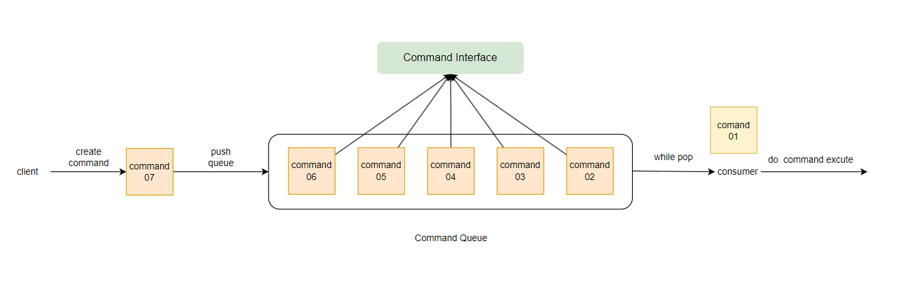

## 命令模式

命令模式	Command Pattern

命令模式将请求的命令封装成为一个对象，对象包含相关的所有信息，并将该对象放入一个队列的形式，由消费者执行相关命令。

如下图所示，client 负责创建命令对象并放入的队列中，cusumer 不断地从队列中获取命令对象，之后执行 execute() 方法。

> 应用场景

JdbcTemplate 中的回调方法，StatementCallback 也是一种命令模式的实现。
